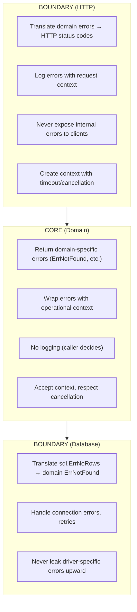

# Error Philosophy

> In Go, errors are values—not exceptions. They're returned, not thrown. How you design, wrap, and propagate errors defines the reliability of your system and the clarity of your API.

---

## Core Principle

**Errors are part of your API contract, not an afterthought.**

Every function that can fail communicates *how* it can fail through its error return. This is a design decision, not a mechanical formality. Sentinel errors, typed errors, and opaque errors each carry different commitments to your callers.

---

## Invariants

> Rules that must hold true. Violating these leads to bugs, leaks, or architectural debt.

- **Handle an error or return it, never both.** Logging and returning creates duplicate noise; handling and returning masks what the caller sees. Exception: boundary code may log errors that won't be observable by callers (e.g., HTTP handler logs internal error, returns generic 500).
- **Errors at boundaries must be translated, not leaked.** Internal implementation details (database errors, wire protocol failures) should never reach external consumers.
- **Add context when crossing package boundaries.** Wrap errors with operational context where they cross architectural layers—not at every call site.
- **Only wrap with `%w` when you intend callers to depend on the underlying error's identity.** Error *cause* (for debugging) and error *identity* (for control flow) are different concerns. `%w` preserves identity—use it deliberately, not reflexively.

---

## The "Why" Behind This

Go's error handling is often criticized for verbosity. The criticism misses the point. The verbosity is *intentional*—it forces you to confront failure at every call site. Exceptions in other languages create invisible control flow: a function three layers deep can throw, and you won't know unless you trace through every possible path. Go makes the failure paths explicit.

Rob Pike's observation that "errors are values" is deeper than it appears. Because errors are values, you can *program* with them. You can accumulate them, transform them, filter them, and build domain-specific error handling that fits your problem. The `bufio.Scanner` pattern—where errors are checked once at the end rather than at every read—is a canonical example of **deferred error checking**. The error doesn't disappear; it's just managed by the value itself.

This philosophy has architectural consequences. Errors cross boundaries: from database to repository, from repository to service, from service to HTTP handler. At each boundary, you must decide: should the caller see the original error? A transformed version? A completely different error? These decisions shape your API's contract with its consumers.

---

## Key Concepts

### Errors as Values

The `error` interface is minimal by design:

```go
type error interface {
    Error() string
}
```

Any type with an `Error() string` method is an error. This simplicity enables composition. Errors can carry structured data, wrap other errors, implement additional interfaces, and participate in type hierarchies—all while remaining compatible with the standard error checking pattern.

**Idiomatic:**

```go
result, err := doSomething()
if err != nil {
    return fmt.Errorf("doing something: %w", err)
}
```

The check is explicit. The caller sees the failure. The wrapping adds context without losing the original cause.

### Three Kinds of Errors

Go code uses three categories of errors, each with different API implications:

| Type | Use When | API Commitment |
|------|----------|----------------|
| **Sentinel** | Callers need to match specific conditions | Identity is frozen—removing or changing is breaking |
| **Typed** | Callers need structured data | Type and fields are frozen |
| **Opaque** | Callers only need `err != nil` | None—implementation can change freely |

**Sentinel errors** are package-level variables that callers can compare against:

```go
var ErrNotFound = errors.New("user not found")

func GetUser(id string) (*User, error) {
    user, ok := users[id]
    if !ok {
        return nil, ErrNotFound
    }
    return user, nil
}
```

Sentinels are part of your public API. **Once exported, they're effectively ABI commitments**—removing or changing their semantics is a breaking change. Use sentinels when you want callers to handle specific conditions differently.

For evolving APIs, consider **unexported sentinels with exported checker functions** to preserve flexibility:

```go
var errNotFound = errors.New("user not found") // unexported

func IsNotFound(err error) bool {
    return errors.Is(err, errNotFound)
}
```

**Typed errors** carry structured information beyond a message:

```go
type ValidationError struct {
    Field   string
    Message string
}

func (e *ValidationError) Error() string {
    return fmt.Sprintf("validation failed on %s: %s", e.Field, e.Message)
}

func ValidateUser(u *User) error {
    if u.Email == "" {
        return &ValidationError{Field: "email", Message: "required"}
    }
    return nil
}
```

Typed errors let callers extract structured data using `errors.As`. Use them when callers need more than identity—they need context to make decisions.

**Scope rule:** Typed errors should rarely cross more than one architectural boundary. They couple callers to domain structure and tend to grow fields over time, becoming pseudo-DTOs. Keep them close to where they're created.

**Opaque errors** provide no programmatic access to their details:

```go
func ProcessOrder(o *Order) error {
    if err := validate(o); err != nil {
        return fmt.Errorf("validating order: %w", err)
    }
    // ...
    return nil
}
```

Opaque errors are the default. They give you freedom to change implementation details without breaking callers. Use them when callers only need to know that something failed, not *what* failed.

Note: using `%v` instead of `%w` makes any error opaque—even if the underlying error is a sentinel or typed error. The identity is hidden from `errors.Is` and `errors.As`.

### Error Wrapping and Unwrapping

Go 1.13 introduced `%w` for wrapping errors with context while preserving the original:

```go
func LoadConfig(path string) (*Config, error) {
    data, err := os.ReadFile(path)
    if err != nil {
        return nil, fmt.Errorf("reading config %s: %w", path, err)
    }
    // ...
}
```

The wrapped error can be inspected with `errors.Is` and `errors.As`:

```go
err := LoadConfig("config.yaml")
if errors.Is(err, os.ErrNotExist) {
    // File doesn't exist—use defaults
}

var pathErr *os.PathError
if errors.As(err, &pathErr) {
    // Access pathErr.Path, pathErr.Op, etc.
}
```

**When to use `%w` vs `%v`:**

- Use `%w` when callers should be able to inspect the underlying error. This makes the wrapped error part of your API.
- Use `%v` when you want to include the error message but hide the underlying type. This preserves your freedom to change implementations.

**Anti-pattern—over-wrapping:**

```go
// Every layer adds "failed to" — noise accumulates
func handler(w http.ResponseWriter, r *http.Request) {
    err := service.Process(r.Context())
    // Error message: "failed to process: failed to save: failed to connect: connection refused"
}
```

Keep context succinct. Each layer should add *new* information, not restate the obvious:

```go
// Better: each layer adds its own context
// "processing request: saving user 123: connecting to db: connection refused"
return fmt.Errorf("saving user %s: %w", userID, err)
```

### Handle or Return, Never Both

A common anti-pattern is logging an error and then returning it:

```go
// Anti-pattern: error is logged twice (here and by caller)
func Process(data []byte) error {
    result, err := parse(data)
    if err != nil {
        log.Printf("parse failed: %v", err)
        return err // Caller will also log this
    }
    // ...
}
```

This creates duplicate log entries and confuses debugging. The rule: **handle it or return it**.

**Handling** means taking an action that resolves the error's impact—logging, falling back to a default, retrying. After handling, you don't return the error.

**Returning** means propagating the error to the caller. The caller is now responsible for handling or further propagating.

```go
// Idiomatic: return with context, let caller decide
func Process(data []byte) error {
    result, err := parse(data)
    if err != nil {
        return fmt.Errorf("parsing data: %w", err)
    }
    // ...
}

// Or: handle it here, don't return
func Process(data []byte) (*Result, error) {
    result, err := parse(data)
    if err != nil {
        log.Printf("parse failed, using default: %v", err)
        return defaultResult(), nil
    }
    return result, nil
}
```

### When to Panic

Almost never.

Panic is for *programmer errors*—conditions that should never occur if the code is correct. The key invariant: **panic is acceptable only when continuing execution would violate system invariants**. This frames panic as invariant enforcement, not convenience.

Examples: nil pointer dereference that violates an invariant, index out of bounds in code that pre-validated bounds, impossible state in a state machine.

**Acceptable panic scenarios:**

```go
// Initialization that cannot fail in correct code
var configTemplate = template.Must(template.New("config").Parse(configTmpl))

// Impossible state (indicates bug)
func (s *State) Transition(event Event) {
    switch s.current {
    case StateA:
        // ...
    case StateB:
        // ...
    default:
        panic(fmt.Sprintf("impossible state: %v", s.current))
    }
}
```

**Never panic for:**
- User input validation failures
- File not found
- Network errors
- Any error that could reasonably occur in production

Panics unwind the stack, execute deferred functions, and terminate the program unless recovered. They destroy the caller's ability to handle the failure gracefully. For expected errors—even rare ones—return an error.

---

## Boundary vs Core

> How errors behave differently at system boundaries vs core logic. This framing recurs throughout the handbook.

This document introduces a distinction that appears throughout the rest of this handbook: **boundary code** vs **core code**.

**Boundaries** are where your system meets the outside world: HTTP handlers, gRPC endpoints, CLI entry points, message queue consumers. Boundaries deal with external formats, protocols, and untrusted input.

**Core** is your domain logic: business rules, algorithms, data transformations. Core code should be protocol-agnostic and testable in isolation.

Error handling differs at these layers:



**At the HTTP boundary (inbound):**

```go
func (h *Handler) GetUser(w http.ResponseWriter, r *http.Request) {
    userID := chi.URLParam(r, "id")
    
    user, err := h.service.FindUser(r.Context(), userID)
    if err != nil {
        // Translate domain errors to HTTP
        if errors.Is(err, domain.ErrNotFound) {
            http.Error(w, "user not found", http.StatusNotFound)
            return
        }
        // Log internal errors, return generic message
        h.logger.Error("finding user", "error", err, "userID", userID)
        http.Error(w, "internal error", http.StatusInternalServerError)
        return
    }
    
    json.NewEncoder(w).Encode(user)
}
```

**In the core (domain logic):**

```go
func (s *UserService) FindUser(ctx context.Context, id string) (*User, error) {
    user, err := s.repo.Get(ctx, id)
    if err != nil {
        // Return domain error or wrap with context
        return nil, fmt.Errorf("finding user %s: %w", id, err)
    }
    return user, nil
}
```

**At the database boundary (outbound):**

```go
func (r *PostgresRepo) Get(ctx context.Context, id string) (*User, error) {
    var user User
    err := r.db.QueryRowContext(ctx, "SELECT ...", id).Scan(&user.ID, &user.Name)
    if err != nil {
        if errors.Is(err, sql.ErrNoRows) {
            return nil, domain.ErrNotFound // Translate to domain error
        }
        return nil, fmt.Errorf("querying user: %w", err)
    }
    return &user, nil
}
```

The key insight: **errors flow upward, translation happens at boundaries**. Core code uses domain errors; boundary code translates between domains. This keeps your core testable and your boundaries responsible for external concerns.

---

## Trade-Off Matrix

| If You Need... | Choose... | Accept... |
|----------------|-----------|-----------|
| Callers to match specific conditions | Sentinel error (`var ErrX = errors.New(...)`) | Error becomes frozen API—can't remove or change |
| Callers to extract structured data | Typed error (struct implementing `error`) | Type and fields become frozen API; keep scope narrow |
| Freedom to change implementation | Opaque error (`fmt.Errorf` without `%w`) | Callers can only check `err != nil` |
| Callers to inspect wrapped errors | `%w` in `fmt.Errorf` | Wrapped error's identity is part of API |
| To hide implementation details | `%v` in `fmt.Errorf` | Callers cannot use `errors.Is`/`As` |

---

## Interview Signals

| When Asked... | Demonstrate... |
|---------------|----------------|
| "How do you handle errors in Go?" | Errors are values, not exceptions. Check explicitly, wrap with context at boundaries, translate at API edges. Handle or return, never both. |
| "Sentinel vs typed vs opaque?" | Sentinels for identity checks (`errors.Is`). Typed for structured data (`errors.As`). Opaque by default for implementation freedom. |
| "When do you use panic?" | Almost never. Panic is for programmer errors—impossible states, violated invariants. Never for user input, network errors, or expected failures. |
| "How do errors cross layers?" | Translate at boundaries. Database errors become domain errors; domain errors become HTTP status codes. Core code is protocol-agnostic. |
| "What's wrong with logging and returning?" | Creates duplicate logs, confuses debugging. Handle (log, fallback, retry) *or* return—not both. |

---

## Bridge to Next

Errors flow through your system—but *something* must carry them and signal when to stop trying. That something is `context.Context`. Context is the backbone of lifecycle management in Go: it carries cancellation signals, deadlines, and request-scoped values. When a context is cancelled, operations should stop and return errors—`context.Canceled` or `context.DeadlineExceeded`. The next document explores how context is created at boundaries, propagated through core logic, and used to coordinate graceful termination.

→ Continue to [Context and Lifecycle](04_CONTEXT_AND_LIFECYCLE.md)
