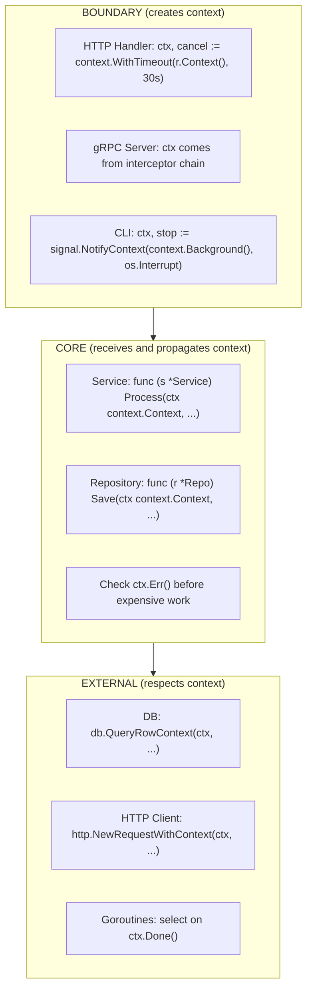

# Context and Lifecycle

> `context.Context` is the backbone of lifecycle management in Go. It carries cancellation signals, deadlines, and request-scoped values across API boundaries—enabling coordinated termination of goroutines and clean resource management.

---

## Core Principle

**Context flows downstream; cancellation propagates automatically.**

A context forms a tree: parents can cancel children, but children cannot cancel parents. This one-way flow creates predictable termination semantics. When you cancel a context, all derived contexts—and all operations watching them—stop.

---

## Invariants

> Rules that must hold true. Violating these leads to bugs, leaks, or architectural debt.

- **Context is created at boundaries, propagated through core.** HTTP handlers, gRPC servers, `main()`—these are where contexts originate. Core logic receives and respects context; it does not create root contexts.
- **The creator of a context owns its cancellation.** The function that calls `WithCancel`, `WithTimeout`, or `WithDeadline` is responsible for calling `cancel()` exactly once—even on the success path. This ownership rule connects directly to goroutine ownership in [Concurrency Architecture](05_CONCURRENCY_ARCHITECTURE.md).
- **Cancellation flows downstream only.** A child context can be cancelled independently, but cancelling a parent cancels all children. Never design systems that expect children to cancel parents.
- **Deadlines compose by taking the earliest.** If you create a child context with a 5-second timeout but the parent has only 2 seconds remaining, the child inherits the parent's deadline. You cannot extend a deadline by deriving a new context.
- **Never store context in structs.** Context represents the lifecycle of a single operation. Storing it couples the struct to that operation's lifetime, creating ambiguity about which calls the context applies to.
- **Cancellation is not rollback.** Context cancellation means "stop waiting, stop working"—it does not undo side effects. If you've written to a database before checking `ctx.Done()`, that write persists. Idempotency and transactional semantics live outside of context.

---

## The "Why" Behind This

Before `context`, Go had no standard way to propagate cancellation. Libraries invented their own mechanisms: custom channels, `tomb` packages, or simply no cancellation at all. This fragmentation made composition difficult. If library A used channels and library B used a different pattern, combining them required translation code.

The context package solves this by providing a *lingua franca* for cancellation and deadlines. Every function that might block or spawn work can accept a `context.Context` as its first parameter. This creates a consistent interface across the entire Go ecosystem—standard library, third-party packages, and your own code.

The design is intentionally minimal. Context does four things: carry a deadline, carry a cancellation signal, carry request-scoped values, and report why it was cancelled. It does not manage goroutines, handle retries, or provide synchronization. This minimalism is a feature—context is a coordination primitive, not a framework.

The tree structure of contexts mirrors the call graph of your program. An HTTP request creates a context; that context is passed to the service layer, which passes it to the repository layer, which passes it to the database driver. If the client disconnects, the HTTP server cancels the context, and that cancellation propagates through every layer—stopping database queries, releasing connections, and cleaning up goroutines. This is *structured cancellation*: the same structure that creates work also controls its termination.

---

## Key Concepts

### The Context Interface (Reference)

The `context.Context` interface has four methods. `Done()` returns a channel that closes on cancellation—the channel never sends values; its closing *is* the signal. `Err()` reports *why* it closed (`Canceled` or `DeadlineExceeded`). `Deadline()` returns the cancellation time if set. `Value()` retrieves request-scoped data.

```go
type Context interface {
    Deadline() (deadline time.Time, ok bool)
    Done() <-chan struct{}
    Err() error
    Value(key any) any
}
```

The canonical pattern for respecting cancellation:

```go
select {
case <-ctx.Done():
    return ctx.Err()
case result := <-workCh:
    return result, nil
}
```

### Root Contexts: Background and TODO

Two functions create root contexts—contexts with no parent:

```go
ctx := context.Background() // The "empty" context. Use at program boundaries.
ctx := context.TODO()       // Placeholder when you're unsure which context to use.
```

`context.Background()` is your starting point. Use it in `main()`, in initialization code, and in tests. It never cancels and has no deadline.

`context.TODO()` signals that context plumbing is incomplete. It's a marker for code that should eventually receive a context from its caller but doesn't yet. Don't use it in production code paths—it's a TODO, not a solution.

**Idiomatic:**

```go
func main() {
    ctx := context.Background()
    if err := run(ctx); err != nil {
        log.Fatal(err)
    }
}
```

**Anti-pattern:**

```go
func ProcessOrder(order *Order) error {
    // Creating a root context deep in the call stack
    ctx := context.Background() // Where did the caller's context go?
    return db.Save(ctx, order)
}
```

### WithCancel: Manual Cancellation

`WithCancel` creates a derived context that can be cancelled programmatically:

```go
func ProcessWithWorker(ctx context.Context, data []byte) error {
    ctx, cancel := context.WithCancel(ctx)
    defer cancel() // Always call cancel to release resources
    
    resultCh := make(chan Result, 1)
    go func() {
        result := expensiveComputation(ctx, data)
        select {
        case resultCh <- result:
        case <-ctx.Done():
        }
    }()
    
    select {
    case result := <-resultCh:
        return handleResult(result)
    case <-ctx.Done():
        return ctx.Err()
    }
}
```

**Critical:** Always `defer cancel()` immediately after calling `WithCancel`. Even if the parent context has its own cancellation, failing to call the child's cancel function leaks resources until the parent is cancelled.

### WithTimeout and WithDeadline

`WithTimeout` and `WithDeadline` add automatic cancellation based on time:

```go
// Cancel after duration elapses
ctx, cancel := context.WithTimeout(ctx, 5*time.Second)
defer cancel()

// Cancel at specific time
deadline := time.Now().Add(5 * time.Second)
ctx, cancel := context.WithDeadline(ctx, deadline)
defer cancel()
```

The difference is semantic: timeouts are relative ("5 seconds from now"), deadlines are absolute ("at 3:00 PM"). `WithTimeout` is implemented as `WithDeadline(parent, time.Now().Add(timeout))`.

**Deadline composition rule:** Deadlines always compose by taking the earliest. If you create a child with a 5-second timeout but the parent has only 2 seconds remaining, the child inherits the 2-second deadline. You cannot extend time by deriving a new context—only shorten it.

**Choosing a timeout value:**

Timeouts should be set at boundaries where you understand the expected latency. An HTTP handler might set a 30-second timeout for the entire request. A database query might have a 5-second timeout. These compose: if the request timeout is 30 seconds and you've already spent 20 seconds, the database query will be cancelled after 10 seconds (when the parent deadline passes), even though it asked for 5.

```go
func (h *Handler) GetUser(w http.ResponseWriter, r *http.Request) {
    // Request-level timeout
    ctx, cancel := context.WithTimeout(r.Context(), 30*time.Second)
    defer cancel()
    
    user, err := h.service.FindUser(ctx, chi.URLParam(r, "id"))
    if err != nil {
        if errors.Is(err, context.DeadlineExceeded) {
            http.Error(w, "request timeout", http.StatusGatewayTimeout)
            return
        }
        // ... handle other errors
    }
    // ...
}
```

### Context Values: Use Sparingly

`WithValue` attaches request-scoped data to a context:

```go
ctx = context.WithValue(ctx, key, value)
val := ctx.Value(key)
```

This is the most misused feature of the context package. Context values are for *request-scoped data that transits process boundaries*—things like request IDs, authentication tokens, and tracing information. They are **not** for passing optional parameters, configuration, or dependencies.

**Why the restriction?** Context values are untyped (`any`), have no compile-time safety, and create implicit dependencies. A function that reads from context has a hidden requirement that's not visible in its signature. This makes code harder to understand and test.

**Idiomatic—request ID for tracing:**

```go
// Define an unexported key type to avoid collisions
type ctxKey struct{}

var requestIDKey = ctxKey{}

func WithRequestID(ctx context.Context, id string) context.Context {
    return context.WithValue(ctx, requestIDKey, id)
}

func RequestIDFrom(ctx context.Context) (string, bool) {
    id, ok := ctx.Value(requestIDKey).(string)
    return id, ok
}
```

**Anti-pattern—passing dependencies:**

```go
// DON'T: Logger is a dependency, not request-scoped data
ctx = context.WithValue(ctx, "logger", logger)

// DO: Pass dependencies explicitly
func NewService(logger *slog.Logger, repo Repository) *Service
```

**Key type rules:**

1. Use an unexported struct type as the key to avoid collisions with other packages
2. Provide exported accessor functions (`WithX`, `XFrom`) for type safety
3. Document what values are expected in the context

### Respecting Cancellation

Functions that accept context should check for cancellation at appropriate points:

```go
func ProcessItems(ctx context.Context, items []Item) error {
    for _, item := range items {
        // Check before expensive work
        if err := ctx.Err(); err != nil {
            return err
        }
        
        if err := processItem(ctx, item); err != nil {
            return err
        }
    }
    return nil
}
```

For I/O operations, prefer variants that accept context:

```go
// Prefer context-aware methods
row := db.QueryRowContext(ctx, "SELECT ...")
resp, err := http.NewRequestWithContext(ctx, "GET", url, nil)
```

For long-running work with no natural cancellation points, use a select:

```go
func LongComputation(ctx context.Context) (Result, error) {
    resultCh := make(chan Result, 1)
    
    go func() {
        // Computation that can't check context internally
        resultCh <- compute()
    }()
    
    select {
    case result := <-resultCh:
        return result, nil
    case <-ctx.Done():
        return Result{}, ctx.Err()
    }
}
```

### Never Store Context in Structs

The official documentation is explicit: *"Do not store Contexts inside a struct type; instead, pass a Context explicitly to each function that needs it."*

**Why?** A context represents the lifecycle of a single operation. Storing it in a struct creates ambiguity:

```go
// Anti-pattern: Which operation does this context belong to?
type Worker struct {
    ctx    context.Context // Created when? Cancelled when?
    cancel context.CancelFunc
    // ...
}

func (w *Worker) DoSomething() error {
    return w.repo.Save(w.ctx, data) // Is this context still valid?
}
```

The caller of `DoSomething()` has no control over the context. They can't set their own timeout. They can't cancel the operation independently. The context's lifecycle is coupled to the struct's lifecycle in ways that aren't visible from the API.

**Idiomatic—pass context to each method:**

```go
type Worker struct {
    repo Repository
}

func (w *Worker) DoSomething(ctx context.Context) error {
    return w.repo.Save(ctx, data)
}
```

**Exception:** When retrofitting context support into existing APIs, storing context in a struct may be necessary for backward compatibility. The `net/http` package does this with `Request.Context()`. This is a pragmatic compromise, not a pattern to emulate in new code.

---

## Process-Level Lifecycle

Context manages request lifecycles, but applications have a larger lifecycle: **startup → steady-state → draining → shutdown**. Understanding how context fits into this model prepares you for [Graceful Shutdown](06_GRACEFUL_SHUTDOWN.md).

```go
func main() {
    // 1. STARTUP: Create root context bound to OS signals
    ctx, stop := signal.NotifyContext(context.Background(), os.Interrupt, syscall.SIGTERM)
    defer stop()
    
    // 2. Initialize components (pass ctx for early termination)
    server, err := NewServer(ctx, cfg)
    if err != nil {
        log.Fatal(err)
    }
    
    // 3. STEADY-STATE: Run until signal received
    if err := server.Run(ctx); err != nil && !errors.Is(err, context.Canceled) {
        log.Fatal(err)
    }
    
    // 4. DRAINING/SHUTDOWN: ctx is cancelled, components wind down
    log.Println("shutdown complete")
}
```

**Key insight:** The root context created in `main()` flows to every long-lived goroutine. When `SIGTERM` arrives, `ctx.Done()` closes, and every component watching that context—or any context derived from it—receives the shutdown signal simultaneously.

This is why context ownership matters at the process level: `main()` owns the root context and is responsible for:
- Creating it (via `signal.NotifyContext`)
- Passing it to all subsystems
- Waiting for subsystems to finish after cancellation

---

## Boundary vs Core

> How context behaves differently at system boundaries vs core logic.

Context exemplifies the boundary/core distinction introduced in [Error Philosophy](03_ERROR_PHILOSOPHY.md).

**At boundaries (HTTP handlers, gRPC servers, CLI commands):**
- Create contexts with appropriate timeouts
- Handle context cancellation by returning appropriate status codes
- Translate `context.DeadlineExceeded` to HTTP 504, `context.Canceled` to HTTP 499/client disconnect

**In core logic (services, repositories, domain):**
- Accept context as first parameter
- Propagate context to downstream calls
- Check `ctx.Err()` before expensive operations
- Never create root contexts



**Example—HTTP handler creating context:**

```go
func (h *Handler) CreateOrder(w http.ResponseWriter, r *http.Request) {
    // Boundary: create context with timeout
    ctx, cancel := context.WithTimeout(r.Context(), 30*time.Second)
    defer cancel()
    
    var req CreateOrderRequest
    if err := json.NewDecoder(r.Body).Decode(&req); err != nil {
        http.Error(w, "invalid request", http.StatusBadRequest)
        return
    }
    
    // Pass to core
    order, err := h.service.CreateOrder(ctx, req)
    if err != nil {
        // Translate context errors to HTTP
        if errors.Is(err, context.DeadlineExceeded) {
            http.Error(w, "request timeout", http.StatusGatewayTimeout)
            return
        }
        if errors.Is(err, context.Canceled) {
            // Client disconnected
            return
        }
        http.Error(w, "internal error", http.StatusInternalServerError)
        return
    }
    
    json.NewEncoder(w).Encode(order)
}
```

**Example—core logic receiving context:**

```go
func (s *OrderService) CreateOrder(ctx context.Context, req CreateOrderRequest) (*Order, error) {
    // Validate (cheap, no context check needed)
    if err := req.Validate(); err != nil {
        return nil, fmt.Errorf("invalid request: %w", err)
    }
    
    // Check before expensive operation
    if err := ctx.Err(); err != nil {
        return nil, err
    }
    
    // Propagate context to repository
    order, err := s.repo.Save(ctx, &Order{...})
    if err != nil {
        return nil, fmt.Errorf("saving order: %w", err)
    }
    
    // Propagate context to external service
    if err := s.notifier.Notify(ctx, order); err != nil {
        // Log but don't fail—notification is best-effort
        s.logger.Warn("notification failed", "error", err)
    }
    
    return order, nil
}
```

---

## Trade-Off Matrix

| If You Need... | Choose... | Accept... |
|----------------|-----------|-----------|
| Manual cancellation control | `WithCancel` | Must call cancel, even on success |
| Automatic timeout | `WithTimeout` | Cannot exceed parent's deadline |
| Request-scoped data | `WithValue` | Untyped, implicit dependencies, interview red flags if overused |
| Background work (no timeout) | `context.Background()` | No automatic cleanup if stuck |

---

## Interview Signals

| When Asked... | Demonstrate... |
|---------------|----------------|
| "What is context.Context for?" | Cancellation, deadlines, and request-scoped values. It's a standard way to propagate lifecycle signals across API boundaries. Not for dependency injection. |
| "When do you create a context?" | At boundaries: `main()`, HTTP handlers, gRPC servers. Core logic receives context, it doesn't create root contexts. |
| "Why not store context in structs?" | Context represents a single operation's lifecycle. Storing it couples the struct to that operation's lifetime, making it unclear which calls the context applies to. Pass it explicitly. |
| "What happens if you forget to call cancel?" | Resource leak. Timers keep running, internal goroutines may block waiting for parent cancellation. Always `defer cancel()` immediately. |
| "How do deadlines compose?" | **Deadlines always compose by taking the earliest.** A child cannot extend its parent's deadline—only shorten it. If parent has 2s left and child asks for 5s, child gets 2s. |
| "Does cancellation roll back my operation?" | **No. Cancellation means 'stop waiting/working', not 'undo side effects'.** If you wrote to DB before checking `ctx.Done()`, that write persists. Idempotency lives outside of context. |
| "Who owns cancellation?" | The creator. Whoever calls `WithCancel/WithTimeout/WithDeadline` is responsible for calling `cancel()`—even on success paths. This parallels goroutine ownership. |

---

## Bridge to Next

Context coordinates the lifecycle of individual operations. But who owns the goroutines that *perform* those operations? How do you prevent goroutine leaks? How do you ensure all work stops when the application terminates?

The next document explores **concurrency architecture**: patterns for safe, maintainable concurrent systems. It introduces the critical concept of *goroutine ownership*—the rule that **the code which starts a goroutine must ensure it can stop**. This principle mirrors context ownership: whoever creates a derived context owns its cancellation; whoever spawns a goroutine owns its termination.

→ Continue to [Concurrency Architecture](05_CONCURRENCY_ARCHITECTURE.md)

→ Deep dive: [Time and Clocks](DD_TIME_AND_CLOCKS.md) — injected clocks, deadlines vs timeouts, and testable time
