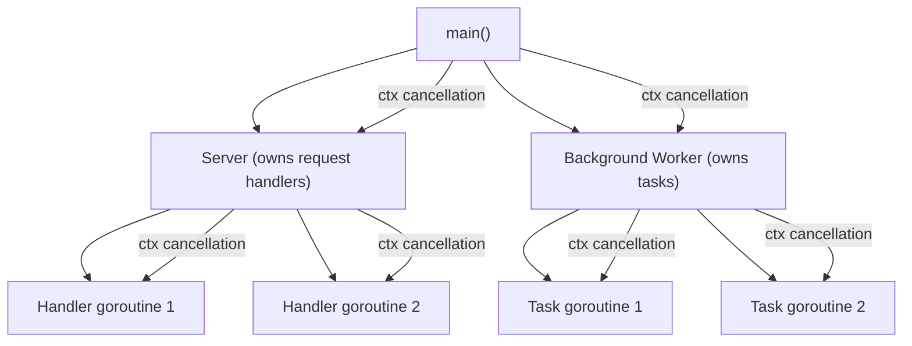

# Concurrency Architecture

> Concurrency in Go is not about goroutines and channels—it's about **ownership**, **lifecycle**, and **communication**. Understanding these principles separates code that works from code that works reliably under load.

---

## Core Principle

**Every goroutine must have an owner responsible for its termination.**

Goroutines are cheap to start but expensive to leak. A goroutine without a clear owner—someone responsible for ensuring it stops—is a resource leak waiting to happen. The ownership principle applies recursively: if function A spawns a goroutine, A must ensure that goroutine can be stopped, even if A delegates to B.

---

## Invariants

> Rules that must hold true. Violating these leads to bugs, leaks, or architectural debt.

- **The code that starts a goroutine must ensure it can stop.** No fire-and-forget goroutines in production code. Every `go` statement implies a termination contract.
- **Share memory by communicating; don't communicate by sharing memory.** Prefer channels for coordination between goroutines. Use mutexes for protecting state within a single component.
- **Goroutines must have a bounded lifetime.** Every goroutine should either complete its work and exit, or respond to a cancellation signal. Infinite loops without exit conditions are bugs.
- **Channels are for communication; mutexes are for protection.** Don't use channels to protect state. Don't use mutexes to coordinate independent goroutines.
- **The sender owns the channel; receivers never close.** The goroutine that creates a channel is responsible for closing it. Closing a channel you don't own causes panics and race conditions.

---

## The "Why" Behind This

Go makes concurrency syntactically trivial: `go doSomething()`. This simplicity is dangerous. In languages where threads are expensive, developers think carefully before spawning them. Go's lightweight goroutines remove that friction—and with it, the pause for reflection.

The consequence: goroutine leaks are endemic in Go codebases. A goroutine blocked on a channel that will never receive. A worker loop that never checks for shutdown. A background task spawned in `init()` that outlives the component that needs it. These leaks accumulate silently, consuming memory and file descriptors until the system degrades or crashes.

The ownership principle addresses this directly. Before writing `go`, ask: "Who will stop this goroutine?" If you can't answer, don't write the code. This principle—borrowed from structured concurrency concepts in other languages—transforms goroutines from liabilities into manageable resources.

Go's concurrency philosophy is rooted in Communicating Sequential Processes (CSP), Tony Hoare's 1978 formalism. The core insight: concurrent processes should communicate by passing messages, not by sharing memory. Channels embody this model. When goroutines communicate through channels, synchronization happens at the communication point—no locks, no races, no subtle ordering bugs.

But CSP isn't the only valid model. Some problems—protecting a cache, maintaining a counter—are better solved with mutexes. Go provides both tools. Knowing when to use each is a senior-level skill.

**Concurrency is not free.** Every goroutine adds coordination cost. If operations are sequential and fast, adding concurrency often reduces clarity without improving throughput. The goal is not maximum parallelism—it's appropriate structure for the problem at hand.

---

## Key Concepts

### Concurrency vs Parallelism

These terms are often confused. They are different:

**Concurrency** is about *structure*—composing independently executing processes. It's a design decision about how to organize your program.

**Parallelism** is about *execution*—running multiple things simultaneously. It's a runtime property that depends on hardware.

A concurrent program might run on a single CPU core, interleaving execution. A parallel program requires multiple cores. Go's concurrency primitives enable concurrent design; the runtime decides whether to execute in parallel based on `GOMAXPROCS` and available cores.

The practical implication: design for concurrency when your problem has independent parts that can make progress independently. Don't use concurrency to "make things faster"—use it to structure code that interacts with a concurrent world (network I/O, user input, multiple clients).

### Goroutine Lifecycle and Ownership

A goroutine has a clear lifecycle: **start → run → stop**. Problems arise when stop never happens.

**Ownership means responsibility for the full lifecycle:**

```go
// Owner starts the goroutine and ensures it can stop
func (s *Server) Start(ctx context.Context) error {
    s.wg.Add(1)
    go func() {
        defer s.wg.Done()
        s.processRequests(ctx)
    }()
    return nil
}

func (s *Server) Stop() {
    // Signal all goroutines to stop (via context cancellation)
    s.cancel()
    // Wait for them to actually stop
    s.wg.Wait()
}
```

The owner (`Server`) controls both the start and stop of the goroutine. The goroutine respects context cancellation. The owner can wait for completion via `WaitGroup`.

**Anti-pattern—fire-and-forget:**

```go
func ProcessOrder(order *Order) {
    go sendNotification(order) // Who stops this? Who waits for it?
    go updateAnalytics(order)  // What if these outlive the request?
}
```

These goroutines have no owner. If `sendNotification` blocks, it leaks. If the application shuts down, these goroutines are terminated mid-execution. There's no way to know when they complete or if they succeeded.

**Anti-pattern—goroutines in constructors:**

Constructors (`NewX` functions) should not start goroutines unless lifecycle management is explicit and documented. A constructor that spawns a goroutine couples object creation to runtime behavior—the caller can't control when the goroutine starts or stops.

```go
// Anti-pattern: hidden goroutine in constructor
func NewWatcher(path string) *Watcher {
    w := &Watcher{path: path}
    go w.watch() // Caller didn't ask for this; can't stop it
    return w
}

// Better: explicit Start method
func NewWatcher(path string) *Watcher {
    return &Watcher{path: path}
}

func (w *Watcher) Start(ctx context.Context) {
    go w.watch(ctx) // Caller controls lifecycle
}
```

**Ownership hierarchy:**

In well-structured programs, ownership forms a tree. `main()` owns top-level components. Components own their workers. Workers own their sub-tasks. When `main()` signals shutdown, cancellation flows down the tree.



### The For-Select Pattern

Long-lived goroutines typically follow a standard pattern: loop forever, select on channels, exit on cancellation.

```go
func (w *Worker) run(ctx context.Context) {
    for {
        select {
        case <-ctx.Done():
            return // Owner cancelled; exit cleanly
        case job := <-w.jobs:
            w.process(job)
        case <-w.ticker.C:
            w.periodicTask()
        }
    }
}
```

This pattern is the backbone of concurrent Go code. The `select` blocks until one case is ready. The `ctx.Done()` case ensures the goroutine can be stopped. Without it, the goroutine would run forever.

**Common mistake—missing cancellation case:**

```go
// Anti-pattern: no way to stop this goroutine
func (w *Worker) run() {
    for job := range w.jobs {
        w.process(job) // Blocks forever if jobs channel is never closed
    }
}
```

If `w.jobs` is never closed, this goroutine never exits. Even if it's closed, you can't stop it mid-processing of remaining jobs. Always include a cancellation mechanism.

### Channels vs Mutexes: A Decision Framework

The Go Wiki provides clear guidance, which can be summarized as:

| Use Channels When... | Use Mutexes When... |
|---------------------|---------------------|
| Passing ownership of data | Protecting internal state |
| Distributing units of work | Guarding a cache or map |
| Communicating async results | Simple counter increments |
| Coordinating multiple goroutines | Critical sections are short |

**Channels are for communication:**

```go
// Good: channel passes work between goroutines
func producer(out chan<- Job) {
    for {
        job := generateJob()
        out <- job // Ownership transfers to consumer
    }
}

func consumer(in <-chan Job) {
    for job := range in {
        process(job) // Consumer now owns the job
    }
}
```

**Mutexes are for protection:**

```go
// Good: mutex protects shared state
type Cache struct {
    mu   sync.RWMutex
    data map[string]Value
}

func (c *Cache) Get(key string) (Value, bool) {
    c.mu.RLock()
    defer c.mu.RUnlock()
    v, ok := c.data[key]
    return v, ok
}

func (c *Cache) Set(key string, value Value) {
    c.mu.Lock()
    defer c.mu.Unlock()
    c.data[key] = value
}
```

**Anti-pattern—channel for state protection:**

```go
// Overcomplicated: using channel where mutex is simpler
type Counter struct {
    inc chan struct{}
    get chan int
}

func NewCounter() *Counter {
    c := &Counter{
        inc: make(chan struct{}),
        get: make(chan int),
    }
    go func() {
        var count int
        for {
            select {
            case <-c.inc:
                count++
            case c.get <- count:
            }
        }
    }()
    return c
}
```

This spawns a goroutine just to protect an integer. A mutex is simpler, faster, and doesn't leak a goroutine if `Counter` is garbage collected. Don't use channels to protect state—use them to communicate between independent processes.

**When the line blurs:**

Some patterns genuinely benefit from either approach. A rate limiter could be a buffered channel (channel as semaphore) or a mutex-protected token bucket. Choose based on what makes the code clearest, not what feels most "Go-like."

### Structured Concurrency with errgroup

The `golang.org/x/sync/errgroup` package embodies structured concurrency: goroutines are scoped to a task, errors are collected, and context cancellation is automatic.

```go
func fetchAll(ctx context.Context, urls []string) ([]Response, error) {
    g, ctx := errgroup.WithContext(ctx)
    responses := make([]Response, len(urls))
    
    for i, url := range urls {
        i, url := i, url // Capture loop variables
        g.Go(func() error {
            resp, err := fetch(ctx, url)
            if err != nil {
                return err
            }
            responses[i] = resp
            return nil
        })
    }
    
    if err := g.Wait(); err != nil {
        return nil, err // First error returned; context cancelled
    }
    return responses, nil
}
```

**What `errgroup` provides:**

- **Automatic waiting:** `g.Wait()` blocks until all goroutines complete
- **Error propagation:** First non-nil error is returned
- **Context cancellation:** When one goroutine errors, the context is cancelled
- **Bounded concurrency:** `g.SetLimit(n)` restricts concurrent goroutines

**Bounded concurrency as backpressure:** `SetLimit(n)` is a backpressure mechanism. When the limit is reached, `g.Go()` blocks until a slot is available. This prevents unbounded goroutine growth under load. When designing bounded systems, decide explicitly what happens when capacity is exceeded: block (backpressure), queue (buffer), or fail fast (reject).

**Critical subtlety:** `errgroup` cancels the context when a goroutine errors, but it does *not* stop the other goroutines. Those goroutines must check `ctx.Done()` themselves:

```go
g.Go(func() error {
    for {
        select {
        case <-ctx.Done():
            return ctx.Err() // Respond to cancellation
        default:
            // Do work
        }
    }
})
```

**Warning about `default`:** The `default` case makes the select non-blocking. This is correct only when the work in `default` is naturally bounded or rate-limited. Without work that blocks or yields, this becomes a busy loop consuming 100% CPU. For long-running goroutines, prefer blocking selects with explicit work channels or tickers.
```

### Preventing Goroutine Leaks

A goroutine leak occurs when a goroutine blocks forever, consuming resources indefinitely. Common causes:

**Blocked channel send (no receiver):**

```go
// Leak: if nobody reads from ch, this goroutine blocks forever
func leaky() {
    ch := make(chan int)
    go func() {
        ch <- 42 // Blocks forever
    }()
    // ch goes out of scope, goroutine still blocked
}
```

**Blocked channel receive (channel never closed):**

```go
// Leak: if ch is never closed, this blocks forever
func leaky(ch <-chan int) {
    for v := range ch {
        process(v)
    }
}
```

**Fixes:**

1. **Always provide a cancellation path:**

```go
func notLeaky(ctx context.Context) {
    ch := make(chan int)
    go func() {
        select {
        case ch <- 42:
        case <-ctx.Done(): // Exit if context cancelled
        }
    }()
}
```

2. **Use buffered channels when appropriate:**

```go
// If exactly one value will be sent, buffer of 1 prevents blocking
ch := make(chan int, 1)
go func() {
    ch <- 42 // Never blocks
}()
```

3. **Test with goleak:**

```go
func TestNoLeaks(t *testing.T) {
    defer goleak.VerifyNone(t)
    // Test code here
}
```

The `go.uber.org/goleak` package detects goroutine leaks in tests. Use it routinely—leaks caught in tests don't reach production.

### Synchronization Primitives

Beyond channels, Go provides several synchronization primitives in the `sync` package:

**sync.WaitGroup—waiting for goroutines:**

```go
var wg sync.WaitGroup

for i := 0; i < n; i++ {
    wg.Add(1)
    go func() {
        defer wg.Done()
        doWork()
    }()
}

wg.Wait() // Block until all goroutines complete
```

**sync.Once—one-time initialization:**

```go
var (
    instance *Singleton
    once     sync.Once
)

func GetInstance() *Singleton {
    once.Do(func() {
        instance = &Singleton{}
    })
    return instance
}
```

**sync.Mutex and sync.RWMutex—mutual exclusion:**

```go
var mu sync.RWMutex
var data map[string]int

// Multiple readers allowed
func read(key string) int {
    mu.RLock()
    defer mu.RUnlock()
    return data[key]
}

// Only one writer at a time
func write(key string, value int) {
    mu.Lock()
    defer mu.Unlock()
    data[key] = value
}
```

**sync/atomic—low-level atomic operations:**

```go
var counter int64

func increment() {
    atomic.AddInt64(&counter, 1)
}

func get() int64 {
    return atomic.LoadInt64(&counter)
}
```

Atomics are rarely needed in business logic—they're most appropriate for metrics, flags, and low-level coordination primitives. For compound operations or anything involving multiple variables, use mutexes.

Use atomics for simple counters and flags. Use mutexes for compound operations. Use channels for communication between goroutines.

---

## Boundary vs Core

> How concurrency behaves differently at system boundaries vs core logic.

**At boundaries (HTTP handlers, message consumers):**

- Goroutines are created per-request by the framework
- Context carries request lifecycle—use it
- Set timeouts at the boundary
- Don't spawn unbounded goroutines from handlers

```go
func (h *Handler) ProcessOrder(w http.ResponseWriter, r *http.Request) {
    ctx := r.Context() // Request-scoped context from framework
    
    // Bad: spawning goroutine without waiting
    // go h.notifyAsync(order) // Who owns this?
    
    // Good: bound to request lifecycle
    g, ctx := errgroup.WithContext(ctx)
    g.Go(func() error {
        return h.validateInventory(ctx, order)
    })
    g.Go(func() error {
        return h.checkPayment(ctx, order)
    })
    
    if err := g.Wait(); err != nil {
        http.Error(w, err.Error(), http.StatusInternalServerError)
        return
    }
    // ...
}
```

**In core logic (services, domain):**

- Accept context, respect cancellation
- Don't create root contexts
- Let the caller decide timeout/cancellation policy
- Document goroutine ownership if spawning background work

```go
// Core service: accepts context, doesn't create goroutines unless necessary
func (s *OrderService) Process(ctx context.Context, order *Order) error {
    if err := ctx.Err(); err != nil {
        return err
    }
    
    // Sequential operations—no concurrency needed
    if err := s.validator.Validate(order); err != nil {
        return fmt.Errorf("validation: %w", err)
    }
    
    return s.repo.Save(ctx, order)
}
```

**Background workers (long-lived goroutines):**

- Owned by a component with explicit lifecycle
- Created at startup, stopped at shutdown
- Always respect context cancellation

```go
type BackgroundProcessor struct {
    jobs   chan Job
    wg     sync.WaitGroup
    cancel context.CancelFunc
}

func (p *BackgroundProcessor) Start(ctx context.Context) {
    ctx, p.cancel = context.WithCancel(ctx)
    
    p.wg.Add(1)
    go func() {
        defer p.wg.Done()
        for {
            select {
            case <-ctx.Done():
                return
            case job := <-p.jobs:
                p.process(ctx, job)
            }
        }
    }()
}

func (p *BackgroundProcessor) Stop() {
    p.cancel()
    p.wg.Wait()
}
```

---

## Trade-Off Matrix

| If You Need... | Choose... | Accept... |
|----------------|-----------|-----------|
| Coordinate independent goroutines | Channels | More complex setup, potential for deadlocks if misused |
| Protect shared state | `sync.Mutex` or `sync.RWMutex` | Lock contention under high concurrency |
| Simple counter/flag | `sync/atomic` | Limited to primitive operations |
| Wait for N goroutines | `sync.WaitGroup` | No error handling, no cancellation |
| Wait + error handling + cancellation | `errgroup.Group` | External dependency (`golang.org/x/sync`) |
| Bounded concurrency | `errgroup.SetLimit(n)` or semaphore channel | Backpressure handling complexity |
| One-time initialization | `sync.Once` | Can't re-initialize |

---

## Interview Signals

| When Asked... | Demonstrate... |
|---------------|----------------|
| "How do you prevent goroutine leaks?" | Every goroutine needs an owner. Always provide a cancellation path via context. Use `goleak` in tests. Buffered channels for fire-and-forget single values. |
| "Channels vs mutexes?" | Channels for communication between goroutines (passing data, distributing work). Mutexes for protecting shared state (caches, counters). Don't use channels where a mutex is simpler. |
| "Who should close a channel?" | The sender (creator) closes; receivers never close. Closing a channel signals "no more values"—only the producer knows when that's true. Closing from the receiver side causes panics. |
| "What is structured concurrency?" | Goroutines are scoped to their parent's lifetime. When the parent completes or cancels, all children stop. `errgroup` embodies this in Go. |
| "How does errgroup work?" | Groups goroutines, waits for all to complete, returns first error. `WithContext` cancels context on first error, but goroutines must check `ctx.Done()` to actually stop. |
| "What's the for-select pattern?" | Standard structure for long-lived goroutines: infinite loop, select on channels, always include `ctx.Done()` case for cancellation. |
| "Concurrency vs parallelism?" | Concurrency is structure—composing independent processes. Parallelism is execution—running simultaneously. Go enables concurrent design; runtime decides parallelism. |

---

## Bridge to Next

Goroutines need to stop gracefully when your application terminates. But termination is more complex than cancelling a context—you need to drain in-flight requests, close database connections, flush logs, and release resources in the correct order. If startup creates resources in order A → B → C, shutdown typically reverses that: C → B → A.

The next document explores **graceful shutdown**: signal handling, shutdown ordering, timeout budgets, and the patterns that ensure your application terminates cleanly without losing data or leaving connections dangling.

→ Continue to [Graceful Shutdown](06_GRACEFUL_SHUTDOWN.md)
