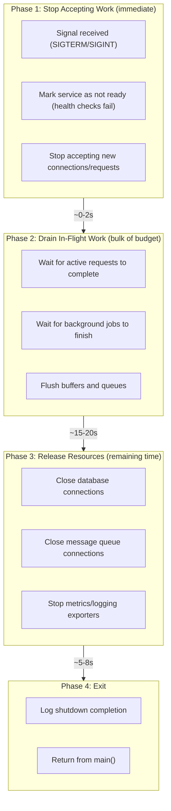

# Graceful Shutdown

> Programs that terminate correctly are as important as programs that run correctly. Graceful shutdown ensures your application stops accepting new work, completes in-flight operations, releases resources, and exits within a bounded time—without data loss or corruption.

---

## Core Principle

**Shutdown order is the reverse of startup order.**

If you started the database connection, then the cache, then the HTTP server—you shut down the HTTP server first (stop accepting requests), then the cache (flush pending writes), then the database (close connections). The component that depends on others must stop *before* the components it depends on.

---

## Invariants

> Rules that must hold true. Violating these leads to bugs, leaks, or architectural debt.

- **Every component must have a shutdown path.** If a component can be started, it must be stoppable. No goroutine, connection, or resource should lack an explicit termination mechanism.
- **Shutdown order is the reverse of startup order.** Dependencies must outlive their dependents. Stopping a database before the service using it causes errors in flight.
- **Shutdown must complete within a bounded time.** Open-ended shutdown is no different from hanging. Set timeout budgets; if components don't stop in time, force termination.
- **Shutdown is triggered once; components must be idempotent to repeated close calls.** Calling `Close()` or `Shutdown()` twice should not panic or corrupt state.

---

## The "Why" Behind This

Production applications don't run forever. They're restarted for deployments, scaled down by orchestrators, terminated by resource limits, or stopped for maintenance. In containerized environments like Kubernetes, graceful shutdown is not optional—it's expected behavior. Kubernetes sends `SIGTERM`, waits for `terminationGracePeriodSeconds` (default 30 seconds), then sends `SIGKILL`. If your application doesn't handle `SIGTERM`, in-flight requests fail, data may be lost, and users experience errors.

The challenge is coordination. A typical service has multiple components running concurrently: an HTTP server accepting requests, background workers processing jobs, connections to databases and caches, metrics exporters, health check endpoints. Each has its own lifecycle. Shutting down means orchestrating all of them to stop in the right order, at the right time, without racing against each other.

This is where context and ownership converge. [Context and Lifecycle](04_CONTEXT_AND_LIFECYCLE.md) established that context flows from boundaries into core logic, carrying cancellation signals. [Concurrency Architecture](05_CONCURRENCY_ARCHITECTURE.md) established that every goroutine has an owner responsible for its termination. Graceful shutdown is where these principles meet: the root context created in `main()` becomes the coordination point for application-wide termination, and ownership ensures every goroutine responds to that cancellation.

---

## Key Concepts

### Signal Handling Fundamentals

Unix signals are the standard way for the operating system (or orchestrators) to communicate with processes. For graceful shutdown, two signals matter:

- **SIGTERM** (signal 15): "Please terminate." Sent by Kubernetes, Docker, systemd, and most process managers. Catchable and handleable.
- **SIGINT** (signal 2): "Interrupt." Sent when you press Ctrl+C. Catchable and handleable.

**SIGKILL** (signal 9) cannot be caught or handled—the kernel terminates your process immediately. This is why graceful shutdown must complete *before* the orchestrator loses patience and sends SIGKILL.

**Idiomatic signal handling with `signal.NotifyContext`:**

```go
func main() {
    // Create a context that cancels on SIGTERM or SIGINT
    ctx, stop := signal.NotifyContext(context.Background(),
        syscall.SIGTERM, syscall.SIGINT)
    defer stop()
    
    // Run the application
    if err := run(ctx); err != nil && !errors.Is(err, context.Canceled) {
        log.Fatal(err)
    }
    
    log.Println("shutdown complete")
}
```

`signal.NotifyContext` (added in Go 1.16) is the modern approach. It returns a context that cancels when the specified signals arrive. The `stop` function should be deferred to clean up signal handling resources.

**Alternative: manual channel-based handling:**

```go
func main() {
    ctx, cancel := context.WithCancel(context.Background())
    
    sigCh := make(chan os.Signal, 1)
    signal.Notify(sigCh, syscall.SIGTERM, syscall.SIGINT)
    
    go func() {
        sig := <-sigCh
        log.Printf("received signal: %v", sig)
        cancel()
    }()
    
    if err := run(ctx); err != nil && !errors.Is(err, context.Canceled) {
        log.Fatal(err)
    }
}
```

The channel approach gives more control (you can log the signal, perform pre-cancellation work, or handle multiple signals differently), but `signal.NotifyContext` is usually sufficient and cleaner.

**Critical:** The signal channel must be buffered (size 1). If the channel is unbuffered and your code isn't ready to receive, the signal is dropped.

### The Shutdown Sequence

A well-structured shutdown follows a predictable sequence:



Each phase must complete before the next begins. The total time across all phases must fit within your shutdown budget (e.g., Kubernetes' `terminationGracePeriodSeconds`).

> **Reality check:** Graceful shutdown is a *best-effort contract*, not a guarantee. Network partitions, stuck syscalls, and uncooperative dependencies can all prevent clean termination. Design for the happy path, but accept that SIGKILL is the ultimate backstop.

### HTTP Server Shutdown

The standard library's `http.Server` has a `Shutdown` method designed for graceful termination:

```go
func runHTTPServer(ctx context.Context, addr string, handler http.Handler) error {
    server := &http.Server{
        Addr:    addr,
        Handler: handler,
    }
    
    // Start server in a goroutine
    errCh := make(chan error, 1)
    go func() {
        if err := server.ListenAndServe(); err != nil && err != http.ErrServerClosed {
            errCh <- err
        }
        close(errCh)
    }()
    
    // Wait for context cancellation or server error
    select {
    case err := <-errCh:
        return fmt.Errorf("server error: %w", err)
    case <-ctx.Done():
        // Graceful shutdown with timeout
        shutdownCtx, cancel := context.WithTimeout(context.Background(), 10*time.Second)
        defer cancel()
        
        if err := server.Shutdown(shutdownCtx); err != nil {
            return fmt.Errorf("shutdown error: %w", err)
        }
        return ctx.Err()
    }
}
```

**What `server.Shutdown` does:**

1. Immediately stops accepting new connections
2. Waits for all active requests to complete
3. Closes idle connections
4. Returns when all connections are closed or the context expires

**Anti-pattern—calling `server.Close()` instead:**

```go
// DON'T: Close() terminates immediately, dropping in-flight requests
server.Close()

// DO: Shutdown() waits for requests to complete
server.Shutdown(ctx)
```

`Close()` is for abnormal termination only. In graceful shutdown, always use `Shutdown()`.

### Component Lifecycle Interface

For applications with multiple components, define a common lifecycle interface:

```go
// Component represents a startable/stoppable service component.
type Component interface {
    // Name returns the component's identifier for logging.
    Name() string
    
    // Start begins the component's work. It should block until
    // ctx is cancelled or an error occurs.
    Start(ctx context.Context) error
    
    // Stop gracefully shuts down the component within the given context.
    // It should be idempotent—safe to call multiple times.
    Stop(ctx context.Context) error
}
```

**Design note:** `Start(ctx)` may either block (owning its goroutines internally) *or* spawn goroutines and block on coordination primitives (channels, errgroup). The invariant is not *how* it blocks, but that **it does not return while the component is considered running**. When `Start` returns, the component is no longer active.

This interface enables uniform handling of diverse components:

```go
type HTTPServer struct {
    server *http.Server
}

func (h *HTTPServer) Name() string { return "http-server" }

func (h *HTTPServer) Start(ctx context.Context) error {
    errCh := make(chan error, 1)
    go func() {
        if err := h.server.ListenAndServe(); err != http.ErrServerClosed {
            errCh <- err
        }
        close(errCh)
    }()
    
    select {
    case err := <-errCh:
        return err
    case <-ctx.Done():
        return nil
    }
}

func (h *HTTPServer) Stop(ctx context.Context) error {
    return h.server.Shutdown(ctx)
}
```

### Reverse-Order Shutdown

The startup/shutdown ordering invariant requires tracking component order:

```go
type App struct {
    components []Component
}

func (a *App) Register(c Component) {
    a.components = append(a.components, c)
}

func (a *App) Start(ctx context.Context) error {
    for _, c := range a.components {
        if err := c.Start(ctx); err != nil {
            return fmt.Errorf("starting %s: %w", c.Name(), err)
        }
    }
    return nil
}

func (a *App) Shutdown(ctx context.Context) error {
    var errs []error
    
    // Reverse order: last started = first stopped
    for i := len(a.components) - 1; i >= 0; i-- {
        c := a.components[i]
        if err := c.Stop(ctx); err != nil {
            errs = append(errs, fmt.Errorf("stopping %s: %w", c.Name(), err))
            // Continue stopping other components even if one fails
        }
    }
    
    return errors.Join(errs...)
}
```

**Why continue on error?** If the HTTP server fails to stop, you still want to close database connections. Accumulate errors and report them all, but don't short-circuit shutdown.

### Timeout Budgets

Shutdown must complete within a bounded time. Allocate a budget across phases:

```go
const (
    shutdownTimeout     = 25 * time.Second // Total budget
    drainTimeout        = 15 * time.Second // For draining requests
    resourceTimeout     = 8 * time.Second  // For closing connections
    bufferTime          = 2 * time.Second  // Safety margin
)
```

In Kubernetes with a 30-second `terminationGracePeriodSeconds`, reserve ~5 seconds as buffer. Your application should aim to complete shutdown in 25 seconds.

**Ownership note:** Timeout budgets are owned by the **application**, not individual components. Components must respect cancellation but should not decide global shutdown timing. The orchestration layer (typically `main()` or a lifecycle manager) allocates time to each phase and enforces deadlines.

**Nested timeout contexts:**

```go
func shutdown(components []Component) error {
    // Overall shutdown budget
    ctx, cancel := context.WithTimeout(context.Background(), shutdownTimeout)
    defer cancel()
    
    // Phase 1: Stop accepting work (fast)
    stopCtx, stopCancel := context.WithTimeout(ctx, 2*time.Second)
    defer stopCancel()
    markNotReady(stopCtx)
    
    // Phase 2: Drain in-flight work
    drainCtx, drainCancel := context.WithTimeout(ctx, drainTimeout)
    defer drainCancel()
    if err := drainRequests(drainCtx); err != nil {
        log.Printf("drain incomplete: %v", err)
    }
    
    // Phase 3: Close resources (remaining time)
    for i := len(components) - 1; i >= 0; i-- {
        if err := components[i].Stop(ctx); err != nil {
            log.Printf("error stopping %s: %v", components[i].Name(), err)
        }
    }
    
    return ctx.Err()
}
```

### Using errgroup for Concurrent Startup/Shutdown

`errgroup` from `golang.org/x/sync/errgroup` simplifies managing multiple concurrent components:

```go
func run(ctx context.Context) error {
    g, ctx := errgroup.WithContext(ctx)
    
    // Start HTTP server
    g.Go(func() error {
        return runHTTPServer(ctx, ":8080", handler)
    })
    
    // Start background worker
    g.Go(func() error {
        return runWorker(ctx, jobQueue)
    })
    
    // Start metrics exporter
    g.Go(func() error {
        return runMetrics(ctx, ":9090")
    })
    
    // Wait for all to complete (or first error)
    return g.Wait()
}
```

**How this enables graceful shutdown:**

1. When `SIGTERM` arrives, the parent context (from `signal.NotifyContext`) is cancelled
2. `errgroup.WithContext` derives a child context that's also cancelled
3. Each goroutine receives cancellation via `ctx.Done()`
4. `g.Wait()` blocks until all goroutines return
5. If any goroutine returns an error, the context is cancelled, signaling others to stop

**Caution:** `errgroup` cancels context on *first error*. If a component fails during normal operation (not shutdown), all other components stop. This is often desirable for **runtime supervision**—if one critical component fails, the service should restart.

However, **do not use errgroup's cancellation semantics for shutdown cleanup**. During shutdown, partial failure is acceptable: if the cache fails to close, you still want to close the database. Shutdown errors should be logged and accumulated, not trigger cascading cancellation. The complete example below demonstrates this distinction—`errgroup` manages runtime, but shutdown cleanup uses explicit sequential logic with error accumulation.

### Health Check Coordination

In orchestrated environments, health checks determine whether traffic is routed to your instance:

- **Liveness**: "Is the process alive?" Failing this causes restart.
- **Readiness**: "Can this instance handle requests?" Failing this removes the instance from load balancing.

**Invariant: Once shutdown begins, readiness must never return OK again.** This is non-negotiable—flapping readiness during shutdown causes traffic to be routed to a dying instance, resulting in failed requests.

During shutdown, fail the readiness check *immediately* while allowing the liveness check to pass:

```go
var isShuttingDown atomic.Bool

func readinessHandler(w http.ResponseWriter, r *http.Request) {
    if isShuttingDown.Load() {
        http.Error(w, "shutting down", http.StatusServiceUnavailable)
        return
    }
    w.WriteHeader(http.StatusOK)
}

func livenessHandler(w http.ResponseWriter, r *http.Request) {
    // Always pass unless truly broken
    w.WriteHeader(http.StatusOK)
}
```

**The drain delay pattern:**

Even after failing readiness, load balancers need time to stop routing traffic. Insert a small delay:

```go
func shutdown(ctx context.Context) error {
    // Signal not ready
    isShuttingDown.Store(true)
    
    // Wait for load balancer to drain (Kubernetes needs ~5s)
    select {
    case <-time.After(5 * time.Second):
    case <-ctx.Done():
        return ctx.Err()
    }
    
    // Now safe to stop accepting connections
    return server.Shutdown(ctx)
}
```

In Kubernetes, you can also use a `preStop` hook to achieve this delay at the infrastructure level.

---

## Complete Example

Here's a single-process, multi-component service demonstrating all concepts. Note how `errgroup` manages runtime supervision while shutdown cleanup uses explicit sequential logic:

```go
package main

import (
    "context"
    "errors"
    "fmt"
    "log"
    "net/http"
    "os/signal"
    "sync/atomic"
    "syscall"
    "time"

    "golang.org/x/sync/errgroup"
)

var isShuttingDown atomic.Bool

func main() {
    // Root context: cancelled on SIGTERM/SIGINT
    ctx, stop := signal.NotifyContext(context.Background(),
        syscall.SIGTERM, syscall.SIGINT)
    defer stop()

    if err := run(ctx); err != nil && !errors.Is(err, context.Canceled) {
        log.Fatalf("application error: %v", err)
    }
    log.Println("shutdown complete")
}

func run(ctx context.Context) error {
    // Initialize dependencies (startup order)
    db, err := newDatabase(ctx)
    if err != nil {
        return fmt.Errorf("database init: %w", err)
    }

    cache, err := newCache(ctx)
    if err != nil {
        db.Close()
        return fmt.Errorf("cache init: %w", err)
    }

    handler := newHandler(db, cache)
    
    // Use errgroup for concurrent components
    g, ctx := errgroup.WithContext(ctx)

    // HTTP server
    server := &http.Server{
        Addr:    ":8080",
        Handler: handler,
    }

    g.Go(func() error {
        log.Println("starting HTTP server on :8080")
        if err := server.ListenAndServe(); err != http.ErrServerClosed {
            return fmt.Errorf("http server: %w", err)
        }
        return nil
    })

    // Shutdown coordinator
    g.Go(func() error {
        <-ctx.Done()
        log.Println("shutdown signal received")
        
        // Mark not ready
        isShuttingDown.Store(true)
        
        // Drain delay for load balancer
        time.Sleep(5 * time.Second)
        
        // Shutdown HTTP server (reverse order: last started, first stopped)
        shutdownCtx, cancel := context.WithTimeout(context.Background(), 15*time.Second)
        defer cancel()
        
        if err := server.Shutdown(shutdownCtx); err != nil {
            log.Printf("HTTP shutdown error: %v", err)
        }
        
        // Close cache (started second, stopped second)
        if err := cache.Close(); err != nil {
            log.Printf("cache close error: %v", err)
        }
        
        // Close database (started first, stopped last)
        if err := db.Close(); err != nil {
            log.Printf("database close error: %v", err)
        }
        
        return nil
    })

    return g.Wait()
}

func newHandler(db *Database, cache *Cache) http.Handler {
    mux := http.NewServeMux()
    
    mux.HandleFunc("/healthz", func(w http.ResponseWriter, r *http.Request) {
        if isShuttingDown.Load() {
            http.Error(w, "shutting down", http.StatusServiceUnavailable)
            return
        }
        fmt.Fprintln(w, "OK")
    })
    
    mux.HandleFunc("/", func(w http.ResponseWriter, r *http.Request) {
        // Simulate work
        select {
        case <-time.After(100 * time.Millisecond):
            fmt.Fprintln(w, "Hello, World!")
        case <-r.Context().Done():
            // Request cancelled (client disconnected or shutdown)
            return
        }
    })
    
    return mux
}

// Placeholder types for illustration
type Database struct{}
func newDatabase(ctx context.Context) (*Database, error) { return &Database{}, nil }
func (d *Database) Close() error { log.Println("database closed"); return nil }

type Cache struct{}
func newCache(ctx context.Context) (*Cache, error) { return &Cache{}, nil }
func (c *Cache) Close() error { log.Println("cache closed"); return nil }
```

---

## Trade-Off Matrix

| If You Need... | Choose... | Accept... |
|----------------|-----------|-----------|
| Simple signal handling | `signal.NotifyContext` | Less control over pre-cancellation logic |
| Custom signal logic | Manual channel + `signal.Notify` | More boilerplate |
| Concurrent component management | `errgroup` | First error cancels all; design error handling carefully |
| Sequential shutdown control | Manual reverse iteration | More code, but explicit ordering |
| Fast shutdown | Shorter timeouts, parallel close | Risk of incomplete cleanup |
| Complete cleanup | Longer timeouts, sequential close | Slower shutdown, risk of SIGKILL |

---

## Interview Signals

| When Asked... | Demonstrate... |
|---------------|----------------|
| "How do you handle graceful shutdown?" | Signal handling with `signal.NotifyContext`, context cancellation flowing to all components, reverse-order shutdown, timeout budgets. |
| "Why does shutdown order matter?" | Dependencies must outlive dependents. Closing the database before the HTTP server causes in-flight request failures. Reverse startup order ensures correct sequencing. |
| "What signals should you handle?" | `SIGTERM` (orchestrators, process managers) and `SIGINT` (Ctrl+C). `SIGKILL` cannot be handled—that's why shutdown must complete in bounded time. |
| "How do you handle Kubernetes shutdown?" | Fail readiness immediately, add drain delay for load balancer propagation, use `terminationGracePeriodSeconds` as timeout budget minus safety margin. |
| "What if a component hangs during shutdown?" | Timeout contexts per component. If exceeded, log the error and continue shutting down other components. Don't block forever—eventually SIGKILL arrives. |
| "How do you test graceful shutdown?" | Send signals programmatically, verify in-flight requests complete, verify resources are released, verify shutdown completes within budget. Use `goleak` to detect goroutine leaks. |

---

## Bridge to Next

Graceful shutdown ensures your application terminates correctly, but how do you *verify* that it does? How do you test that in-flight requests complete, that goroutines don't leak, that context cancellation propagates correctly?

A common pattern is to inject a cancelable context or directly cancel the root context in tests to deterministically trigger shutdown—no signals required, no timing dependencies.

The next document explores **testing philosophy**: patterns for testing concurrent, lifecycle-aware code. It introduces the preference for *fakes over mocks*, the importance of testing behavioral contracts rather than call sequences, and techniques for testing time-dependent code without flaky sleeps.

→ Continue to [Testing Philosophy](07_TESTING_PHILOSOPHY.md)
