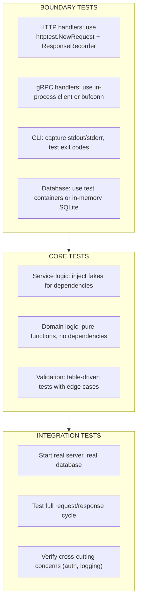

# Testing Philosophy

> Tests verify *what happened*, not *how it happened*. Good tests assert behavioral contracts and outcomes, not implementation details or call sequences.

---

## Core Principle

**Fakes over mocks: prefer real implementations with controlled behavior.**

Mocks verify that specific methods were called with specific arguments. Fakes actually *do* something—they implement the same interface with simplified, in-memory behavior. Mocks couple your tests to implementation; fakes couple your tests to contracts. When implementation changes, mock-heavy tests break. When contracts hold, fake-based tests pass.

This philosophy strongly favors *state-based testing* (asserting outcomes) over *interaction-based testing* (asserting calls).

**Terminology note:** "Mock" is often used as a catch-all for test doubles. In this document, *mock* specifically means an object that verifies interactions (call order, arguments, invocation counts). A *fake* is a working implementation with simplified behavior. A *stub* returns canned responses without verification. This distinction matters because interaction-based tests encode implementation details, while state-based tests encode contracts.

---

## Invariants

> Rules that must hold true. Violating these leads to bugs, leaks, or architectural debt.

- **Assert behavioral contracts, not call order.** Test what the system *did* (state changed, value returned, error produced), not what internal methods were invoked. **Outcome, not implementation.** If behavior is preserved, implementation changes shouldn't break tests.
- **Concurrency tests assert eventual outcomes, not timing.** Never rely on `time.Sleep` to synchronize concurrent tests. Use synchronization primitives, channels, or tools like `goleak` to verify goroutine behavior deterministically.
- **Time is a dependency; inject it like any other.** Code that calls `time.Now()` or `time.Sleep()` directly is untestable without real delays. Inject clocks to control time in tests. (See [DD_TIME_AND_CLOCKS.md](DD_TIME_AND_CLOCKS.md) for patterns.)
- **Every test must be independent and repeatable.** Tests that depend on execution order, global state, or external services are fragile. Isolation enables parallelism and reliable CI.

---

## The "Why" Behind This

Testing in Go is deceptively simple. The `testing` package provides `t.Run`, `t.Error`, and `t.Fatal`—nothing else. No assertion library, no mocking framework, no dependency injection container. This minimalism is intentional: Go's testing philosophy mirrors its language philosophy.

**Tests are part of design, not just validation.** If code is hard to test, that's feedback about the design—too many dependencies, unclear responsibilities, or hidden state. Testability is a quality signal, not a checkbox.

The ecosystem offers mocking libraries (`gomock`, `mockery`, `testify/mock`), but their presence doesn't mean they should be your default tool. The Go community has developed a strong preference for fakes over mocks—a preference that emerges from experience with the costs of mock-heavy test suites.

Mocks are seductive because they feel precise. You specify exactly what calls should happen, and the test fails if reality deviates. But this precision is a trap. You've encoded *how* the code works, not *what* it accomplishes. Refactor the implementation—split a method, reorder calls, add caching—and tests break, even though **behavior is identical**. You spend time updating test expectations rather than catching bugs.

Fakes invert this relationship. A fake repository stores data in a map; a fake HTTP client returns canned responses. The code under test uses the fake exactly as it would use the real thing. Your test verifies that after calling `CreateUser`, a subsequent `GetUser` returns the user. That's the contract. How storage happens is irrelevant.

This philosophy connects directly to [Types and Composition](02_TYPES_AND_COMPOSITION.md): interfaces should be small and discovered, not designed upfront. Small interfaces are easy to fake. A `UserGetter` with one method is trivial to implement. A `Repository` with fifteen methods is a burden—you must implement all fifteen even if your test exercises one.

---

## Key Concepts

### Table-Driven Tests

Table-driven tests are Go's signature testing pattern. Define test cases as data, loop over them, run each as a subtest.

```go
func TestParseAmount(t *testing.T) {
    tests := []struct {
        name    string
        input   string
        want    int64
        wantErr bool
    }{
        {name: "valid dollars", input: "$100", want: 10000, wantErr: false},
        {name: "valid cents", input: "$1.50", want: 150, wantErr: false},
        {name: "negative", input: "-$50", want: -5000, wantErr: false},
        {name: "invalid format", input: "100", want: 0, wantErr: true},
        {name: "empty string", input: "", want: 0, wantErr: true},
    }
    
    for _, tt := range tests {
        t.Run(tt.name, func(t *testing.T) {
            got, err := ParseAmount(tt.input)
            
            if (err != nil) != tt.wantErr {
                t.Errorf("ParseAmount(%q) error = %v, wantErr = %v", 
                    tt.input, err, tt.wantErr)
                return
            }
            if got != tt.want {
                t.Errorf("ParseAmount(%q) = %v, want %v", tt.input, got, tt.want)
            }
        })
    }
}
```

**Why table-driven tests work:**

1. **Adding cases is trivial**—just add a row to the table
2. **Each case is named**—failures identify which scenario broke
3. **Test logic is written once**—no copy-paste errors
4. **Subtests enable parallelism**—add `t.Parallel()` inside `t.Run`
5. **Subtests enable isolation**—run a single case with `go test -run TestParseAmount/valid_dollars`

**Parallel table tests require variable capture:**

```go
for _, tt := range tests {
    tt := tt // Capture loop variable (required before Go 1.22)
    t.Run(tt.name, func(t *testing.T) {
        t.Parallel()
        // ... test logic
    })
}
```

In Go 1.22+, the loop variable capture is no longer required due to language changes, but the pattern remains common in codebases supporting older versions.

### Fakes Over Mocks

A fake implements an interface with simplified behavior. A mock records calls and verifies expectations.

**Fake (preferred):**

```go
// Fake implementation for testing
type FakeUserStore struct {
    users map[string]*User
    mu    sync.RWMutex
}

func NewFakeUserStore() *FakeUserStore {
    return &FakeUserStore{users: make(map[string]*User)}
}

func (f *FakeUserStore) Get(ctx context.Context, id string) (*User, error) {
    f.mu.RLock()
    defer f.mu.RUnlock()
    
    user, ok := f.users[id]
    if !ok {
        return nil, ErrNotFound
    }
    return user, nil
}

func (f *FakeUserStore) Save(ctx context.Context, user *User) error {
    f.mu.Lock()
    defer f.mu.Unlock()
    
    f.users[user.ID] = user
    return nil
}

// Test using the fake
func TestUserService_CreateAndRetrieve(t *testing.T) {
    store := NewFakeUserStore()
    service := NewUserService(store)
    
    // Act
    created, err := service.CreateUser(ctx, "alice@example.com")
    if err != nil {
        t.Fatalf("CreateUser failed: %v", err)
    }
    
    // Assert outcome, not implementation
    retrieved, err := service.GetUser(ctx, created.ID)
    if err != nil {
        t.Fatalf("GetUser failed: %v", err)
    }
    
    if retrieved.Email != "alice@example.com" {
        t.Errorf("email = %q, want %q", retrieved.Email, "alice@example.com")
    }
}
```

**Mock (use sparingly):**

```go
// Mock verifies specific calls were made
type MockUserStore struct {
    GetFunc  func(ctx context.Context, id string) (*User, error)
    SaveFunc func(ctx context.Context, user *User) error
    
    GetCalls  []string // Records IDs passed to Get
    SaveCalls []*User  // Records users passed to Save
}

func (m *MockUserStore) Get(ctx context.Context, id string) (*User, error) {
    m.GetCalls = append(m.GetCalls, id)
    return m.GetFunc(ctx, id)
}

// Test using the mock
func TestUserService_CreateUser_CallsSave(t *testing.T) {
    mock := &MockUserStore{
        SaveFunc: func(ctx context.Context, user *User) error {
            return nil
        },
    }
    service := NewUserService(mock)
    
    service.CreateUser(ctx, "alice@example.com")
    
    // Assert implementation detail: Save was called
    if len(mock.SaveCalls) != 1 {
        t.Errorf("Save called %d times, want 1", len(mock.SaveCalls))
    }
}
```

The mock test is fragile. If `CreateUser` is refactored to batch saves or use a different storage path, the test breaks. The fake test is resilient—it verifies the contract (create then retrieve) regardless of implementation.

**When mocks are appropriate (last resort):**

Mocks are occasionally necessary, but treat them as exceptions requiring justification:

- Verifying that a notification was sent (side effect with no observable state)
- Testing error handling for specific failure modes that are hard to trigger
- Interactions with external services where you need precise control over responses

Even in these cases, prefer a fake with inspection capabilities when possible. A fake email sender that records sent messages is usually clearer than a mock that verifies `Send` was called. **If a side effect can be modeled as state (even temporary state), a fake is superior to a mock.**

### Testing HTTP Handlers

The `httptest` package provides tools for testing HTTP code without starting a server.

```go
func TestUserHandler_GetUser(t *testing.T) {
    // Arrange: create fake store with test data
    store := NewFakeUserStore()
    store.Save(ctx, &User{ID: "123", Email: "alice@example.com"})
    
    handler := NewUserHandler(store)
    
    // Create test request and recorder
    req := httptest.NewRequest("GET", "/users/123", nil)
    rec := httptest.NewRecorder()
    
    // Act
    handler.ServeHTTP(rec, req)
    
    // Assert
    if rec.Code != http.StatusOK {
        t.Errorf("status = %d, want %d", rec.Code, http.StatusOK)
    }
    
    var user User
    if err := json.NewDecoder(rec.Body).Decode(&user); err != nil {
        t.Fatalf("failed to decode response: %v", err)
    }
    
    if user.Email != "alice@example.com" {
        t.Errorf("email = %q, want %q", user.Email, "alice@example.com")
    }
}
```

**Testing HTTP clients with `httptest.Server`:**

```go
func TestAPIClient_FetchData(t *testing.T) {
    // Create a test server that returns canned response
    server := httptest.NewServer(http.HandlerFunc(func(w http.ResponseWriter, r *http.Request) {
        // Verify request
        if r.URL.Path != "/api/data" {
            t.Errorf("unexpected path: %s", r.URL.Path)
        }
        
        // Return canned response
        w.Header().Set("Content-Type", "application/json")
        json.NewEncoder(w).Encode(map[string]string{"status": "ok"})
    }))
    defer server.Close()
    
    // Point client at test server
    client := NewAPIClient(server.URL)
    
    data, err := client.FetchData(ctx)
    if err != nil {
        t.Fatalf("FetchData failed: %v", err)
    }
    
    if data.Status != "ok" {
        t.Errorf("status = %q, want %q", data.Status, "ok")
    }
}
```

### Testing Concurrent Code

Concurrent code requires special testing attention. The race detector and goroutine leak detection are essential tools.

**Always run tests with the race detector:**

```bash
go test -race ./...
```

The race detector instruments memory accesses and reports when two goroutines access the same variable concurrently with at least one write. It has no false positives—if it reports a race, you have a race. The cost is 2-20x slower execution and 5-10x more memory, so it's typically used in CI rather than local development loops.

**Testing for goroutine leaks with `goleak`:**

```go
import "go.uber.org/goleak"

func TestMain(m *testing.M) {
    goleak.VerifyTestMain(m)
}

// Or per-test:
func TestWorker_Shutdown(t *testing.T) {
    defer goleak.VerifyNone(t)
    
    worker := NewWorker()
    worker.Start()
    
    // Do work...
    
    worker.Stop()
    // goleak verifies no goroutines leaked
}
```

**Testing concurrent behavior without `time.Sleep`:**

```go
func TestWorker_ProcessesAllJobs(t *testing.T) {
    ctx, cancel := context.WithCancel(context.Background())
    defer cancel()
    
    jobs := make(chan Job, 10)
    results := make(chan Result, 10)
    
    worker := NewWorker(jobs, results)
    go worker.Run(ctx)
    
    // Send jobs
    for i := 0; i < 5; i++ {
        jobs <- Job{ID: i}
    }
    close(jobs)
    
    // Collect results with timeout
    collected := make([]Result, 0, 5)
    timeout := time.After(time.Second)
    
    for len(collected) < 5 {
        select {
        case r := <-results:
            collected = append(collected, r)
        case <-timeout:
            t.Fatalf("timed out waiting for results, got %d", len(collected))
        }
    }
    
    // Assert all jobs processed
    if len(collected) != 5 {
        t.Errorf("processed %d jobs, want 5", len(collected))
    }
}
```

**Key pattern:** Use channels and timeouts for synchronization, not sleeps. A sleep-based test might pass locally but fail in CI when the machine is under load.

### Testing with Context

Context is central to lifecycle management. Tests should verify that code respects cancellation.

```go
func TestService_RespectsContextCancellation(t *testing.T) {
    ctx, cancel := context.WithCancel(context.Background())
    
    store := NewFakeUserStore()
    // Make the fake slow to ensure cancellation can interrupt
    store.Delay = 100 * time.Millisecond
    
    service := NewUserService(store)
    
    // Cancel immediately
    cancel()
    
    _, err := service.GetUser(ctx, "123")
    
    if !errors.Is(err, context.Canceled) {
        t.Errorf("expected context.Canceled, got %v", err)
    }
}
```

**Testing shutdown sequences** (connects to [Graceful Shutdown](06_GRACEFUL_SHUTDOWN.md)):

```go
func TestServer_GracefulShutdown(t *testing.T) {
    defer goleak.VerifyNone(t)
    
    ctx, cancel := context.WithCancel(context.Background())
    
    server := NewServer(":0") // Random port
    
    // Start server
    errCh := make(chan error, 1)
    go func() {
        errCh <- server.Run(ctx)
    }()
    
    // Wait for server to be ready
    if err := server.WaitReady(time.Second); err != nil {
        t.Fatalf("server failed to start: %v", err)
    }
    
    // Trigger shutdown
    cancel()
    
    // Verify clean shutdown
    select {
    case err := <-errCh:
        if err != nil && !errors.Is(err, context.Canceled) {
            t.Errorf("unexpected shutdown error: %v", err)
        }
    case <-time.After(5 * time.Second):
        t.Fatal("shutdown timed out")
    }
}
```

### Test Helpers and `t.Helper()`

Mark helper functions with `t.Helper()` so that test failures report the caller's line number, not the helper's.

```go
func assertNoError(t *testing.T, err error) {
    t.Helper()
    if err != nil {
        t.Fatalf("unexpected error: %v", err)
    }
}

func assertUserEquals(t *testing.T, got, want *User) {
    t.Helper()
    if got.ID != want.ID {
        t.Errorf("ID = %q, want %q", got.ID, want.ID)
    }
    if got.Email != want.Email {
        t.Errorf("Email = %q, want %q", got.Email, want.Email)
    }
}

func TestUserService(t *testing.T) {
    // ...
    user, err := service.GetUser(ctx, "123")
    assertNoError(t, err) // Failure reports this line, not inside assertNoError
    assertUserEquals(t, user, expectedUser)
}
```

### Integration Tests and Build Tags

Separate unit tests from integration tests using build tags.

```go
//go:build integration

package store_test

import (
    "testing"
    // ...
)

func TestPostgresStore_Integration(t *testing.T) {
    // Requires real database
    db := setupTestDatabase(t)
    defer db.Close()
    
    store := NewPostgresStore(db)
    // ... test against real database
}
```

Run integration tests explicitly:

```bash
go test -tags=integration ./...
```

**Warning: Integration tests are not a dumping ground.** Integration tests should validate integration boundaries—that your code correctly talks to the database, the HTTP layer serializes correctly, authentication flows work end-to-end. They should *not* re-test business logic already covered by unit tests. When integration tests duplicate core logic assertions, they become slow, brittle, and low-signal. If an integration test fails, you should immediately know which *boundary* broke, not debug business logic.

---

## Boundary vs Core

> How testing differs at system boundaries vs core logic.

**Testing core logic** is straightforward: inject fakes, assert outcomes. Core code has no side effects beyond its return values and mutations to injected dependencies.

**Testing boundary code** requires more care:



**HTTP boundary testing pattern:**

```go
func TestHandler_Integration(t *testing.T) {
    // Real database (test container)
    db := testdb.New(t)
    
    // Real store, real service
    store := postgres.NewStore(db)
    service := NewUserService(store)
    handler := NewHandler(service)
    
    // Test through HTTP interface
    req := httptest.NewRequest("POST", "/users", 
        strings.NewReader(`{"email":"test@example.com"}`))
    req.Header.Set("Content-Type", "application/json")
    
    rec := httptest.NewRecorder()
    handler.ServeHTTP(rec, req)
    
    // Assert HTTP response
    if rec.Code != http.StatusCreated {
        t.Errorf("status = %d, want %d", rec.Code, http.StatusCreated)
    }
    
    // Verify side effect (user exists in database)
    var count int
    db.QueryRow("SELECT COUNT(*) FROM users WHERE email = $1", 
        "test@example.com").Scan(&count)
    if count != 1 {
        t.Error("user not created in database")
    }
}
```

---

## Trade-Off Matrix

| If You Need... | Choose... | Accept... |
|----------------|-----------|-----------|
| Fast, isolated tests | Fakes (in-memory implementations) | Must write/maintain fake implementations |
| Verify specific calls | Mocks (call recording) | Coupling to implementation details |
| Test external APIs | `httptest.Server` | Canned responses may drift from reality |
| Test concurrent code | Race detector + `goleak` | Slower test execution |
| Test time-dependent code | Injected clock interface | Additional abstraction layer |
| Test database interactions | Test containers | Slower tests, more infrastructure |
| Quick feedback loop | Unit tests with fakes | Less confidence in integration |
| High integration confidence | Integration tests | Slower, flakier, harder to debug |

---

## Interview Signals

| When Asked... | Demonstrate... |
|---------------|----------------|
| "How do you test in Go?" | Table-driven tests, fakes over mocks, race detector in CI. Tests verify outcomes, not call sequences. |
| "Mocks vs fakes?" | Mocks verify implementation (what methods were called). Fakes verify contracts (what behavior occurred). Fakes are more resilient to refactoring. |
| "How do you test concurrent code?" | Race detector (`-race` flag), `goleak` for leak detection, channels for synchronization—never `time.Sleep`. Assert eventual outcomes. |
| "How do you test HTTP handlers?" | `httptest.NewRequest` and `httptest.ResponseRecorder` for unit tests. `httptest.Server` for testing HTTP clients. No real network needed. |
| "What about integration tests?" | Build tags to separate from unit tests. Test containers for databases. Run in CI, not blocking local development. |
| "How do you make code testable?" | Small interfaces (easy to fake). Dependency injection via constructors. Time and randomness as injected dependencies. Separation of pure logic from I/O. |

---

## Bridge to Next

Tests verify that individual components and their interactions work correctly. But how do you *structure* those components? How do you decide what belongs in which package? When should you split a package? What's the difference between `internal/`, `cmd/`, and `pkg/`?

The next document explores **package and project design**: naming conventions, dependency direction, and the architectural patterns that keep large Go codebases maintainable. It reinforces the boundary/core distinction at the package level—your package structure should make the separation explicit.

→ Continue to [Package and Project Design](08_PACKAGE_AND_PROJECT_DESIGN.md)
