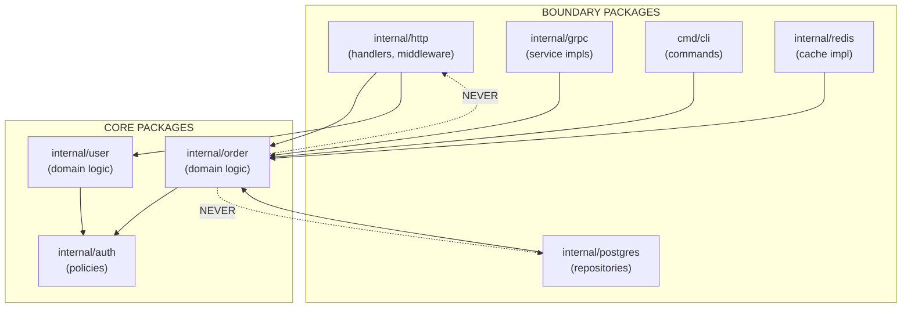

# Package and Project Design

> Package structure is architecture made visible. How you organize code determines how dependencies flow, what can change independently, and whether your system remains maintainable as it grows.

---

## Core Principle

**Name packages by responsibility, not by type.**

A package named `models` or `utils` tells you nothing about what it does—only what kind of things it contains. A package named `order` or `auth` or `postgres` communicates purpose. When you read an import path, you should understand *why* the code exists, not just *what form* it takes.

---

## Invariants

> Rules that must hold true. Violating these leads to bugs, leaks, or architectural debt.

- **Dependencies point inward: boundary → core, never core → boundary.** Your domain logic must not import HTTP handlers or database drivers. The dependency arrow points from infrastructure toward business logic, never the reverse.
- **`internal/` protects your right to change.** Code in `internal/` cannot be imported by external modules. Use it aggressively—it's your freedom to refactor without breaking consumers.
- **Packages must not form cycles.** If package A imports B and B imports A, you have a design problem. Go enforces this at compile time; the real discipline is designing to avoid it.
- **A package should have a single, clear purpose.** If you struggle to describe what a package does in one sentence, it's doing too much. Split it.

---

## The "Why" Behind This

Go's package system is both its organizational unit and its encapsulation boundary. Unlike languages with separate concepts for namespaces, modules, and visibility scopes, Go packages serve all these roles. This unification is intentional—it forces you to think about boundaries early and consistently.

The official Go documentation is deliberately minimal about project structure because *there is no universal correct layout*. A CLI tool, a library, and a microservice have different needs. The community has developed conventions, but these are patterns, not rules. The infamous "Standard Go Project Layout" repository is explicitly *not* endorsed by the Go team—it's a collection of common patterns that may or may not fit your project.

What Go *does* enforce is the `internal/` convention. Code under an `internal/` directory can only be imported by code rooted at the parent of `internal/`. This is compiler-enforced, not just convention. It exists to solve a real problem: once you export a package, changing its API is a breaking change. `internal/` lets you structure your code cleanly without committing to a public API.

The principle that dependencies should point inward comes from hexagonal architecture (ports and adapters) and clean architecture. The idea: your core business logic—the *reason your software exists*—should be independent of delivery mechanisms (HTTP, gRPC, CLI) and storage mechanisms (Postgres, Redis, S3). When your domain logic imports `net/http`, you've coupled your business rules to a transport protocol. That coupling makes testing harder, makes changes riskier, and makes the system harder to reason about.

---

## Key Concepts

### The Minimal Project Layout

Start simple. A Go project can be a single file:

```
myproject/
├── go.mod
├── main.go
└── main_test.go
```

This is appropriate for small tools and scripts. Don't add structure until complexity demands it. Over-engineering a project layout for a 500-line CLI tool is cargo-cult thinking.

As the project grows, you'll naturally need to split code. The question is *how*.

### The `cmd/` Convention

When a module produces multiple binaries, use `cmd/`:

```
myproject/
├── cmd/
│   ├── server/
│   │   └── main.go
│   └── migrate/
│       └── main.go
├── internal/
│   └── ...
└── go.mod
```

Each subdirectory of `cmd/` contains a `main` package that produces one binary. The `main.go` file should be minimal—just wiring and startup. Business logic lives elsewhere.

**Idiomatic:**

```go
// cmd/server/main.go
package main

import (
    "context"
    "log"
    "os/signal"
    "syscall"

    "myproject/internal/app"
    "myproject/internal/config"
)

func main() {
    ctx, stop := signal.NotifyContext(context.Background(),
        syscall.SIGTERM, syscall.SIGINT)
    defer stop()

    cfg, err := config.Load()
    if err != nil {
        log.Fatal(err)
    }

    if err := app.Run(ctx, cfg); err != nil {
        log.Fatal(err)
    }
}
```

**Anti-pattern—business logic in main:**

```go
// cmd/server/main.go
package main

func main() {
    // 500 lines of database setup, HTTP routing,
    // middleware configuration, business logic...
    // This is untestable and unmaintainable.
}
```

### The Composition Root

The **composition root** is the single place where concrete implementations are chosen and wired together. This is a critical architectural concept: there should be exactly one location—typically `main()` or an `internal/app` package—where you decide "this service will use PostgreSQL, this logger, this HTTP server."

**Invariant:** Domain packages must never construct infrastructure. If your `order` package calls `postgres.NewConnection()`, you've violated dependency direction and made testing harder.

```go
// internal/app/app.go — the composition root
package app

func Run(ctx context.Context, cfg Config) error {
    // Create infrastructure (boundary)
    db, err := postgres.Connect(cfg.DatabaseURL)
    if err != nil {
        return fmt.Errorf("connecting to database: %w", err)
    }
    defer db.Close()

    // Create repositories (boundary implementations)
    orderRepo := postgres.NewOrderRepository(db)
    userRepo := postgres.NewUserRepository(db)

    // Create services (core), injecting boundary implementations
    orderService := order.NewService(orderRepo)
    userService := user.NewService(userRepo)

    // Create HTTP handlers (boundary), injecting core services
    handler := httpapi.NewHandler(orderService, userService)

    // Run server
    return httpapi.Serve(ctx, cfg.Addr, handler)
}
```

The composition root is the only code that knows about *all* the concrete types. Domain packages see only interfaces; infrastructure packages implement them; the composition root connects them.

### The `internal/` Directory

`internal/` is Go's privacy mechanism for packages. The compiler prevents any package outside the module (or, for nested `internal/`, outside the parent directory) from importing code within `internal/`.

```
myproject/
├── internal/
│   ├── order/          # Domain logic
│   │   ├── order.go
│   │   └── service.go
│   ├── postgres/       # Database implementation
│   │   └── order_repo.go
│   └── http/           # HTTP handlers
│       └── order_handler.go
├── cmd/
│   └── server/
│       └── main.go
└── go.mod
```

**Use `internal/` aggressively.** The cost of over-exposing is high: once external code depends on your package, changing it is a breaking change. The cost of over-hiding is low: if you later decide to expose something, just move it out of `internal/`.

**What goes in `internal/`:**

- All application code for a service (handlers, services, repositories)
- Supporting packages that aren't meant for external consumption
- Experimental code you might remove or restructure

**What stays outside `internal/`:**

- Libraries explicitly designed for external use
- Shared packages in a multi-module repository (these get their own module)

### The `pkg/` Question

You'll see `pkg/` in many Go projects. Its intended meaning: "packages that are safe for external import." But this convention has significant problems:

1. **It's not enforced.** Unlike `internal/`, `pkg/` is purely conventional. Nothing prevents external code from importing your non-`pkg/` packages.
2. **It's often cargo-culted.** Many projects have `pkg/` containing packages that were never meant for external use.
3. **It adds noise.** Import paths become `myproject/pkg/thing` instead of `myproject/thing`.

The official Go module layout documentation doesn't recommend `pkg/`. Eli Bendersky's widely-cited article argues that `internal/` makes `pkg/` unnecessary: if something isn't in `internal/`, it's implicitly public.

**Guidance:** For new projects, prefer `internal/` for private code and root-level or clearly-named subdirectories for public packages. Use `pkg/` only if your organization has established that convention.

### Package Naming

Package names should be lowercase, single-word, and describe *what the package does*:

**Good names:**

```go
package order    // Handles order domain logic
package postgres // PostgreSQL implementations
package auth     // Authentication and authorization
package http     // HTTP transport layer (or httpapi to avoid shadowing)
```

**Bad names:**

```go
package models   // What models? For what?
package utils    // Grab-bag of unrelated functions
package common   // Even vaguer than utils
package helpers  // Same problem
package types    // Tells you nothing about domain
```

The standard library provides the gold standard: `fmt`, `net`, `http`, `io`, `os`. Short, clear, purposeful.

**Avoid stuttering.** A type in package `order` should be `order.Order` or `order.Service`, not `order.OrderService`. The package name is already context:

```go
// Good: no stuttering
order.New()
order.Service{}

// Bad: redundant
order.NewOrder()
order.OrderService{}
```

### Dependency Direction

This is where package design meets architecture. The invariant: **dependencies point inward**.



**Core packages (domain logic):**
- Define domain types, business rules, and service interfaces
- Know nothing about HTTP, gRPC, databases, or other infrastructure
- Depend only on the standard library and other core packages

**Boundary packages (infrastructure):**
- Implement interfaces defined in core packages
- Handle protocol-specific concerns (serialization, error translation)
- Depend on core packages and external libraries

**Example—interface defined in core, implemented at boundary:**

```go
// internal/order/repository.go (CORE)
package order

import "context"

// Repository defines persistence operations for orders.
// This interface is defined in the core package.
type Repository interface {
    Get(ctx context.Context, id string) (*Order, error)
    Save(ctx context.Context, order *Order) error
}

// Service uses the Repository interface, not a concrete implementation.
type Service struct {
    repo Repository
}

func NewService(repo Repository) *Service {
    return &Service{repo: repo}
}
```

```go
// internal/postgres/order_repo.go (BOUNDARY)
package postgres

import (
    "context"
    "database/sql"
    
    "myproject/internal/order"
)

// OrderRepository implements order.Repository using PostgreSQL.
type OrderRepository struct {
    db *sql.DB
}

// Compile-time check: ensure OrderRepository implements order.Repository
var _ order.Repository = (*OrderRepository)(nil)

func NewOrderRepository(db *sql.DB) *OrderRepository {
    return &OrderRepository{db: db}
}

func (r *OrderRepository) Get(ctx context.Context, id string) (*order.Order, error) {
    // PostgreSQL-specific implementation
}

func (r *OrderRepository) Save(ctx context.Context, o *order.Order) error {
    // PostgreSQL-specific implementation
}
```

The core `order` package knows nothing about PostgreSQL. You could swap in a different implementation (in-memory for tests, DynamoDB for production) without changing the domain logic.

**Anti-pattern—core importing boundary:**

```go
// internal/order/service.go (CORE) — WRONG
package order

import (
    "myproject/internal/postgres" // ❌ Core imports boundary
)

type Service struct {
    repo *postgres.OrderRepository // ❌ Concrete type, not interface
}

func NewService(connStr string) *Service {
    db := postgres.Connect(connStr) // ❌ Core constructs infrastructure
    return &Service{
        repo: postgres.NewOrderRepository(db),
    }
}
```

This violates dependency direction. Now `order` is tightly coupled to PostgreSQL—you can't test it without a database, can't swap storage backends, and can't reason about business logic in isolation. The fix is the interface pattern shown above: define the interface in core, implement at the boundary, inject at the composition root.

**Packages vs directories:** Directories suggest intent, but packages—not folders—are the true architectural boundary. A deep folder tree does not imply layering unless imports enforce it. The compiler cares about import paths, not filesystem depth. You can have a flat directory with correct dependencies or a nested tree with dependency violations.

### When to Split Packages

Split a package when:

1. **It has multiple distinct responsibilities.** If you can't describe the package's purpose in one sentence, split it.
2. **It has grown too large to navigate.** This is subjective, but if you frequently get lost looking for code, consider splitting.
3. **Different parts change for different reasons.** If user management and billing always change together, they might belong together. If they change independently, consider splitting.
4. **You need to hide implementation details.** Create a sub-package in `internal/` to reduce the surface area.

**Don't split prematurely.** A package with 3 files and 500 lines probably doesn't need to be split. Wait until you feel the pain.

### Configuration Patterns

Configuration wiring happens at the boundary—typically in `main()` or an `app` package.

**Constructor injection (preferred):**

```go
// Dependencies are explicit in the constructor signature
func NewOrderService(repo order.Repository, notifier Notifier) *OrderService {
    return &OrderService{
        repo:     repo,
        notifier: notifier,
    }
}
```

**Functional options (for optional configuration):**

```go
type ServerOption func(*Server)

func WithTimeout(d time.Duration) ServerOption {
    return func(s *Server) {
        s.timeout = d
    }
}

func WithLogger(l *slog.Logger) ServerOption {
    return func(s *Server) {
        s.logger = l
    }
}

func NewServer(addr string, opts ...ServerOption) *Server {
    s := &Server{
        addr:    addr,
        timeout: 30 * time.Second, // default
        logger:  slog.Default(),   // default
    }
    for _, opt := range opts {
        opt(s)
    }
    return s
}

// Usage
srv := NewServer(":8080",
    WithTimeout(60*time.Second),
    WithLogger(customLogger),
)
```

Functional options shine when you have many optional parameters with sensible defaults. They're more verbose than a config struct but allow for validation and transformation during construction.

**Config structs (for many parameters):**

```go
type ServerConfig struct {
    Addr         string
    ReadTimeout  time.Duration
    WriteTimeout time.Duration
    Logger       *slog.Logger
    TLSConfig    *tls.Config
}

func NewServer(cfg ServerConfig) *Server {
    // ...
}
```

Config structs work well when most parameters are required or when you want to load configuration from files/environment.

---

## Boundary vs Core

> Package structure should make the boundary/core distinction explicit.

This document reinforces the boundary/core framing introduced in [Error Philosophy](03_ERROR_PHILOSOPHY.md). Your package structure should *visualize* this separation:

```
internal/
├── order/           # CORE: domain logic, interfaces
│   ├── order.go     # Domain types
│   ├── service.go   # Business rules
│   └── errors.go    # Domain errors (ErrNotFound, etc.)
├── user/            # CORE: another domain
│   └── ...
├── httpapi/         # BOUNDARY: HTTP transport
│   ├── order_handler.go
│   ├── user_handler.go
│   └── middleware.go
├── grpcapi/         # BOUNDARY: gRPC transport
│   └── ...
├── postgres/        # BOUNDARY: database
│   ├── order_repo.go
│   └── user_repo.go
└── redis/           # BOUNDARY: cache
    └── ...
```

**Naming note:** Prefer `httpapi` or `httptransport` over `internal/http`. While technically valid, a package named `http` causes import shadowing with the standard library, grep ambiguity, and cognitive overhead in mixed contexts.

**Naming alternatives:**

Some teams prefer explicit boundary naming:

```
internal/
├── domain/          # or "core"
│   ├── order/
│   └── user/
├── adapters/        # or "infra" or "boundary"
│   ├── httpapi/
│   ├── postgres/
│   └── redis/
```

Both approaches work. What matters is consistency and that the structure communicates the architectural intent.

---

## Trade-Off Matrix

| If You Need... | Choose... | Accept... |
|----------------|-----------|-----------|
| External consumers | Root-level packages outside `internal/` | API stability commitment |
| Freedom to refactor | `internal/` for all application code | Longer import paths |
| Multiple binaries | `cmd/` subdirectories | Minimal `main.go` files |
| Optional configuration | Functional options | More verbose constructors |
| Many required parameters | Config structs | Less discoverability of options |
| Clean domain separation | Separate core/boundary packages | More packages to manage |
| Simple project | Single package at root | Will need refactoring as you grow |

---

## Interview Signals

| When Asked... | Demonstrate... |
|---------------|----------------|
| "How do you structure Go projects?" | Start simple (single package), grow as needed. Use `internal/` aggressively. `cmd/` for multiple binaries. No cargo-culting—structure serves the code, not vice versa. Package structure is expected to evolve; early flattening is a feature, not a failure. |
| "What's the purpose of `internal/`?" | Compiler-enforced privacy. Protects your freedom to refactor without breaking external consumers. Use it for anything that shouldn't be part of your public API. |
| "Should I use `pkg/`?" | Probably not. `internal/` provides enforced privacy; anything outside `internal/` is implicitly public. `pkg/` is purely conventional and often cargo-culted. |
| "How do you name packages?" | By responsibility, not by type. `order`, `auth`, `postgres`—not `models`, `utils`, `types`. Short, lowercase, single-word when possible. |
| "How do dependencies flow?" | Inward: boundary → core. HTTP handlers depend on domain services, not vice versa. Domain packages define interfaces; infrastructure packages implement them. |
| "Where do you wire dependencies?" | At the composition root—typically `main()` or `internal/app`. This is the only place that knows all concrete types. Domain packages see interfaces only. |
| "When do you split packages?" | When a package has multiple responsibilities, grows too large to navigate, or when different parts change for different reasons. Not prematurely. |
| "Functional options vs config structs?" | Functional options for optional parameters with sensible defaults. Config structs when most parameters are required or when loading from files/environment. |

---

## Bridge to Next

You've now completed the core document sequence: from Go's design philosophy through types, errors, context, concurrency, shutdown, testing, and package design. These concepts form an interconnected whole—each building on the previous, each reinforcing the others.

The final core document is the **Quick Reference**: a condensed cheat sheet of invariants, decision matrices, and interview signals from across the handbook. It's designed for the day before an interview, when you need to refresh the key principles without re-reading everything.

→ Continue to [Quick Reference](09_QUICK_REFERENCE.md)

→ Deep dive: [Dependency Injection](DD_DEPENDENCY_INJECTION.md) — constructor injection, functional options, and wire-free DI
