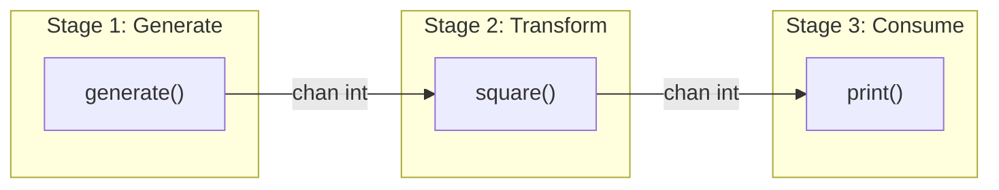
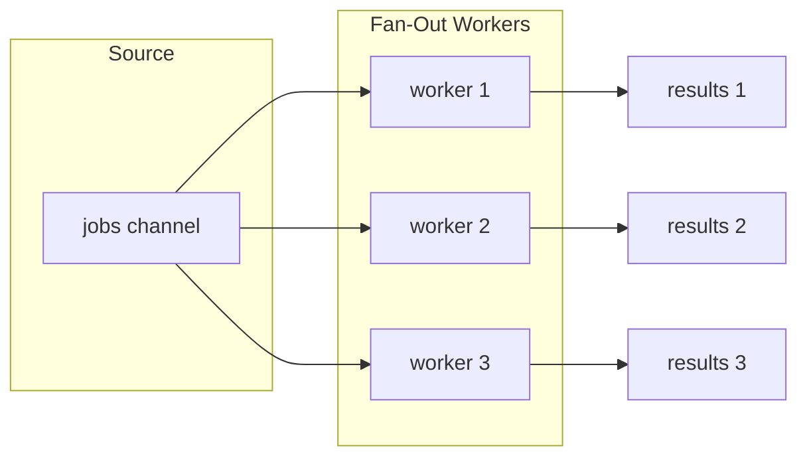

# Channel Patterns

> Channels are Go's primitives for communication between goroutines. Mastering channel patterns means understanding when to use them, how to compose them safely, and how to avoid the subtle bugs that emerge when channels interact with cancellation, errors, and resource management.

---

## Core Principle

**Channels transfer ownership; the sender relinquishes, the receiver acquires.**

When you send a value on a channel, you're not just passing data—you're transferring responsibility. The sender should no longer access or modify the value; the receiver now owns it. This mental model prevents races and clarifies who is responsible for what at any point in your concurrent program.

---

## Invariants

> Rules that must hold true. Violating these leads to bugs, leaks, or architectural debt.

- **The goroutine that owns the channel's lifecycle is responsible for closing it.** Closing signals "no more values." In single-producer scenarios, the sender closes. In multi-producer scenarios (fan-in), a coordinator that knows when all producers are done closes. Receivers never close. Closing from the receiver side causes panics; closing twice causes panics.
- **Every channel operation must have a cancellation path.** A channel send or receive without a `ctx.Done()` case or a guaranteed counterpart is a potential goroutine leak.
- **Buffered channels are for decoupling timing, not for correctness.** If your code only works with a specific buffer size, you have a design bug. Unbuffered channels make synchronization explicit. One legitimate exception: buffer size equals number of producers, allowing all producers to send and exit without blocking while a coordinator drains results.
- **Nil channels block forever; use this intentionally or not at all.** A `nil` channel in a select case effectively disables that case. This is a feature for dynamic channel management, but a trap if accidental.

---

## The "Why" Behind This

Channels implement Go's CSP (Communicating Sequential Processes) model. The insight from CSP is that synchronization should happen at communication points, not through shared state. When two goroutines communicate via a channel, the send and receive synchronize them—no locks required, no race conditions possible on the transferred data.

But channels are not magic. They introduce their own complexity: deadlocks from mismatched senders and receivers, goroutine leaks from blocked operations, and subtle bugs when channels interact with context cancellation. The patterns in this document address these challenges.

The standard library and production Go code use a small set of well-understood channel patterns. These patterns compose: a pipeline stage can be a fan-out source; an or-done channel can wrap any channel to make it cancellation-aware. Learning these patterns gives you building blocks for complex concurrent systems.

Channels are most powerful when used for *coordination*, not just *data transfer*. A channel that signals "work is done" (by closing) coordinates goroutines even if no data passes through it. The `done` channel idiom—a channel closed to signal completion—is pervasive in Go precisely because channels are coordination primitives first.

---

## Key Concepts

### Channel Semantics Recap

Before diving into patterns, ensure these fundamentals are clear:

| Operation | Unbuffered Channel | Buffered Channel (not full) | Buffered Channel (full) | Closed Channel |
|-----------|-------------------|----------------------------|------------------------|----------------|
| Send `ch <- v` | Blocks until receiver ready | Does not block | Blocks until space available | **Panic** |
| Receive `<-ch` | Blocks until sender ready | Does not block if values present | Does not block if values present | Returns zero value immediately |
| Close `close(ch)` | Unblocks all receivers | Unblocks all receivers after drain | Unblocks all receivers after drain | **Panic** |

**Key insight:** Receiving from a closed channel returns immediately with the zero value. Use the two-value receive form to detect closure:

```go
v, ok := <-ch
if !ok {
    // Channel is closed; v is zero value
}
```

**Ranging over channels** handles this automatically—`for v := range ch` exits when the channel closes.

### The Generator Pattern

A generator is a function that returns a channel and spawns a goroutine to produce values. The caller receives values; the goroutine produces them.

```go
func generateNumbers(ctx context.Context, start, count int) <-chan int {
    out := make(chan int)
    go func() {
        defer close(out) // Sender closes
        for i := 0; i < count; i++ {
            select {
            case <-ctx.Done():
                return
            case out <- start + i:
            }
        }
    }()
    return out
}

// Usage
ctx, cancel := context.WithTimeout(context.Background(), time.Second)
defer cancel()

for n := range generateNumbers(ctx, 1, 100) {
    fmt.Println(n)
}
```

**Pattern elements:**

1. **Returns receive-only channel** (`<-chan T`)—caller can only receive, not close
2. **Goroutine owns the channel**—creates it, writes to it, closes it
3. **Context for cancellation**—prevents goroutine leaks if caller stops early
4. **`defer close(out)`**—ensures channel closes on all exit paths

**Anti-pattern—no cancellation path:**

```go
// WRONG: Leaks goroutine if caller stops receiving
func generateForever(start int) <-chan int {
    out := make(chan int)
    go func() {
        for i := start; ; i++ {
            out <- i // Blocks forever when nobody receives
        }
    }()
    return out
}
```

### The Pipeline Pattern

A pipeline is a series of stages connected by channels. Each stage receives values from upstream, performs work, and sends results downstream.



```go
// Stage 1: Generate values
func generate(ctx context.Context, nums ...int) <-chan int {
    out := make(chan int)
    go func() {
        defer close(out)
        for _, n := range nums {
            select {
            case <-ctx.Done():
                return
            case out <- n:
            }
        }
    }()
    return out
}

// Stage 2: Transform values
func square(ctx context.Context, in <-chan int) <-chan int {
    out := make(chan int)
    go func() {
        defer close(out)
        for n := range in {
            select {
            case <-ctx.Done():
                return
            case out <- n * n:
            }
        }
    }()
    return out
}

// Stage 3: Consume (in main goroutine or another stage)
func main() {
    ctx, cancel := context.WithCancel(context.Background())
    defer cancel()
    
    // Build pipeline: generate → square → consume
    nums := generate(ctx, 1, 2, 3, 4, 5)
    squares := square(ctx, nums)
    
    for result := range squares {
        fmt.Println(result)
    }
}
```

**Pipeline properties:**

- **Each stage owns its output channel**—creates and closes it
- **Stages are independent goroutines**—they run concurrently
- **Closing propagates downstream**—when `generate` closes `nums`, `square` exits its range loop and closes `squares`
- **Cancellation propagates via context**—all stages check `ctx.Done()`

**Why pipelines matter:** Pipelines decompose complex processing into simple, testable stages. Each stage has one responsibility. Stages can be reused, replaced, or composed differently. The pipeline structure makes data flow explicit.

### Fan-Out

Fan-out distributes work from one channel to multiple goroutines. Use fan-out when:

- Work items are independent (no ordering requirements)
- Processing is CPU-bound or has high latency
- You want to parallelize a pipeline stage

```go
func fanOut(ctx context.Context, in <-chan Job, numWorkers int) []<-chan Result {
    workers := make([]<-chan Result, numWorkers)
    for i := 0; i < numWorkers; i++ {
        workers[i] = worker(ctx, in)
    }
    return workers
}

func worker(ctx context.Context, in <-chan Job) <-chan Result {
    out := make(chan Result)
    go func() {
        defer close(out)
        for job := range in {
            select {
            case <-ctx.Done():
                return
            case out <- process(job):
            }
        }
    }()
    return out
}
```

**Key insight:** Multiple goroutines receiving from the same channel naturally distribute work—Go's channel semantics ensure each value goes to exactly one receiver. No explicit distribution logic needed.



### Fan-In

Fan-in merges multiple channels into one. It's the complement to fan-out—collecting results from parallel workers into a single stream.

```go
func fanIn(ctx context.Context, channels ...<-chan Result) <-chan Result {
    out := make(chan Result)
    var wg sync.WaitGroup
    
    // Start a goroutine for each input channel
    for _, ch := range channels {
        wg.Add(1)
        go func(c <-chan Result) {
            defer wg.Done()
            for result := range c {
                select {
                case <-ctx.Done():
                    return
                case out <- result:
                }
            }
        }(ch)
    }
    
    // Close output when all inputs are drained
    go func() {
        wg.Wait()
        close(out)
    }()
    
    return out
}
```

**Usage with fan-out:**

```go
func processJobs(ctx context.Context, jobs <-chan Job) <-chan Result {
    // Fan out to 5 workers
    workerChannels := fanOut(ctx, jobs, 5)
    
    // Fan in results
    return fanIn(ctx, workerChannels...)
}
```

**Fan-in invariants:**

- **Output closes only when all inputs close**—use `WaitGroup` to coordinate
- **Cancellation must stop all merge goroutines**—check `ctx.Done()` in each
- **Order is non-deterministic**—results arrive as workers complete, not in input order

### The Or-Channel Pattern

The or-channel collapses multiple cancellation signals into one. It returns a channel that closes when *any* of its input channels close.

```go
func or(channels ...<-chan struct{}) <-chan struct{} {
    switch len(channels) {
    case 0:
        return nil
    case 1:
        return channels[0]
    }
    
    orDone := make(chan struct{})
    go func() {
        defer close(orDone)
        switch len(channels) {
        case 2:
            select {
            case <-channels[0]:
            case <-channels[1]:
            }
        default:
            select {
            case <-channels[0]:
            case <-channels[1]:
            case <-channels[2]:
            case <-or(append(channels[3:], orDone)...):
            }
        }
    }()
    return orDone
}
```

**Usage—race multiple operations:**

```go
func doWork(ctx context.Context) {
    // Create operation-specific done channels
    done1 := make(chan struct{})
    done2 := make(chan struct{})
    
    go func() { /* operation 1 */ close(done1) }()
    go func() { /* operation 2 */ close(done2) }()
    
    // Wait for first completion OR context cancellation
    select {
    case <-or(done1, done2, ctx.Done()):
        // At least one completed or cancelled
    }
}
```

**When to use or-channel:**

- Racing multiple independent operations
- Combining multiple cancellation sources
- First-one-wins semantics

**Caveat:** The recursive implementation has O(N) goroutine and stack overhead. This is fine for small, static channel sets. For large or dynamic channel sets, prefer iterative approaches or unify signals through a shared `context.Context`.

**Note:** For simple cases, `context.WithCancel` often suffices. Or-channel shines when combining signals from different subsystems that don't share a context.

### The Or-Done Channel Pattern

Or-done wraps any channel to make it respect cancellation. It's essential when consuming channels from code you don't control.

```go
func orDone[T any](ctx context.Context, in <-chan T) <-chan T {
    out := make(chan T)
    go func() {
        defer close(out)
        for {
            select {
            case <-ctx.Done():
                return
            case v, ok := <-in:
                if !ok {
                    return
                }
                select {
                case <-ctx.Done():
                    return
                case out <- v:
                }
            }
        }
    }()
    return out
}
```

**Why the nested select?** The outer select waits for input. But after receiving, we must also check cancellation before sending—the downstream consumer might have stopped. Without the inner select, we'd block on send after cancellation.

**Usage:**

```go
// Safely consume from a channel that doesn't respect context
for item := range orDone(ctx, externalChannel) {
    process(item)
}
// Loop exits on context cancellation OR channel close
```

**Or-done is defensive programming.** When you receive a channel from external code, you don't know if it respects cancellation. Wrapping with or-done ensures your code can always exit cleanly.

### The Tee Channel Pattern

Tee splits one channel into two, sending each value to both outputs. Named after the Unix `tee` command.

```go
func tee[T any](ctx context.Context, in <-chan T) (<-chan T, <-chan T) {
    out1 := make(chan T)
    out2 := make(chan T)
    
    go func() {
        defer close(out1)
        defer close(out2)
        
        for val := range orDone(ctx, in) {
            // Create local copies for the select
            // to avoid sending to the same channel twice
            var out1, out2 = out1, out2
            
            // Send to both, in either order
            for i := 0; i < 2; i++ {
                select {
                case <-ctx.Done():
                    return
                case out1 <- val:
                    out1 = nil // Disable this case
                case out2 <- val:
                    out2 = nil // Disable this case
                }
            }
        }
    }()
    
    return out1, out2
}
```

**The nil channel trick:** After successfully sending to `out1`, we set it to `nil`. A nil channel blocks forever in a select, effectively disabling that case. The loop then sends to `out2` on the second iteration. This ensures both outputs receive the value without favoring either.

**Usage:**

```go
values := generate(ctx, 1, 2, 3, 4, 5)
copy1, copy2 := tee(ctx, values)

// Both channels receive all values
go func() {
    for v := range copy1 {
        log.Println("log:", v)
    }
}()

for v := range copy2 {
    process(v)
}
```

**Caution:** Tee introduces *shared backpressure*: the slowest downstream consumer governs throughput. If one output blocks, the other blocks too. Use buffered channels or separate goroutines to decouple consumers when their processing rates differ significantly.

### The Bridge Channel Pattern

Bridge flattens a channel of channels into a single channel. It "bridges" nested channel structures.

```go
func bridge[T any](ctx context.Context, chanStream <-chan <-chan T) <-chan T {
    out := make(chan T)
    go func() {
        defer close(out)
        for {
            var stream <-chan T
            select {
            case <-ctx.Done():
                return
            case maybeStream, ok := <-chanStream:
                if !ok {
                    return
                }
                stream = maybeStream
            }
            
            for val := range orDone(ctx, stream) {
                select {
                case <-ctx.Done():
                    return
                case out <- val:
                }
            }
        }
    }()
    return out
}
```

**When to use bridge:**

- Consuming from an API that returns channels (e.g., paginated results as channels)
- Composing generators that each produce channels
- Flattening hierarchical concurrent structures

**Trade-off:** Bridge consumes inner channels *sequentially*—only one inner channel drains at a time. This preserves ordering between streams but serializes throughput. If you need parallel flattening (all inner channels consumed concurrently), use fan-in over the inner channels instead.

**Usage:**

```go
// genChannels returns a channel that emits channels
genChannels := func() <-chan <-chan int {
    out := make(chan (<-chan int))
    go func() {
        defer close(out)
        for i := 0; i < 3; i++ {
            out <- generate(ctx, i*10, i*10+5)
        }
    }()
    return out
}

// Bridge flattens to a single stream
for v := range bridge(ctx, genChannels()) {
    fmt.Println(v) // Prints 0-4, then 10-14, then 20-24
}
```

### Select Patterns

The `select` statement is the control structure for channel operations.

**Non-blocking operations with default:**

```go
select {
case ch <- value:
    // Sent
default:
    // Channel not ready; handle backpressure
}
```

**Timeout pattern:**

```go
timer := time.NewTimer(5 * time.Second)
defer timer.Stop()

select {
case result := <-resultCh:
    return result, nil
case <-timer.C:
    return nil, errors.New("timeout")
case <-ctx.Done():
    return nil, ctx.Err()
}
```

**Warning:** Avoid `time.After` in loops—it leaks timers. Use `time.NewTimer` with explicit `Stop()`. In loops, drain the channel before `Reset()`.

**Priority select (rarely needed):**

```go
for {
    select {
    case <-highPriority:
        handle()
    default:
        select {
        case <-highPriority:
            handle()
        case <-lowPriority:
            handleLow()
        }
    }
}
```

If you need true priority, consider separate goroutines or a priority queue—not nested selects.

### Bounded Channels as Semaphores

A buffered channel can act as a semaphore, limiting concurrent operations:

```go
func processWithLimit(ctx context.Context, items []Item, maxConcurrent int) error {
    sem := make(chan struct{}, maxConcurrent)
    var wg sync.WaitGroup
    
    for _, item := range items {
        // Acquire semaphore (blocks if at limit)
        select {
        case <-ctx.Done():
            break
        case sem <- struct{}{}:
        }
        
        wg.Add(1)
        go func(item Item) {
            defer wg.Done()
            defer func() { <-sem }() // Release semaphore
            
            process(ctx, item)
        }(item)
    }
    
    wg.Wait()
    return ctx.Err()
}
```

**How it works:** The buffered channel holds up to `maxConcurrent` tokens. Each goroutine acquires a token before starting and releases it when done. When the channel is full, new goroutines block on the send.

**Trade-off:** Channel semaphores are simple but create goroutines that may block. For high-volume workloads, consider `golang.org/x/sync/semaphore` which provides a weighted semaphore without goroutine overhead.

---

## Pattern Composition

The real power emerges when composing patterns. Here's a complete example: parallel file processing with bounded concurrency.

```go
func processFiles(ctx context.Context, paths []string, maxWorkers int) <-chan Result {
    // Stage 1: Generate file paths
    pathCh := make(chan string)
    go func() {
        defer close(pathCh)
        for _, p := range paths {
            select {
            case <-ctx.Done():
                return
            case pathCh <- p:
            }
        }
    }()
    
    // Stage 2: Fan-out to workers (bounded)
    workerResults := make([]<-chan Result, maxWorkers)
    for i := 0; i < maxWorkers; i++ {
        workerResults[i] = processWorker(ctx, pathCh)
    }
    
    // Stage 3: Fan-in results
    return fanIn(ctx, workerResults...)
}

func processWorker(ctx context.Context, paths <-chan string) <-chan Result {
    out := make(chan Result)
    go func() {
        defer close(out)
        for path := range paths {
            result := processFile(ctx, path)
            select {
            case <-ctx.Done():
                return
            case out <- result:
            }
        }
    }()
    return out
}
```

**This composition provides:**

- **Bounded parallelism**—exactly `maxWorkers` concurrent file operations
- **Backpressure**—if workers are slow, the path generator blocks
- **Clean cancellation**—context cancellation stops all stages
- **Single output stream**—caller receives results as they complete

---

## Trade-Off Matrix

| If You Need... | Choose... | Accept... |
|----------------|-----------|-----------|
| Data flow between stages | Pipeline | Increased goroutine count |
| Parallel processing | Fan-out / Fan-in | Non-deterministic ordering |
| First-wins semantics | Or-channel | Complexity of combining signals |
| Cancel-safe channel consumption | Or-done wrapper | Extra goroutine per wrapped channel |
| Duplicate stream | Tee | Coupled consumer timing |
| Flatten channel-of-channels | Bridge | Sequential inner channel consumption |
| Bounded concurrency | Semaphore channel | Blocked goroutines when at limit |
| Non-blocking operation | Select with default | Must handle the default case |

---

## Common Mistakes

| Mistake | Consequence | Fix |
|---------|-------------|-----|
| Closing from receiver | Panic | Only sender closes; receiver uses range or detects close with `ok` |
| Forgetting `ctx.Done()` case | Goroutine leak | Every blocking channel op needs a cancellation path |
| Closing channel twice | Panic | Use `sync.Once` or track closure state |
| Sending to nil channel | Permanent block | Initialize channels before use; use nil intentionally |
| Unbounded fan-out | Memory exhaustion | Use bounded worker pools or semaphore |
| Ignoring closed channel | Zero value bugs | Always check the `ok` return from receive |
| `time.After` in loop | Timer leak | Use `time.NewTimer` once; call `Stop()` and drain before `Reset()` |

---

## Interview Signals

| When Asked... | Demonstrate... |
|---------------|----------------|
| "What's the mental model for channels?" | Channels transfer ownership: the sender relinquishes, the receiver acquires. After sending, the sender should no longer access the value. This prevents races and clarifies responsibility. |
| "Explain fan-out/fan-in" | Fan-out: multiple goroutines receive from one channel, naturally distributing work. Fan-in: merge multiple channels into one using goroutines per input, `WaitGroup` to know when all inputs close, close output after all done. |
| "How do you prevent goroutine leaks with channels?" | Every send/receive must have a cancellation path via `ctx.Done()`. Use or-done to wrap channels you don't control. Test with `goleak`. |
| "How do you guarantee goroutines exit on shutdown?" | Context cancellation propagates the signal. Channel closure causes range loops to exit. WaitGroup ensures the parent waits for children. Fan-in coordinator closes output only after all inputs drain. Combine all four for robust shutdown. |
| "When would you use a buffered channel?" | Decouple producer/consumer timing, not for correctness. Known bounded work (e.g., results from N goroutines into buffer of N). Semaphore for limiting concurrency. |
| "What's the pipeline pattern?" | Stages connected by channels; each stage owns its output channel; closing propagates downstream; context propagates cancellation. Decomposes processing into testable, composable stages. |
| "Who should close a channel?" | The goroutine that owns the channel's lifecycle. In single-producer: the sender. In multi-producer (fan-in): the coordinator that knows when all producers finished. Receivers never close. |
| "How do you handle multiple cancellation sources?" | Or-channel combines multiple done channels; first close propagates. Or-done wraps channels to add cancellation awareness. Context is the standard mechanism when sources share lifecycle. |
| "What's the nil channel trick?" | Nil channels block forever in select, effectively disabling that case. Useful for dynamic channel management—disable a case by setting its channel to nil. |

---

## Bridge to Related Documents

This deep dive extends [Concurrency Architecture](05_CONCURRENCY_ARCHITECTURE.md), which established goroutine ownership and the for-select pattern. Channel patterns build on those foundations.

For bounded worker pools that use these channel patterns, see [DD_WORKER_POOLS.md](DD_WORKER_POOLS.md). Worker pools combine fan-out with backpressure mechanisms and graceful shutdown—taking the patterns here into production-ready implementations.

For testing concurrent code that uses these patterns, see [Testing Philosophy](07_TESTING_PHILOSOPHY.md), particularly sections on `goleak` and avoiding `time.Sleep` in tests.
