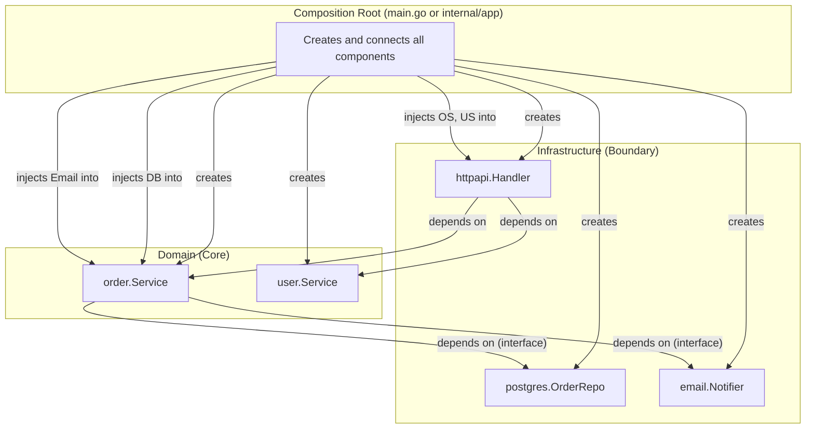

# Dependency Injection

> Dependency injection in Go is manual, explicit, and framework-free. It's not a pattern you import—it's a design discipline where constructors declare their needs and the composition root wires concrete implementations.

---

## Core Principle

**Dependencies are parameters, not globals.**

Every dependency a component needs should be passed explicitly through its constructor. No hidden `init()` magic, no package-level variables that secretly connect systems, no service locators that obscure what a function actually requires. When dependencies are parameters, the compiler enforces completeness, tests become trivial, and the code documents itself.

---

## Invariants

> Rules that must hold true. Violating these leads to bugs, leaks, or architectural debt.

- **Core packages define interfaces; boundary packages implement them.** The direction of abstraction follows the dependency rule: domain logic declares what it needs, infrastructure provides it. Never the reverse.
- **The composition root is the only place that knows all concrete types.** Domain packages see interfaces. Infrastructure packages implement interfaces. Only `main()` or `internal/app` sees both and wires them together.
- **Constructors return concrete types, not interfaces.** This gives callers maximum flexibility—they can assign the result to any interface they define. Returning interfaces hides capabilities and couples callers to the producer's abstraction choices. (This applies to public constructors; internal helpers within a package may return interfaces when deliberately hiding implementation details.)
- **Circular dependencies indicate design problems, not DI limitations.** If A needs B and B needs A, one of them has too many responsibilities. Extract the shared behavior into a third component.

---

## The "Why" Behind This

In languages like Java, Spring, or C#, dependency injection is synonymous with frameworks—containers that scan for annotations, resolve dependency graphs at runtime, and instantiate objects through reflection. This approach trades explicitness for convenience: you don't write wiring code, but you also can't see what's connected to what without running the application or consulting framework documentation.

Go takes a different path. There's no standard DI framework, no annotation processing, no reflection-based wiring. This isn't a limitation—it's a choice that aligns with Go's philosophy of explicitness over magic. In Go, dependency injection is just *passing arguments to functions*. Your `main()` function (or composition root) creates dependencies in the right order and passes them to constructors. That's it.

This manual approach has profound benefits. The wiring code is visible, grep-able, and debuggable. The compiler catches missing dependencies at build time, not runtime. Tests can inject fakes without framework configuration. New team members understand the system by reading `main.go`, not by learning a framework's lifecycle hooks.

The cost is boilerplate. As applications grow, the composition root grows too—sometimes to hundreds of lines of wiring code. This is where tools like Wire provide value: they generate the boilerplate while preserving compile-time safety. But even without code generation, manual DI scales surprisingly well. The wiring code is repetitive but simple, and its explicitness pays dividends in maintainability.

The key insight is that DI isn't about frameworks—it's about *inverting control*. Instead of a component reaching out to get its dependencies (service locator pattern), dependencies are pushed in from outside (dependency injection). This inversion makes components testable, composable, and decoupled from infrastructure decisions.

---

## Key Concepts

### Constructor Injection

Constructor injection is the primary DI pattern in Go. Dependencies are passed as parameters to a `NewX` function that returns an initialized struct.

```go
// internal/order/service.go (CORE)
package order

type Repository interface {
    Get(ctx context.Context, id string) (*Order, error)
    Save(ctx context.Context, order *Order) error
}

type Notifier interface {
    NotifyOrderCreated(ctx context.Context, order *Order) error
}

type Service struct {
    repo     Repository
    notifier Notifier
    clock    Clock
}

func NewService(repo Repository, notifier Notifier, clock Clock) *Service {
    return &Service{
        repo:     repo,
        notifier: notifier,
        clock:    clock,
    }
}

func (s *Service) CreateOrder(ctx context.Context, items []Item) (*Order, error) {
    order := &Order{
        ID:        generateID(),
        Items:     items,
        CreatedAt: s.clock.Now(),
    }
    
    if err := s.repo.Save(ctx, order); err != nil {
        return nil, fmt.Errorf("saving order: %w", err)
    }
    
    // Notification is best-effort
    if err := s.notifier.NotifyOrderCreated(ctx, order); err != nil {
        // Log but don't fail
    }
    
    return order, nil
}
```

**What makes this idiomatic:**

1. **Interfaces are defined in the consumer package** (`order`), not the producer package
2. **Dependencies are explicit** in the constructor signature—no hidden requirements
3. **The constructor returns a concrete type** (`*Service`), not an interface
4. **All dependencies are stored as interfaces**, enabling testing with fakes

**Anti-pattern—constructing dependencies internally:**

```go
// WRONG: Service creates its own dependencies
func NewService(dbURL string, smtpHost string) *Service {
    db := postgres.Connect(dbURL)           // Hidden dependency on postgres package
    notifier := email.NewNotifier(smtpHost) // Hidden dependency on email package
    return &Service{
        repo:     postgres.NewOrderRepo(db),
        notifier: notifier,
    }
}
```

This violates dependency inversion. The `order` package now imports `postgres` and `email`—boundary packages. Testing requires a real database and SMTP server (or complex mocking). The dependency graph is hidden inside the constructor.

### The Composition Root Pattern

The composition root is where all wiring happens. It's typically `main()` or a dedicated `internal/app` package.



**Complete composition root example:**

```go
// internal/app/app.go
package app

import (
    "context"
    "fmt"
    
    "myproject/internal/email"
    "myproject/internal/httpapi"
    "myproject/internal/order"
    "myproject/internal/postgres"
    "myproject/internal/user"
)

type Config struct {
    DatabaseURL string
    SMTPHost    string
    HTTPAddr    string
}

func Run(ctx context.Context, cfg Config) error {
    // 1. Create infrastructure (outermost layer)
    db, err := postgres.Connect(cfg.DatabaseURL)
    if err != nil {
        return fmt.Errorf("connecting to database: %w", err)
    }
    defer db.Close()
    
    notifier := email.NewNotifier(cfg.SMTPHost)
    clock := &RealClock{}
    
    // 2. Create repositories (boundary implementations)
    orderRepo := postgres.NewOrderRepository(db)
    userRepo := postgres.NewUserRepository(db)
    
    // 3. Create domain services (core), injecting interfaces
    orderService := order.NewService(orderRepo, notifier, clock)
    userService := user.NewService(userRepo, clock)
    
    // 4. Create transport layer (boundary), injecting services
    handler := httpapi.NewHandler(orderService, userService)
    
    // 5. Run
    return httpapi.Serve(ctx, cfg.HTTPAddr, handler)
}
```

**Key observations:**

- **Creation order follows dependency order**: infrastructure first, then repositories, then services, then transport
- **Each layer sees only what it needs**: `orderService` sees `Repository` interface, not `*postgres.OrderRepository`
- **Shutdown order is reverse of creation**: implicit via `defer` or explicit shutdown sequence (see [Graceful Shutdown](06_GRACEFUL_SHUTDOWN.md))
- **The composition root is the only file that imports all packages**—this is intentional and correct

**Why the composition root has authority:** The composition root is the only place where dependency direction is allowed to be "violated"—it imports both core and boundary packages. This temporary violation at the edge of the system restores correct dependency direction everywhere else. Domain packages never import infrastructure; the composition root makes that possible by doing all the wiring in one place.

### Functional Options Pattern

When a constructor has many optional parameters with sensible defaults, functional options provide a clean API:

```go
type Server struct {
    addr         string
    readTimeout  time.Duration
    writeTimeout time.Duration
    logger       *slog.Logger
    middleware   []Middleware
}

type Option func(*Server)

func WithReadTimeout(d time.Duration) Option {
    return func(s *Server) {
        s.readTimeout = d
    }
}

func WithWriteTimeout(d time.Duration) Option {
    return func(s *Server) {
        s.writeTimeout = d
    }
}

func WithLogger(l *slog.Logger) Option {
    return func(s *Server) {
        s.logger = l
    }
}

func WithMiddleware(m ...Middleware) Option {
    return func(s *Server) {
        s.middleware = append(s.middleware, m...)
    }
}

func NewServer(addr string, opts ...Option) *Server {
    // Defaults
    s := &Server{
        addr:         addr,
        readTimeout:  30 * time.Second,
        writeTimeout: 30 * time.Second,
        logger:       slog.Default(),
    }
    
    // Apply options
    for _, opt := range opts {
        opt(s)
    }
    
    return s
}

// Usage
srv := NewServer(":8080",
    WithReadTimeout(60*time.Second),
    WithLogger(customLogger),
    WithMiddleware(authMiddleware, loggingMiddleware),
)
```

**When to use functional options:**

- Many optional parameters (more than 2-3)
- Sensible defaults exist for most parameters
- Parameters may be added over time (backward-compatible extension)
- Options require validation or transformation
- **Construction logic owns the defaults**—the constructor decides sensible values

**When to prefer config structs:**

- Most parameters are required
- Configuration comes from files/environment (struct maps naturally to JSON/YAML)
- No complex validation needed during construction
- **Configuration lifecycle exists outside the constructor**—values are loaded, validated, and passed in from external sources

### Config Struct Pattern

Config structs work well when parameters are numerous and mostly required:

```go
type ServiceConfig struct {
    // Required
    Repository Repository
    Notifier   Notifier
    
    // Optional with defaults
    Clock         Clock
    RetryAttempts int
    BatchSize     int
}

func (c *ServiceConfig) setDefaults() {
    if c.Clock == nil {
        c.Clock = &RealClock{}
    }
    if c.RetryAttempts == 0 {
        c.RetryAttempts = 3
    }
    if c.BatchSize == 0 {
        c.BatchSize = 100
    }
}

func NewService(cfg ServiceConfig) (*Service, error) {
    // Validate required fields
    if cfg.Repository == nil {
        return nil, errors.New("repository is required")
    }
    if cfg.Notifier == nil {
        return nil, errors.New("notifier is required")
    }
    
    cfg.setDefaults()
    
    return &Service{
        repo:     cfg.Repository,
        notifier: cfg.Notifier,
        clock:    cfg.Clock,
        retries:  cfg.RetryAttempts,
        batch:    cfg.BatchSize,
    }, nil
}
```

**Hybrid approach—required params + options:**

```go
func NewService(repo Repository, notifier Notifier, opts ...Option) *Service {
    s := &Service{
        repo:     repo,     // Required: in signature
        notifier: notifier, // Required: in signature
        clock:    &RealClock{}, // Optional: has default
    }
    for _, opt := range opts {
        opt(s)
    }
    return s
}
```

This pattern makes required dependencies visually distinct (positional parameters) while allowing optional configuration (variadic options).

### Interface Segregation in Practice

Consumer-defined interfaces naturally lead to interface segregation. Each consumer defines only what it needs:

```go
// internal/order/service.go
package order

// This service needs to save and retrieve orders
type Repository interface {
    Get(ctx context.Context, id string) (*Order, error)
    Save(ctx context.Context, order *Order) error
}
```

```go
// internal/reporting/service.go
package reporting

// This service only needs to read orders
type OrderReader interface {
    Get(ctx context.Context, id string) (*order.Order, error)
}
```

```go
// internal/cleanup/service.go
package cleanup

// This service needs to delete old orders
type OrderDeleter interface {
    Delete(ctx context.Context, id string) error
    ListOlderThan(ctx context.Context, t time.Time) ([]string, error)
}
```

The same `*postgres.OrderRepository` satisfies all three interfaces. Each consumer depends only on what it uses. This is interface segregation emerging naturally from Go's implicit satisfaction.

**Testing benefits:** Each consumer's tests need only implement the methods that consumer calls:

```go
// Fake for order.Repository (2 methods)
type fakeOrderRepo struct {
    orders map[string]*order.Order
}

func (f *fakeOrderRepo) Get(ctx context.Context, id string) (*order.Order, error) {
    o, ok := f.orders[id]
    if !ok {
        return nil, order.ErrNotFound
    }
    return o, nil
}

func (f *fakeOrderRepo) Save(ctx context.Context, o *order.Order) error {
    f.orders[o.ID] = o
    return nil
}
```

### Avoiding Circular Dependencies

Circular dependencies are a design smell, not a DI problem. If package A needs B and B needs A, extract the shared concern:

**Warning:** If two services depend on each other even via interfaces, this often indicates missing use-case orchestration rather than missing abstraction. Interfaces are not a magic escape hatch from design problems.

**Before (circular):**

```go
// BROKEN: These packages import each other
package user
import "myproject/internal/order"

type Service struct {
    orderSvc *order.Service // user needs order
}

package order
import "myproject/internal/user"

type Service struct {
    userSvc *user.Service // order needs user
}
```

**After (extracted interface):**

```go
// order/service.go
package order

type UserGetter interface {
    GetUser(ctx context.Context, id string) (*User, error)
}

type Service struct {
    users UserGetter // order depends on interface
}
```

```go
// user/service.go
package user

type OrderLister interface {
    ListOrdersForUser(ctx context.Context, userID string) ([]*Order, error)
}

type Service struct {
    orders OrderLister // user depends on interface
}
```

```go
// Composition root wires concrete types to interfaces
orderSvc := order.NewService(userSvc)  // *user.Service satisfies UserGetter
userSvc := user.NewService(orderSvc)   // *order.Service satisfies OrderLister

// Wait—this is still circular at the wiring level!
```

**True solution—extract shared logic or rethink responsibilities:**

```go
// Often, one direction is the "real" dependency
// and the other is a convenience that should be refactored

// Maybe user.Service shouldn't know about orders at all
// Instead, a higher-level use case orchestrates both:

// internal/usecase/userprofile.go
package usecase

type UserProfileService struct {
    users  UserGetter
    orders OrderLister
}

func (s *UserProfileService) GetUserWithOrders(ctx context.Context, userID string) (*UserProfile, error) {
    user, err := s.users.GetUser(ctx, userID)
    if err != nil {
        return nil, err
    }
    orders, err := s.orders.ListOrdersForUser(ctx, userID)
    if err != nil {
        return nil, err
    }
    return &UserProfile{User: user, Orders: orders}, nil
}
```

### Manual DI vs Wire

Google's Wire tool generates composition root code from provider functions:

**Manual DI:**

```go
func Run(ctx context.Context, cfg Config) error {
    db, err := postgres.Connect(cfg.DatabaseURL)
    if err != nil {
        return err
    }
    defer db.Close()
    
    orderRepo := postgres.NewOrderRepository(db)
    userRepo := postgres.NewUserRepository(db)
    
    orderService := order.NewService(orderRepo)
    userService := user.NewService(userRepo)
    
    handler := httpapi.NewHandler(orderService, userService)
    
    return httpapi.Serve(ctx, cfg.HTTPAddr, handler)
}
```

**Wire provider set:**

```go
// wire.go
//go:build wireinject

package app

import "github.com/google/wire"

var providerSet = wire.NewSet(
    postgres.Connect,
    postgres.NewOrderRepository,
    postgres.NewUserRepository,
    order.NewService,
    user.NewService,
    httpapi.NewHandler,
)

func InitializeApp(ctx context.Context, cfg Config) (*httpapi.Handler, func(), error) {
    wire.Build(providerSet)
    return nil, nil, nil
}
```

Wire generates the actual wiring code at build time. The generated code is equivalent to manual DI—no runtime reflection.

**When to use Wire:**

- Large applications with many dependencies (50+ components)
- Frequent changes to the dependency graph
- Team prefers declarative provider definitions

**When to stay manual:**

- Small to medium applications
- Team values explicit wiring code
- Simpler debugging (no code generation step)

**The honest comparison:**

| Aspect | Manual DI | Wire |
|--------|-----------|------|
| Boilerplate | More typing | Less typing |
| Debuggability | Direct—step through wiring | Generated code (readable but extra step) |
| Compile-time safety | Yes | Yes |
| Learning curve | None | Wire-specific concepts |
| Build complexity | None | Requires `go generate` |
| Refactoring | Explicit changes needed | Re-run generation |

For most Go applications, manual DI is sufficient and preferable. Wire becomes valuable when the composition root exceeds ~200 lines and changes frequently.

### Testing with Dependency Injection

DI's payoff is in testing. When dependencies are injected, replacing them with fakes is trivial:

```go
func TestOrderService_CreateOrder(t *testing.T) {
    // Create fakes
    repo := &fakeOrderRepo{orders: make(map[string]*order.Order)}
    notifier := &fakeNotifier{}
    clock := &fakeClock{now: time.Date(2024, 1, 1, 12, 0, 0, 0, time.UTC)}
    
    // Inject fakes into the real service
    svc := order.NewService(repo, notifier, clock)
    
    // Exercise the service
    created, err := svc.CreateOrder(ctx, []order.Item{{SKU: "ABC", Qty: 2}})
    
    // Assert outcomes
    if err != nil {
        t.Fatalf("unexpected error: %v", err)
    }
    if created.CreatedAt != clock.now {
        t.Errorf("CreatedAt = %v, want %v", created.CreatedAt, clock.now)
    }
    
    // Verify side effects via fake state
    saved, ok := repo.orders[created.ID]
    if !ok {
        t.Error("order not saved to repository")
    }
    if !notifier.called {
        t.Error("notifier not called")
    }
}
```

**No mocking library needed.** The fakes are simple structs that implement interfaces. They record what happened (for verification) and return canned responses (for test scenarios).

**Why fakes over mocks:** Fakes model *state*, not *expectations*. The `fakeOrderRepo` above maintains a map of orders—it behaves like a real repository, just simpler. This aligns tests with domain behavior. Mocks, by contrast, verify call sequences ("Save was called with these arguments")—coupling tests to implementation choreography rather than outcomes. When you refactor how a service works internally, fake-based tests keep passing as long as behavior is preserved; mock-based tests break.

This connects directly to [Testing Philosophy](07_TESTING_PHILOSOPHY.md): fakes over mocks. DI makes fakes easy to inject; small interfaces make fakes easy to implement.

---

## Boundary vs Core

> How DI behaves differently at system boundaries vs core logic.

**In core packages (domain logic):**

- Define interfaces for dependencies
- Accept interfaces via constructor injection
- No knowledge of concrete implementations
- Zero imports from boundary packages

```go
// internal/order/service.go (CORE)
package order

// Interfaces defined here
type Repository interface { /* ... */ }
type Notifier interface { /* ... */ }

// Constructor accepts interfaces
func NewService(repo Repository, notifier Notifier) *Service {
    return &Service{repo: repo, notifier: notifier}
}
```

**In boundary packages (infrastructure):**

- Implement interfaces defined in core
- May have their own dependencies (database connections, HTTP clients)
- Return concrete types from constructors

```go
// internal/postgres/order_repo.go (BOUNDARY)
package postgres

import "myproject/internal/order"

type OrderRepository struct {
    db *sql.DB
}

// Compile-time check: ensure we implement the interface
var _ order.Repository = (*OrderRepository)(nil)

func NewOrderRepository(db *sql.DB) *OrderRepository {
    return &OrderRepository{db: db}
}
```

**Note on compile-time interface checks:** The `var _ order.Repository = (*OrderRepository)(nil)` pattern is optional but valuable. It fails fast when refactoring breaks interface conformance. This is most useful in boundary packages where concrete types implement interfaces defined elsewhere—catching mismatches at compile time rather than when wiring in the composition root.

**At the composition root:**

- Imports both core and boundary packages
- Creates concrete implementations
- Injects them where interfaces are expected

```go
// internal/app/app.go (COMPOSITION ROOT)
package app

import (
    "myproject/internal/order"    // core
    "myproject/internal/postgres" // boundary
)

func Run(cfg Config) error {
    db := postgres.Connect(cfg.DatabaseURL)
    
    orderRepo := postgres.NewOrderRepository(db)  // concrete
    orderService := order.NewService(orderRepo)   // injected as interface
    
    // ...
}
```

---

## Trade-Off Matrix

| If You Need... | Choose... | Accept... |
|----------------|-----------|-----------|
| Explicit, debuggable wiring | Manual DI | More boilerplate |
| Reduced boilerplate at scale | Wire | Build-time code generation |
| Optional parameters with defaults | Functional options | More verbose API |
| Configuration from files/env | Config structs | Less API flexibility |
| Maximum testability | Constructor injection + interfaces | Interface definitions overhead |
| Simple standalone tools | Direct instantiation (no DI) | Reduced testability, tighter coupling |

---

## Common Mistakes

| Mistake | Consequence | Fix |
|---------|-------------|-----|
| Constructing dependencies inside constructors | Hidden coupling, untestable | Accept dependencies as parameters |
| Returning interfaces from constructors | Hides capabilities, couples to producer's abstraction | Return concrete types |
| Defining interfaces in producer packages | Consumers depend on more than they need | Define interfaces at consumer |
| Package-level variables for dependencies | Hidden global state, test interference | Constructor injection |
| Service locator pattern | Hidden dependencies, unclear requirements | Explicit constructor parameters |
| Too many constructor parameters (>5) | Unwieldy API, possible SRP violation | Consider splitting component or using config struct |
| Circular dependencies | Compile error or runtime panic | Extract shared interface to third package; rethink responsibilities |

---

## Interview Signals

| When Asked... | Demonstrate... |
|---------------|----------------|
| "How does Go handle dependency injection?" | Manual, explicit, framework-free. Dependencies are constructor parameters. Composition root (main/app) wires everything. No runtime reflection—compile-time safety. |
| "Where do you wire dependencies?" | At the composition root—typically `main()` or `internal/app`. This is the only place that imports all concrete types. Domain packages see only interfaces. |
| "Functional options vs config structs?" | Functional options for optional parameters with defaults, extensible API, validation during construction. Config structs when parameters are required, configuration comes from files, or struct mapping is convenient. |
| "How do you avoid circular dependencies?" | Define interfaces in the consumer package. If A needs B and B needs A, extract the shared concern into a third component or reconsider responsibilities. Circular dependencies indicate design problems. |
| "What about Wire or other DI frameworks?" | Wire generates code at build time—no runtime reflection. Valuable for large apps (50+ components). For most apps, manual DI is simpler and equally safe. |
| "How does DI relate to testing?" | DI makes testing trivial. Dependencies are interfaces; tests inject fakes. No mocking frameworks needed—just structs that implement the interface. |
| "Constructor injection vs field injection?" | Go doesn't have field injection (no annotations). Constructor injection is the only pattern: dependencies are explicit in the constructor signature. This is a feature—dependencies are visible and required. |

---

## Quick Reference: DI Patterns

```go
// 1. Constructor Injection (primary pattern)
func NewService(repo Repository, notifier Notifier) *Service

// 2. Functional Options (optional params)
func NewServer(addr string, opts ...Option) *Server
srv := NewServer(":8080", WithTimeout(30*time.Second))

// 3. Config Struct (many params, file-based config)
func NewService(cfg ServiceConfig) (*Service, error)

// 4. Hybrid (required + optional)
func NewService(repo Repository, opts ...Option) *Service

// 5. Compile-time interface check
var _ Repository = (*PostgresRepository)(nil)
```

---

## Bridge to Related Documents

This deep dive extends [Package and Project Design](08_PACKAGE_AND_PROJECT_DESIGN.md), which introduced the composition root and dependency direction. The patterns here—constructor injection, functional options, config structs—are the implementation details of that architectural principle.

The interface patterns in [DD_INTERFACE_PATTERNS.md](DD_INTERFACE_PATTERNS.md) provide the foundation: small, consumer-defined interfaces make DI practical. Without interface segregation, injecting dependencies means implementing large interfaces in fakes—defeating much of the testing benefit.

For injecting time as a dependency (a specific and common case), see [DD_TIME_AND_CLOCKS.md](DD_TIME_AND_CLOCKS.md). Clock injection follows the same patterns described here but addresses the unique challenges of testing time-dependent code.

The testing benefits of DI are explored in [Testing Philosophy](07_TESTING_PHILOSOPHY.md), particularly the "fakes over mocks" stance that DI enables.
