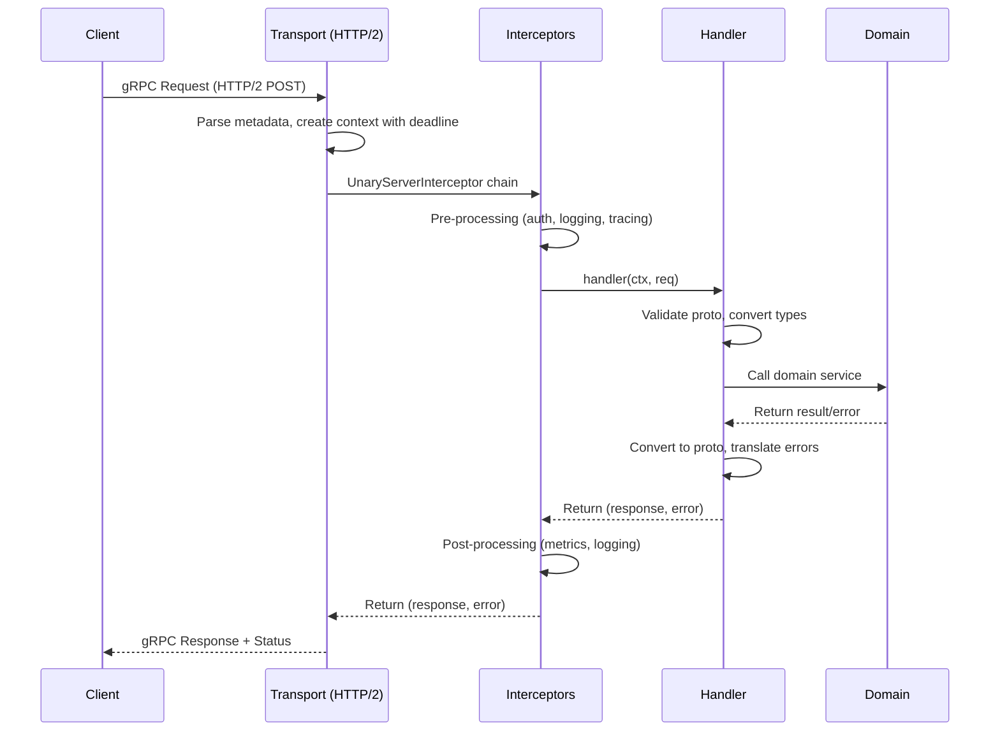
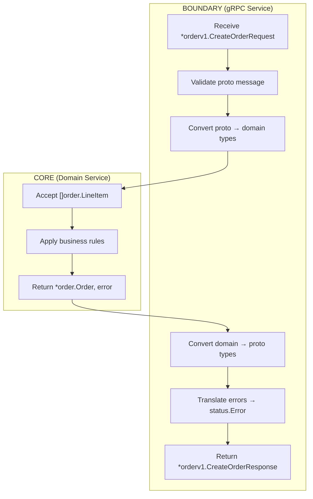

# gRPC Server Patterns

> gRPC servers in Go are built on `google.golang.org/grpc`—a high-performance RPC framework with strongly-typed contracts, bidirectional streaming, and first-class support for deadlines, cancellation, and metadata. Mastering gRPC means understanding interceptors, streaming lifecycles, error handling, and service design patterns that keep your transport layer thin.

---

## Core Principle

**Services are boundaries; proto files are contracts.**

gRPC services are the outermost layer of your application—they translate between protocol buffer messages and your domain logic. The `.proto` file defines the contract; the generated Go code provides type safety. Business logic does not belong in service implementations. When services stay thin, your domain logic remains testable, portable, and protocol-agnostic.

---

## Invariants

> Rules that must hold true. Violating these leads to bugs, leaks, or architectural debt.

- **Always respect context cancellation.** gRPC propagates deadlines and cancellation automatically. Methods that ignore `ctx.Done()` waste resources and may hold connections open longer than clients expect.
- **Return gRPC status codes, not raw errors.** Clients expect `status.Error` with appropriate codes. Returning `fmt.Errorf` creates `codes.Unknown`, losing semantic information. Domain errors must be translated at the boundary.
- **Interceptors must call the handler or return an error—never silently drop requests.** An interceptor that conditionally proceeds must be explicit about both branches. Silent early returns cause mysterious request failures.
- **Streaming methods own their stream lifecycle.** For server streams, the handler returns when the stream ends. For client streams, the handler must call `Recv()` until `io.EOF`. For bidirectional streams, both directions must be properly closed.
- **Metadata is for transport concerns, not business data.** Request IDs, authentication tokens, and tracing headers belong in metadata. Domain data belongs in the protobuf message.
- **Streaming handlers must treat `Send` as a backpressure point.** A blocked `Send` means the client or network is slow. Handlers must respect context cancellation and avoid unbounded buffering—never outpace your consumer.

---

## The "Why" Behind This

gRPC differs fundamentally from HTTP/JSON APIs. Where HTTP APIs are text-based, loosely typed, and built on request-response semantics, gRPC is binary, strongly typed, and supports streaming. These differences have architectural consequences.

The `.proto` file is your API contract—a machine-readable specification that generates client and server code in any supported language. This contract-first design inverts the typical Go pattern of "accept interfaces, return structs." In gRPC, the interface is generated from the contract, and you implement it. This is a deliberate trade-off: you lose Go's implicit interface satisfaction but gain cross-language type safety and documentation.

gRPC's context integration is deeper than HTTP's. Deadlines and cancellation propagate automatically across service boundaries—when client A calls service B which calls service C, a deadline set by A flows through B to C without explicit plumbing. This is powerful but requires vigilance: your code must respect these signals, or you'll hold resources after clients have given up.

The interceptor pattern in gRPC mirrors HTTP middleware but with cleaner separation between unary (request-response) and streaming calls. Unlike HTTP middleware, which wraps a single `Handler` interface, gRPC interceptors are typed separately for unary and stream calls. This makes streaming-specific concerns explicit rather than hidden in generic middleware.

The boundary/core distinction from [Error Philosophy](03_ERROR_PHILOSOPHY.md) applies directly: gRPC services are *translation layers*—they speak protocol buffers on one side and domain interfaces on the other. When a service implementation contains business logic, you've conflated transport with domain. The result is code that's coupled to protobuf types, hard to test without gRPC scaffolding, and impossible to expose via other transports.

---

## Key Concepts

### Service Definition and Implementation

gRPC services are defined in `.proto` files and compiled to Go interfaces:

```protobuf
// api/proto/order/v1/order.proto
syntax = "proto3";
package order.v1;
option go_package = "myproject/gen/order/v1;orderv1";

service OrderService {
    rpc CreateOrder(CreateOrderRequest) returns (CreateOrderResponse);
    rpc GetOrder(GetOrderRequest) returns (GetOrderResponse);
    rpc ListOrders(ListOrdersRequest) returns (stream Order);
    rpc StreamOrderUpdates(stream OrderUpdateRequest) returns (stream OrderUpdate);
}

message CreateOrderRequest {
    repeated LineItem items = 1;
}

message CreateOrderResponse {
    string order_id = 1;
    google.protobuf.Timestamp created_at = 2;
}
// ... more messages
```

The generated Go code provides an interface to implement:

```go
// Generated by protoc-gen-go-grpc
type OrderServiceServer interface {
    CreateOrder(context.Context, *CreateOrderRequest) (*CreateOrderResponse, error)
    GetOrder(context.Context, *GetOrderRequest) (*GetOrderResponse, error)
    ListOrders(*ListOrdersRequest, OrderService_ListOrdersServer) error
    StreamOrderUpdates(OrderService_StreamOrderUpdatesServer) error
    mustEmbedUnimplementedOrderServiceServer()
}
```

**Implementing the service:**

```go
// internal/grpcapi/order_server.go (BOUNDARY)
package grpcapi

type OrderServer struct {
    orderv1.UnimplementedOrderServiceServer // Required for forward compatibility
    service order.Service                    // Domain service (interface)
    logger  *slog.Logger
}

func NewOrderServer(service order.Service, logger *slog.Logger) *OrderServer {
    return &OrderServer{
        service: service,
        logger:  logger,
    }
}

func (s *OrderServer) CreateOrder(
    ctx context.Context,
    req *orderv1.CreateOrderRequest,
) (*orderv1.CreateOrderResponse, error) {
    // 1. Validate proto message
    if len(req.GetItems()) == 0 {
        return nil, status.Error(codes.InvalidArgument, "items cannot be empty")
    }
    
    // 2. Convert proto to domain types
    items := make([]order.LineItem, len(req.GetItems()))
    for i, item := range req.GetItems() {
        items[i] = order.LineItem{
            SKU:      item.GetSku(),
            Quantity: int(item.GetQuantity()),
        }
    }
    
    // 3. Call domain service
    created, err := s.service.CreateOrder(ctx, items)
    if err != nil {
        return nil, s.toGRPCError(err)
    }
    
    // 4. Convert domain to proto
    return &orderv1.CreateOrderResponse{
        OrderId:   created.ID,
        CreatedAt: timestamppb.New(created.CreatedAt),
    }, nil
}

func (s *OrderServer) toGRPCError(err error) error {
    switch {
    case errors.Is(err, order.ErrNotFound):
        return status.Error(codes.NotFound, err.Error())
    case errors.Is(err, order.ErrValidation):
        return status.Error(codes.InvalidArgument, err.Error())
    case errors.Is(err, order.ErrConflict):
        return status.Error(codes.AlreadyExists, err.Error())
    case errors.Is(err, context.DeadlineExceeded):
        return status.Error(codes.DeadlineExceeded, "operation timed out")
    case errors.Is(err, context.Canceled):
        return status.Error(codes.Canceled, "operation canceled")
    default:
        s.logger.Error("internal error", "error", err)
        return status.Error(codes.Internal, "internal error")
    }
}
```

**Key design decisions:**

1. **Embed `UnimplementedXxxServer`** for forward compatibility—new RPC methods won't break your build
2. **Accept domain service as interface**, not concrete type—enables testing with fakes
3. **Translate at the boundary**: proto → domain before calling service; domain → proto before returning
4. **Centralize error translation** in a helper method; maintain consistency across all RPCs

### Canonical Error Mapping

Error translation must be centralized and explicit. Without a canonical mapping, different team members will translate the same domain error to different gRPC codes, causing semantic drift across your API.

**Error mapping discipline:**

| Principle | Rationale |
|-----------|-----------|
| One mapping table per service boundary | Consistency across all RPCs in a service |
| Mapping owned by boundary layer | Domain must not know about gRPC codes |
| Use `errors.Is` for matching | Supports wrapped errors; never match on strings |
| New domain errors require mapping updates | Explicit review step prevents silent `codes.Internal` |
| Log before returning `codes.Internal` | Unknown errors need visibility for debugging |

**Reference mapping table:**

```go
// internal/grpcapi/errors.go — canonical mapping for this service
package grpcapi

var domainToGRPC = map[error]codes.Code{
    order.ErrNotFound:   codes.NotFound,
    order.ErrValidation: codes.InvalidArgument,
    order.ErrConflict:   codes.AlreadyExists,
    order.ErrForbidden:  codes.PermissionDenied,
}

func toGRPCError(err error, logger *slog.Logger) error {
    // Check context errors first (always take precedence)
    if errors.Is(err, context.DeadlineExceeded) {
        return status.Error(codes.DeadlineExceeded, "deadline exceeded")
    }
    if errors.Is(err, context.Canceled) {
        return status.Error(codes.Canceled, "canceled")
    }
    
    // Check domain errors using errors.Is (supports wrapping)
    for domainErr, code := range domainToGRPC {
        if errors.Is(err, domainErr) {
            return status.Error(code, err.Error())
        }
    }
    
    // Unknown error — log and return Internal
    logger.Error("unmapped error", "error", err)
    return status.Error(codes.Internal, "internal error")
}
```

**Invariant:** Every new domain error type must have an entry in the mapping table. Code review should catch domain errors that fall through to `codes.Internal`.

### The Request Lifecycle

Understanding gRPC's request flow clarifies where interceptors, context, and handlers interact:



**Context propagation:**

gRPC automatically extracts deadlines from incoming requests and sets them on the context. If a client sets a 5-second deadline, `ctx.Done()` will fire after 5 seconds—your code must respect this:

```go
func (s *OrderServer) GetOrder(
    ctx context.Context,
    req *orderv1.GetOrderRequest,
) (*orderv1.GetOrderResponse, error) {
    // Context already has deadline from client
    // No need to create a new deadline unless you want a shorter one
    
    order, err := s.service.GetOrder(ctx, req.GetOrderId())
    if err != nil {
        // If context was canceled/expired, the domain service should
        // return context.Canceled or context.DeadlineExceeded
        return nil, s.toGRPCError(err)
    }
    
    return toOrderResponse(order), nil
}
```

**Metadata access:**

```go
func (s *OrderServer) GetOrder(
    ctx context.Context,
    req *orderv1.GetOrderRequest,
) (*orderv1.GetOrderResponse, error) {
    // Read incoming metadata
    md, ok := metadata.FromIncomingContext(ctx)
    if ok {
        if requestIDs := md.Get("x-request-id"); len(requestIDs) > 0 {
            // Use request ID for logging/tracing
            ctx = WithRequestID(ctx, requestIDs[0])
        }
    }
    
    // ... handle request
    
    // Set response headers (before first response byte)
    header := metadata.Pairs("x-served-by", hostname)
    grpc.SetHeader(ctx, header)
    
    // Set response trailers (after response completes)
    trailer := metadata.Pairs("x-processing-time-ms", fmt.Sprint(elapsed.Milliseconds()))
    grpc.SetTrailer(ctx, trailer)
    
    return response, nil
}
```

### gRPC Status Codes

gRPC uses a finite set of status codes. Choosing the right code is part of your API contract:

| Code | Use When |
|------|----------|
| `OK` | Request succeeded |
| `InvalidArgument` | Client sent malformed request (validation failure) |
| `NotFound` | Requested resource doesn't exist |
| `AlreadyExists` | Resource already exists (create conflict) |
| `PermissionDenied` | Client lacks permission (authorization failure) |
| `Unauthenticated` | Client not authenticated (missing/invalid credentials) |
| `ResourceExhausted` | Rate limit exceeded, quota exhausted |
| `FailedPrecondition` | System not in required state (optimistic lock failure) |
| `Aborted` | Operation aborted (transaction conflict) |
| `DeadlineExceeded` | Deadline expired before completion |
| `Canceled` | Client canceled the request |
| `Unavailable` | Service temporarily unavailable (retry may succeed) |
| `Internal` | Unexpected server error (bug, invariant violation) |

**Error details for richer responses:**

```go
import "google.golang.org/genproto/googleapis/rpc/errdetails"

func validationError(field, description string) error {
    st := status.New(codes.InvalidArgument, "validation failed")
    
    // Add structured details
    details, err := st.WithDetails(&errdetails.BadRequest{
        FieldViolations: []*errdetails.BadRequest_FieldViolation{
            {
                Field:       field,
                Description: description,
            },
        },
    })
    if err != nil {
        return st.Err() // Fallback without details
    }
    
    return details.Err()
}
```

**Client-side error extraction:**

```go
st, ok := status.FromError(err)
if ok {
    fmt.Println("Code:", st.Code())
    fmt.Println("Message:", st.Message())
    
    for _, detail := range st.Details() {
        switch d := detail.(type) {
        case *errdetails.BadRequest:
            for _, v := range d.GetFieldViolations() {
                fmt.Printf("Field %s: %s\n", v.GetField(), v.GetDescription())
            }
        }
    }
}
```

### Interceptors (gRPC Middleware)

Interceptors are the gRPC equivalent of HTTP middleware. There are four types:

| Type | Signature | Use For |
|------|-----------|---------|
| Unary Server | `func(ctx, req, info, handler) (resp, error)` | Request/response RPCs |
| Stream Server | `func(srv, ss, info, handler) error` | Streaming RPCs |
| Unary Client | `func(ctx, method, req, reply, cc, invoker, opts) error` | Outgoing request/response |
| Stream Client | `func(ctx, desc, cc, method, streamer, opts) (ClientStream, error)` | Outgoing streams |

**Unary server interceptor:**

```go
func LoggingInterceptor(logger *slog.Logger) grpc.UnaryServerInterceptor {
    return func(
        ctx context.Context,
        req any,
        info *grpc.UnaryServerInfo,
        handler grpc.UnaryHandler,
    ) (any, error) {
        start := time.Now()
        
        // Pre-processing
        requestID := extractOrGenerateRequestID(ctx)
        ctx = WithRequestID(ctx, requestID)
        
        // Call the handler
        resp, err := handler(ctx, req)
        
        // Post-processing
        duration := time.Since(start)
        code := status.Code(err)
        
        logger.Info("grpc request",
            "method", info.FullMethod,
            "code", code.String(),
            "duration", duration,
            "request_id", requestID,
        )
        
        return resp, err
    }
}
```

**Stream server interceptor:**

```go
func StreamLoggingInterceptor(logger *slog.Logger) grpc.StreamServerInterceptor {
    return func(
        srv any,
        ss grpc.ServerStream,
        info *grpc.StreamServerInfo,
        handler grpc.StreamHandler,
    ) error {
        start := time.Now()
        
        // Wrap the stream to intercept messages
        wrapped := &wrappedServerStream{
            ServerStream: ss,
            ctx:          WithRequestID(ss.Context(), generateRequestID()),
        }
        
        // Call the handler
        err := handler(srv, wrapped)
        
        // Post-processing
        logger.Info("grpc stream",
            "method", info.FullMethod,
            "code", status.Code(err).String(),
            "duration", time.Since(start),
            "messages_sent", wrapped.sentCount,
            "messages_received", wrapped.recvCount,
        )
        
        return err
    }
}

type wrappedServerStream struct {
    grpc.ServerStream
    ctx       context.Context
    sentCount int
    recvCount int
}

func (w *wrappedServerStream) Context() context.Context {
    return w.ctx
}

func (w *wrappedServerStream) SendMsg(m any) error {
    w.sentCount++
    return w.ServerStream.SendMsg(m)
}

func (w *wrappedServerStream) RecvMsg(m any) error {
    err := w.ServerStream.RecvMsg(m)
    if err == nil {
        w.recvCount++
    }
    return err
}
```

**Authentication interceptor:**

```go
func AuthInterceptor(validator TokenValidator) grpc.UnaryServerInterceptor {
    return func(
        ctx context.Context,
        req any,
        info *grpc.UnaryServerInfo,
        handler grpc.UnaryHandler,
    ) (any, error) {
        // Skip auth for health checks
        if info.FullMethod == "/grpc.health.v1.Health/Check" {
            return handler(ctx, req)
        }
        
        // Extract token from metadata
        md, ok := metadata.FromIncomingContext(ctx)
        if !ok {
            return nil, status.Error(codes.Unauthenticated, "missing metadata")
        }
        
        tokens := md.Get("authorization")
        if len(tokens) == 0 {
            return nil, status.Error(codes.Unauthenticated, "missing authorization")
        }
        
        // Validate token
        user, err := validator.Validate(ctx, tokens[0])
        if err != nil {
            return nil, status.Error(codes.Unauthenticated, "invalid token")
        }
        
        // Add user to context
        ctx = WithUser(ctx, user)
        
        return handler(ctx, req)
    }
}
```

**Authentication interceptor constraints:**

Auth interceptors sit in the critical path of every request. They must be fast and bounded:

- **Prefer local verification.** JWT signature validation with cached public keys is fast. Remote token introspection on every request is not.
- **Use caches with short TTLs.** Cache validated tokens or user info to avoid repeated crypto or network calls.
- **Respect context deadlines.** If `validator.Validate` makes network calls, it must accept and honor `ctx`. A hanging auth call blocks the entire request.
- **Fail fast on missing credentials.** Check for the token *before* any expensive validation.

**Anti-pattern:** An auth interceptor that calls a remote identity service synchronously on every request without caching. This adds latency to every RPC and creates a single point of failure.

**Interceptor chaining:**

```go
server := grpc.NewServer(
    grpc.ChainUnaryInterceptor(
        RecoveryInterceptor(logger),    // Outermost: catches panics
        LoggingInterceptor(logger),     // Second: logs all requests
        AuthInterceptor(tokenValidator), // Innermost: runs after logging
    ),
    grpc.ChainStreamInterceptor(
        StreamRecoveryInterceptor(logger),
        StreamLoggingInterceptor(logger),
        StreamAuthInterceptor(tokenValidator),
    ),
)
```

**Execution order:** Like HTTP middleware, interceptors execute outside-in for the request path and inside-out for the response path:

```
Request  → Recovery → Logging → Auth → Handler
Response ← Recovery ← Logging ← Auth ← Handler
```

### Streaming Patterns

gRPC supports three streaming modes beyond unary (request-response):

**Server streaming:** Server sends multiple responses to one request

```go
// Proto: rpc ListOrders(ListOrdersRequest) returns (stream Order);

func (s *OrderServer) ListOrders(
    req *orderv1.ListOrdersRequest,
    stream orderv1.OrderService_ListOrdersServer,
) error {
    ctx := stream.Context()
    
    // Get iterator from domain service
    iter, err := s.service.ListOrders(ctx, req.GetUserId())
    if err != nil {
        return s.toGRPCError(err)
    }
    defer iter.Close()
    
    for iter.Next() {
        // Check context before each send
        if err := ctx.Err(); err != nil {
            return status.FromContextError(err).Err()
        }
        
        order := iter.Order()
        if err := stream.Send(toOrderProto(order)); err != nil {
            return err // Client disconnected or error
        }
    }
    
    if err := iter.Err(); err != nil {
        return s.toGRPCError(err)
    }
    
    return nil // Stream ends when handler returns
}
```

**Client streaming:** Client sends multiple requests, server sends one response

```go
// Proto: rpc BatchCreateOrders(stream CreateOrderRequest) returns (BatchCreateResponse);

func (s *OrderServer) BatchCreateOrders(
    stream orderv1.OrderService_BatchCreateOrdersServer,
) error {
    ctx := stream.Context()
    var created []string
    
    for {
        req, err := stream.Recv()
        if err == io.EOF {
            // Client finished sending; return response
            return stream.SendAndClose(&orderv1.BatchCreateResponse{
                OrderIds: created,
                Count:    int32(len(created)),
            })
        }
        if err != nil {
            return err
        }
        
        // Process each request
        order, err := s.service.CreateOrder(ctx, toLineItems(req.GetItems()))
        if err != nil {
            // Decide: fail entire batch or continue?
            // Here we continue and skip failed items
            s.logger.Warn("batch item failed", "error", err)
            continue
        }
        
        created = append(created, order.ID)
    }
}
```

**Bidirectional streaming:** Both sides send streams simultaneously

```go
// Proto: rpc Chat(stream ChatMessage) returns (stream ChatMessage);

func (s *ChatServer) Chat(
    stream chatv1.ChatService_ChatServer,
) error {
    ctx := stream.Context()
    
    // Start goroutine to send messages
    sendErr := make(chan error, 1)
    go func() {
        sendErr <- s.sendMessages(ctx, stream)
    }()
    
    // Receive messages in main goroutine
    for {
        msg, err := stream.Recv()
        if err == io.EOF {
            break // Client closed their send side
        }
        if err != nil {
            return err
        }
        
        // Process incoming message
        if err := s.handleMessage(ctx, msg); err != nil {
            return err
        }
    }
    
    // Wait for sender to finish
    return <-sendErr
}

func (s *ChatServer) sendMessages(
    ctx context.Context,
    stream chatv1.ChatService_ChatServer,
) error {
    ticker := time.NewTicker(time.Second)
    defer ticker.Stop()
    
    for {
        select {
        case <-ctx.Done():
            return ctx.Err()
        case <-ticker.C:
            msg := s.getNextMessage()
            if msg != nil {
                if err := stream.Send(msg); err != nil {
                    return err
                }
            }
        }
    }
}
```

**Streaming invariants:**

- **Server stream:** Handler return = stream end. The client receives `io.EOF` on their next `Recv()`.
- **Client stream:** Call `Recv()` until `io.EOF`, then `SendAndClose()` with the response.
- **Bidirectional:** Both sides can close independently. Handle `io.EOF` on receive; return from handler to close send.
- **Always check context:** Streams can be long-lived. Check `ctx.Done()` periodically.
- **`Send` is a backpressure point.** If `Send` blocks, the client or network is saturated. Never buffer unboundedly waiting for `Send` to unblock—respect context cancellation and let slow consumers fail gracefully.

### Server Setup and Graceful Shutdown

A production gRPC server needs proper lifecycle management:

```go
func runGRPCServer(
    ctx context.Context,
    addr string,
    orderService order.Service,
    logger *slog.Logger,
) error {
    // Create server with interceptors
    server := grpc.NewServer(
        grpc.ChainUnaryInterceptor(
            RecoveryInterceptor(logger),
            LoggingInterceptor(logger),
        ),
        grpc.ChainStreamInterceptor(
            StreamRecoveryInterceptor(logger),
            StreamLoggingInterceptor(logger),
        ),
        grpc.KeepaliveParams(keepalive.ServerParameters{
            MaxConnectionIdle:     15 * time.Minute,
            MaxConnectionAge:      30 * time.Minute,
            MaxConnectionAgeGrace: 5 * time.Second,
            Time:                  5 * time.Minute,
            Timeout:               20 * time.Second,
        }),
        grpc.KeepaliveEnforcementPolicy(keepalive.EnforcementPolicy{
            MinTime:             5 * time.Second,
            PermitWithoutStream: true,
        }),
    )
    
    // Register services
    orderv1.RegisterOrderServiceServer(server, NewOrderServer(orderService, logger))
    grpc_health_v1.RegisterHealthServer(server, health.NewServer())
    reflection.Register(server) // Enable reflection for debugging
    
    // Create listener
    listener, err := net.Listen("tcp", addr)
    if err != nil {
        return fmt.Errorf("failed to listen: %w", err)
    }
    
    // Start server in goroutine
    errCh := make(chan error, 1)
    go func() {
        logger.Info("gRPC server starting", "addr", addr)
        if err := server.Serve(listener); err != nil {
            errCh <- err
        }
        close(errCh)
    }()
    
    // Wait for shutdown signal or error
    select {
    case err := <-errCh:
        return fmt.Errorf("server error: %w", err)
    case <-ctx.Done():
        logger.Info("initiating graceful shutdown")
        
        // GracefulStop waits for active RPCs to complete
        stopped := make(chan struct{})
        go func() {
            server.GracefulStop()
            close(stopped)
        }()
        
        // Wait with timeout
        select {
        case <-stopped:
            logger.Info("graceful shutdown complete")
            return ctx.Err()
        case <-time.After(30 * time.Second):
            logger.Warn("graceful shutdown timeout, forcing stop")
            server.Stop()
            return ctx.Err()
        }
    }
}
```

**Key considerations:**

- **`server.GracefulStop()`** stops accepting new connections and waits for active RPCs to complete
- **`server.Stop()`** terminates immediately—use only as a fallback after timeout
- **Keepalive parameters** prevent connection leaks and enable load balancer health checks. Note: your load balancer must support HTTP/2 for gRPC to work; many managed LBs require explicit configuration
- **Health service** enables Kubernetes readiness/liveness probes

**Reflection policy:**

Reflection (`reflection.Register`) enables tools like `grpcurl` and `grpcui` for debugging and exploration. However, it also exposes your entire API schema to anyone who can connect.

| Environment | Recommendation |
|-------------|----------------|
| Development | Enabled by default |
| Staging | Enabled, but monitor access |
| Production | Disabled, or behind authentication |

If you leave reflection enabled in production, document *why* (e.g., internal service mesh only, required for specific tooling). Unexplained reflection in prod is a security review flag.

### Panic Recovery

Like HTTP handlers, gRPC handlers can panic. Always use recovery interceptors:

```go
func RecoveryInterceptor(logger *slog.Logger) grpc.UnaryServerInterceptor {
    return func(
        ctx context.Context,
        req any,
        info *grpc.UnaryServerInfo,
        handler grpc.UnaryHandler,
    ) (resp any, err error) {
        defer func() {
            if r := recover(); r != nil {
                logger.Error("panic recovered",
                    "panic", r,
                    "method", info.FullMethod,
                    "stack", string(debug.Stack()),
                )
                err = status.Error(codes.Internal, "internal error")
            }
        }()
        
        return handler(ctx, req)
    }
}

func StreamRecoveryInterceptor(logger *slog.Logger) grpc.StreamServerInterceptor {
    return func(
        srv any,
        ss grpc.ServerStream,
        info *grpc.StreamServerInfo,
        handler grpc.StreamHandler,
    ) (err error) {
        defer func() {
            if r := recover(); r != nil {
                logger.Error("stream panic recovered",
                    "panic", r,
                    "method", info.FullMethod,
                    "stack", string(debug.Stack()),
                )
                err = status.Error(codes.Internal, "internal error")
            }
        }()
        
        return handler(srv, ss)
    }
}
```

### Testing gRPC Services

Test gRPC services without network I/O using `bufconn`:

```go
import (
    "google.golang.org/grpc/test/bufconn"
)

func TestOrderServer_CreateOrder(t *testing.T) {
    // Setup fake domain service
    fakeService := &fakeOrderService{
        createFunc: func(ctx context.Context, items []order.LineItem) (*order.Order, error) {
            return &order.Order{
                ID:        "order-123",
                Items:     items,
                CreatedAt: time.Now(),
            }, nil
        },
    }
    
    // Create server
    server := grpc.NewServer()
    orderv1.RegisterOrderServiceServer(server, NewOrderServer(fakeService, slog.Default()))
    
    // Create in-memory connection
    listener := bufconn.Listen(1024 * 1024)
    go func() {
        if err := server.Serve(listener); err != nil {
            t.Logf("server error: %v", err)
        }
    }()
    defer server.Stop()
    
    // Create client
    dialer := func(context.Context, string) (net.Conn, error) {
        return listener.Dial()
    }
    conn, err := grpc.DialContext(ctx, "bufnet",
        grpc.WithContextDialer(dialer),
        grpc.WithTransportCredentials(insecure.NewCredentials()),
    )
    if err != nil {
        t.Fatalf("failed to dial: %v", err)
    }
    defer conn.Close()
    
    client := orderv1.NewOrderServiceClient(conn)
    
    // Execute RPC
    resp, err := client.CreateOrder(ctx, &orderv1.CreateOrderRequest{
        Items: []*orderv1.LineItem{
            {Sku: "ITEM-1", Quantity: 2},
        },
    })
    
    // Assert
    if err != nil {
        t.Fatalf("CreateOrder failed: %v", err)
    }
    if resp.GetOrderId() != "order-123" {
        t.Errorf("order_id = %q, want %q", resp.GetOrderId(), "order-123")
    }
}

func TestOrderServer_CreateOrder_ValidationError(t *testing.T) {
    fakeService := &fakeOrderService{}
    
    // ... setup server and client as above ...
    
    // Execute RPC with invalid request
    _, err := client.CreateOrder(ctx, &orderv1.CreateOrderRequest{
        Items: nil, // Empty items should fail validation
    })
    
    // Assert gRPC status
    st, ok := status.FromError(err)
    if !ok {
        t.Fatalf("expected gRPC status error, got %v", err)
    }
    if st.Code() != codes.InvalidArgument {
        t.Errorf("code = %v, want %v", st.Code(), codes.InvalidArgument)
    }
}
```

**Testing streams:**

```go
func TestOrderServer_ListOrders(t *testing.T) {
    // Setup with multiple orders
    fakeService := &fakeOrderService{
        orders: []*order.Order{
            {ID: "1", CreatedAt: time.Now()},
            {ID: "2", CreatedAt: time.Now()},
            {ID: "3", CreatedAt: time.Now()},
        },
    }
    
    // ... setup server and client ...
    
    stream, err := client.ListOrders(ctx, &orderv1.ListOrdersRequest{})
    if err != nil {
        t.Fatalf("ListOrders failed: %v", err)
    }
    
    var received []*orderv1.Order
    for {
        order, err := stream.Recv()
        if err == io.EOF {
            break
        }
        if err != nil {
            t.Fatalf("Recv failed: %v", err)
        }
        received = append(received, order)
    }
    
    if len(received) != 3 {
        t.Errorf("received %d orders, want 3", len(received))
    }
}
```

---

## Boundary vs Core

> How gRPC patterns behave differently at system boundaries vs core logic.

**At the gRPC boundary (service implementations):**

- Parse and validate protobuf messages
- Convert proto types to domain types before calling services
- Convert domain types to proto types before returning
- Translate domain errors to gRPC status codes
- Extract metadata (request ID, auth) and add to context
- Log with request context

**In core logic (domain services):**

- Know nothing about protobuf or gRPC
- Accept and return domain types
- Return domain errors (`order.ErrNotFound`, not `status.Error`)
- Respect context cancellation
- Remain testable without gRPC scaffolding



**Example: Clean separation**

```go
// internal/grpcapi/order_server.go (BOUNDARY)
func (s *OrderServer) CreateOrder(
    ctx context.Context,
    req *orderv1.CreateOrderRequest,
) (*orderv1.CreateOrderResponse, error) {
    // Boundary: validate proto
    if err := validateCreateOrderRequest(req); err != nil {
        return nil, status.Error(codes.InvalidArgument, err.Error())
    }
    
    // Boundary: convert proto → domain
    items := toLineItems(req.GetItems())
    
    // Core: call domain service (knows nothing about proto)
    order, err := s.service.CreateOrder(ctx, items)
    if err != nil {
        return nil, s.toGRPCError(err) // Boundary: translate error
    }
    
    // Boundary: convert domain → proto
    return toCreateOrderResponse(order), nil
}

// internal/order/service.go (CORE)
func (s *Service) CreateOrder(ctx context.Context, items []LineItem) (*Order, error) {
    // Pure domain logic—no proto types, no gRPC status codes
    if len(items) == 0 {
        return nil, ErrValidation
    }
    
    order := &Order{
        ID:        generateID(),
        Items:     items,
        CreatedAt: s.clock.Now(),
    }
    
    if err := s.repo.Save(ctx, order); err != nil {
        return nil, fmt.Errorf("saving order: %w", err)
    }
    
    return order, nil
}
```

---

## Complete Example: Production Server

> **Reference Implementation (Non-Narrative):** This section consolidates earlier patterns into a complete, runnable example. If you've read the preceding sections, you can use this as a copy-paste starting point rather than reading it linearly.

Here's a complete, production-ready gRPC server demonstrating all patterns:

```go
package main

import (
    "context"
    "log/slog"
    "net"
    "os"
    "os/signal"
    "runtime/debug"
    "syscall"
    "time"

    "google.golang.org/grpc"
    "google.golang.org/grpc/codes"
    "google.golang.org/grpc/health"
    grpc_health_v1 "google.golang.org/grpc/health/grpc_health_v1"
    "google.golang.org/grpc/keepalive"
    "google.golang.org/grpc/metadata"
    "google.golang.org/grpc/reflection"
    "google.golang.org/grpc/status"
)

func main() {
    ctx, stop := signal.NotifyContext(context.Background(),
        syscall.SIGTERM, syscall.SIGINT)
    defer stop()

    logger := slog.New(slog.NewJSONHandler(os.Stdout, nil))

    // Initialize dependencies
    orderService := NewOrderService(/* deps */)

    // Run server
    if err := runGRPCServer(ctx, ":9090", orderService, logger); err != nil {
        if !errors.Is(err, context.Canceled) {
            logger.Error("server error", "error", err)
            os.Exit(1)
        }
    }

    logger.Info("shutdown complete")
}

func runGRPCServer(
    ctx context.Context,
    addr string,
    orderService OrderService,
    logger *slog.Logger,
) error {
    server := grpc.NewServer(
        grpc.ChainUnaryInterceptor(
            recoveryInterceptor(logger),
            loggingInterceptor(logger),
        ),
        grpc.ChainStreamInterceptor(
            streamRecoveryInterceptor(logger),
            streamLoggingInterceptor(logger),
        ),
        grpc.KeepaliveParams(keepalive.ServerParameters{
            MaxConnectionIdle:     15 * time.Minute,
            MaxConnectionAge:      30 * time.Minute,
            MaxConnectionAgeGrace: 5 * time.Second,
            Time:                  5 * time.Minute,
            Timeout:               20 * time.Second,
        }),
    )

    // Register services
    orderv1.RegisterOrderServiceServer(server, NewOrderServer(orderService, logger))
    grpc_health_v1.RegisterHealthServer(server, health.NewServer())
    reflection.Register(server)

    listener, err := net.Listen("tcp", addr)
    if err != nil {
        return fmt.Errorf("failed to listen: %w", err)
    }

    errCh := make(chan error, 1)
    go func() {
        logger.Info("gRPC server starting", "addr", addr)
        if err := server.Serve(listener); err != nil {
            errCh <- err
        }
        close(errCh)
    }()

    select {
    case err := <-errCh:
        return err
    case <-ctx.Done():
        logger.Info("initiating graceful shutdown")

        stopped := make(chan struct{})
        go func() {
            server.GracefulStop()
            close(stopped)
        }()

        select {
        case <-stopped:
            return ctx.Err()
        case <-time.After(30 * time.Second):
            logger.Warn("shutdown timeout, forcing stop")
            server.Stop()
            return ctx.Err()
        }
    }
}

// Interceptors

func recoveryInterceptor(logger *slog.Logger) grpc.UnaryServerInterceptor {
    return func(ctx context.Context, req any, info *grpc.UnaryServerInfo, handler grpc.UnaryHandler) (resp any, err error) {
        defer func() {
            if r := recover(); r != nil {
                logger.Error("panic", "error", r, "method", info.FullMethod, "stack", string(debug.Stack()))
                err = status.Error(codes.Internal, "internal error")
            }
        }()
        return handler(ctx, req)
    }
}

func loggingInterceptor(logger *slog.Logger) grpc.UnaryServerInterceptor {
    return func(ctx context.Context, req any, info *grpc.UnaryServerInfo, handler grpc.UnaryHandler) (any, error) {
        start := time.Now()
        resp, err := handler(ctx, req)
        logger.Info("grpc request",
            "method", info.FullMethod,
            "code", status.Code(err).String(),
            "duration", time.Since(start),
        )
        return resp, err
    }
}

func streamRecoveryInterceptor(logger *slog.Logger) grpc.StreamServerInterceptor {
    return func(srv any, ss grpc.ServerStream, info *grpc.StreamServerInfo, handler grpc.StreamHandler) (err error) {
        defer func() {
            if r := recover(); r != nil {
                logger.Error("stream panic", "error", r, "method", info.FullMethod, "stack", string(debug.Stack()))
                err = status.Error(codes.Internal, "internal error")
            }
        }()
        return handler(srv, ss)
    }
}

func streamLoggingInterceptor(logger *slog.Logger) grpc.StreamServerInterceptor {
    return func(srv any, ss grpc.ServerStream, info *grpc.StreamServerInfo, handler grpc.StreamHandler) error {
        start := time.Now()
        err := handler(srv, ss)
        logger.Info("grpc stream",
            "method", info.FullMethod,
            "code", status.Code(err).String(),
            "duration", time.Since(start),
        )
        return err
    }
}
```

---

## Trade-Off Matrix

| If You Need... | Choose... | Accept... |
|----------------|-----------|-----------|
| Strong typing across languages | gRPC with protobuf | Proto file management, code generation |
| Maximum performance | gRPC | Less human-readable than JSON, debugging complexity |
| Browser support | gRPC-Web or HTTP/JSON gateway | Additional infrastructure |
| Streaming | Native gRPC streaming | More complex error handling |
| Simple debugging | HTTP/JSON API | Less performance, weaker typing |
| Load balancer compatibility | HTTP/2 support required | Not all load balancers support HTTP/2 |
| Service mesh integration | gRPC health checks, reflection | Additional configuration |

---

## Common Mistakes

| Mistake | Consequence | Fix |
|---------|-------------|-----|
| Returning `fmt.Errorf` instead of `status.Error` | Client sees `codes.Unknown` | Use `status.Error` with appropriate code |
| Ignoring context cancellation | Wasted resources, slow shutdown | Check `ctx.Done()` in long operations |
| Business logic in service impl | Untestable, coupled to proto | Keep services thin, call domain layer |
| Not embedding `Unimplemented*Server` | Build breaks when proto adds methods | Always embed for forward compatibility |
| Closing streams incorrectly | Client hangs, resource leaks | Return from handler (server), call `CloseSend` (client) |
| No panic recovery | Server crashes, connection drops | Always use recovery interceptors |
| Using `Stop()` for shutdown | Drops in-flight requests | Use `GracefulStop()` with timeout |
| Metadata in proto messages | Protocol concerns in domain | Use gRPC metadata for transport concerns |

---

## Interview Signals

| When Asked... | Demonstrate... |
|---------------|----------------|
| "How does gRPC differ from HTTP/JSON?" | Binary format (protobuf), strongly typed contracts, native streaming, automatic deadline propagation. Proto file is the contract; code is generated. |
| "How do you implement middleware in gRPC?" | Interceptors: `UnaryServerInterceptor` for request/response, `StreamServerInterceptor` for streams. Chain with `grpc.ChainUnaryInterceptor`. Order matters: first is outermost. |
| "How do you handle errors in gRPC?" | Return `status.Error` with appropriate code. Translate domain errors at the boundary. Never return raw `error`—clients lose semantic information. |
| "How do you test gRPC services?" | `bufconn` creates in-memory connections. Test with real client against fake domain services. Assert both responses and status codes. |
| "What's the difference between streaming modes?" | Server stream: one request, many responses. Client stream: many requests, one response. Bidirectional: both sides stream independently. Each has different lifecycle rules. |
| "How do you shut down a gRPC server gracefully?" | `server.GracefulStop()` waits for active RPCs. Set a timeout, fall back to `server.Stop()`. Handle in `select` with context cancellation. |
| "Where should business logic live?" | In domain services, not gRPC implementations. Service impls translate proto ↔ domain types and errors. Domain knows nothing about gRPC. |
| "How do deadlines work in gRPC?" | Clients set deadlines that propagate automatically. Server receives context with deadline set. All downstream calls inherit the deadline via context. |

---

## Bridge to Related Documents

This deep dive extends [Context and Lifecycle](04_CONTEXT_AND_LIFECYCLE.md), which established context propagation and deadline semantics. gRPC's automatic deadline propagation is the canonical example of context flowing across service boundaries.

The error handling patterns here implement the boundary/core translation from [Error Philosophy](03_ERROR_PHILOSOPHY.md). Domain errors become gRPC status codes; internal errors become generic `codes.Internal`.

For graceful shutdown patterns, see [Graceful Shutdown](06_GRACEFUL_SHUTDOWN.md). gRPC's `GracefulStop()` is analogous to HTTP's `server.Shutdown()`—both drain in-flight requests before terminating.

The interceptor pattern parallels HTTP middleware from [DD_HTTP_SERVER_PATTERNS.md](DD_HTTP_SERVER_PATTERNS.md). Both wrap handlers for cross-cutting concerns; both execute outside-in for requests, inside-out for responses.

For testing gRPC services with fakes instead of mocks, see [Testing Philosophy](07_TESTING_PHILOSOPHY.md). The `bufconn` approach enables testing without network I/O, using the same fake-based testing philosophy.

For dependency injection patterns that apply to gRPC services, see [DD_DEPENDENCY_INJECTION.md](DD_DEPENDENCY_INJECTION.md). Service implementations accept domain interfaces, enabling clean separation and testability.
