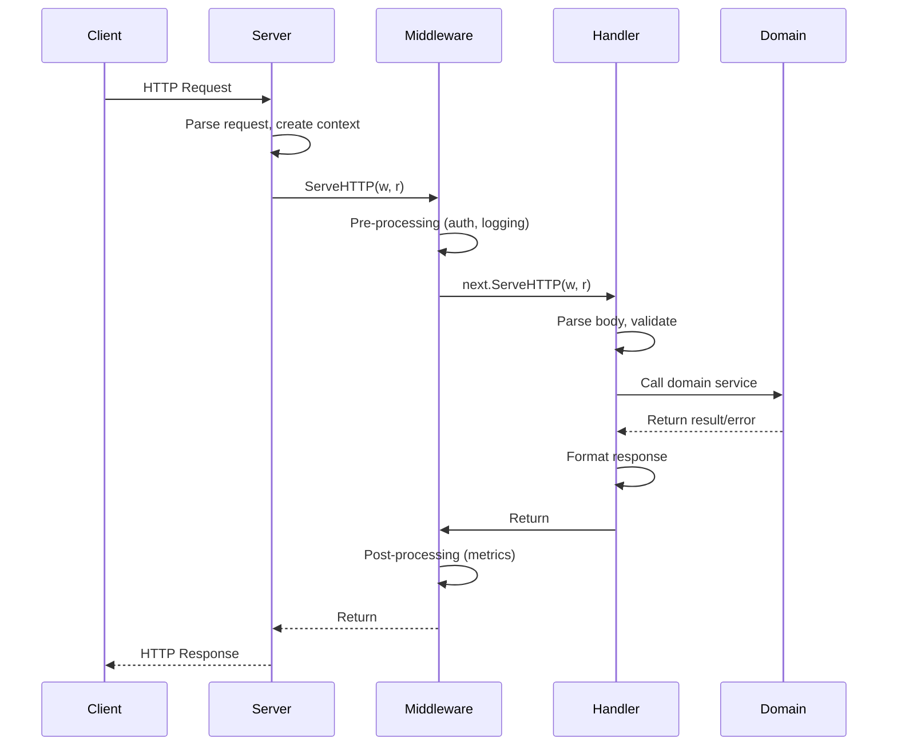

# HTTP Server Patterns

> HTTP servers in Go are built on `net/http`—a powerful, minimal foundation. Mastering HTTP server patterns means understanding the request lifecycle, composing middleware correctly, and designing handlers that respect context, propagate errors cleanly, and shut down gracefully.

---

## Core Principle

**Handlers are boundaries; keep them thin.**

HTTP handlers are the outermost layer of your application—they translate between the HTTP protocol and your domain logic. A handler's job is to parse requests, call domain services, and format responses. Business logic does not belong in handlers. When handlers stay thin, your domain logic remains testable, portable, and protocol-agnostic.

---

## Invariants

> Rules that must hold true. Violating these leads to bugs, leaks, or architectural debt.

- **Write the response once, completely.** Once you call `w.Write()` or `w.WriteHeader()`, the response has begun. You cannot change status codes, add headers, or recover from errors gracefully. Check all errors *before* writing.
- **Respect `r.Context()` cancellation.** The request context cancels when the client disconnects. Long-running handlers that ignore `ctx.Done()` waste resources serving responses nobody will receive.
- **Middleware must call `next` or return—never both paths silently.** A middleware that conditionally calls `next` must be explicit about both branches. Silent early returns are a common source of bugs.
- **Headers must be set before `WriteHeader()` or the first `Write()`.** After the response stream begins, headers are already sent. This is a protocol constraint, not a Go limitation.
- **Errors at the HTTP boundary must be translated to status codes, not leaked as implementation details.** Database errors, service failures, and validation errors all become appropriate HTTP responses. Internal details stay internal.

---

## The "Why" Behind This

Go's `net/http` package is intentionally minimal. There's no built-in routing beyond path matching, no automatic request validation, no response serialization framework. This minimalism is a feature, not a limitation—it gives you complete control over the request lifecycle and avoids framework lock-in.

The `http.Handler` interface is Go's interface design philosophy in action: one method, maximum flexibility. Any type with `ServeHTTP(ResponseWriter, *Request)` can handle HTTP requests. This enables middleware composition through simple function wrapping—no inheritance hierarchies, no plugin registries, no configuration files.

Understanding the request lifecycle is crucial because HTTP is inherently asynchronous and cancelable. A client can disconnect at any time. The server can be shutting down. A deadline can expire. Your handlers must participate in this lifecycle through `context.Context`, completing quickly when cancellation is signaled rather than continuing to do work that will never be delivered.

The boundary/core distinction from [Error Philosophy](03_ERROR_PHILOSOPHY.md) is nowhere more important than in HTTP handlers. Handlers are *translation layers*—they speak HTTP on one side and domain interfaces on the other. When a handler starts containing business logic, you've conflated protocol concerns with domain concerns. The result is code that's hard to test (requires HTTP scaffolding), hard to reuse (locked to one transport), and hard to reason about (mixed responsibilities).

---

## Key Concepts

### The http.Handler Interface

The foundation of Go HTTP servers is a single interface:

```go
type Handler interface {
    ServeHTTP(ResponseWriter, *Request)
}
```

Any type implementing this interface can handle HTTP requests. The `http.HandlerFunc` adapter lets you use regular functions:

```go
func healthCheck(w http.ResponseWriter, r *http.Request) {
    w.WriteHeader(http.StatusOK)
    w.Write([]byte("OK"))
}

// Use as Handler
http.Handle("/health", http.HandlerFunc(healthCheck))

// Or with HandleFunc shortcut
http.HandleFunc("/health", healthCheck)
```

**Why this design works:** The interface is minimal—one method, clear contract. No framework-specific request/response types, no lifecycle hooks to implement, no base classes to extend. You can wrap handlers with other handlers (middleware), you can test handlers with `httptest`, and you can compose handlers into larger structures.

### The Request Lifecycle

Understanding when things happen during request processing prevents subtle bugs:



**Critical timing constraints:**

1. **Headers before body:** `w.Header().Set()` must happen before `w.WriteHeader()` or `w.Write()`
2. **Status code once:** `w.WriteHeader()` can only be called once; subsequent calls are ignored
3. **Implicit 200:** If you call `w.Write()` without `WriteHeader()`, status 200 is sent automatically
4. **Body streaming:** Each `w.Write()` may flush to the network; you can't "undo" written bytes

```go
// Idiomatic: set headers, then status, then body
func handler(w http.ResponseWriter, r *http.Request) {
    result, err := process(r.Context())
    if err != nil {
        writeJSON(w, http.StatusInternalServerError, map[string]string{"error": "internal error"})
        return
    }
    writeJSON(w, http.StatusOK, result)
}

// writeJSON centralizes JSON response writing.
// This becomes your hook for envelopes, compression, and observability.
func writeJSON(w http.ResponseWriter, status int, v any) {
    w.Header().Set("Content-Type", "application/json")
    w.WriteHeader(status)
    _ = json.NewEncoder(w).Encode(v) // Error ignored; connection may be broken
}
```

**Invariant:** `writeJSON` (or your equivalent helper) should be the *only* function that writes responses in handlers. A single write path prevents scattered `w.Write()` calls, makes response formatting consistent, and provides one place to add envelopes, compression, or observability later.
```

**Anti-pattern—writing before error check:**

```go
// WRONG: Can't change status after Write
func handler(w http.ResponseWriter, r *http.Request) {
    w.Write([]byte("Processing...")) // 200 sent implicitly
    
    result, err := process(r.Context())
    if err != nil {
        w.WriteHeader(http.StatusInternalServerError) // Too late! Ignored.
        return
    }
    // ...
}
```

### Middleware Pattern

Middleware wraps handlers to add cross-cutting concerns: logging, authentication, metrics, panic recovery, request IDs.

```go
// Middleware signature: takes a handler, returns a handler
type Middleware func(http.Handler) http.Handler

// Example: logging middleware
func LoggingMiddleware(logger *slog.Logger) Middleware {
    return func(next http.Handler) http.Handler {
        return http.HandlerFunc(func(w http.ResponseWriter, r *http.Request) {
            start := time.Now()
            
            // Wrap ResponseWriter to capture status code
            wrapped := &responseRecorder{ResponseWriter: w, statusCode: http.StatusOK}
            
            // Call the next handler
            next.ServeHTTP(wrapped, r)
            
            // Log after request completes
            logger.Info("request completed",
                "method", r.Method,
                "path", r.URL.Path,
                "status", wrapped.statusCode,
                "duration", time.Since(start),
            )
        })
    }
}

type responseRecorder struct {
    http.ResponseWriter
    statusCode int
}

func (r *responseRecorder) WriteHeader(code int) {
    r.statusCode = code
    r.ResponseWriter.WriteHeader(code)
}
```

**Middleware composition:**

```go
// Chain applies middleware in order (first middleware is outermost)
func Chain(handler http.Handler, middlewares ...Middleware) http.Handler {
    // Apply in reverse so first middleware is outermost
    for i := len(middlewares) - 1; i >= 0; i-- {
        handler = middlewares[i](handler)
    }
    return handler
}

// Usage
handler := Chain(
    myHandler,
    RecoveryMiddleware(),   // Outermost: catches panics from everything below
    LoggingMiddleware(log), // Second: logs all requests
    AuthMiddleware(auth),   // Innermost: runs after logging setup
)
```

**Execution order visualization:**

```
Request  → Recovery → Logging → Auth → Handler
Response ← Recovery ← Logging ← Auth ← Handler
```

The outermost middleware sees the request first and the response last. This matters for logging (capture final status), recovery (catch panics from any layer), and timing (measure total duration).

### ResponseWriter Wrapping

To capture response metadata (status codes, bytes written), wrap `http.ResponseWriter`:

```go
type responseRecorder struct {
    http.ResponseWriter
    statusCode  int
    wroteHeader bool
    bytesWritten int
}

func (r *responseRecorder) WriteHeader(code int) {
    if r.wroteHeader {
        return // Mimic stdlib behavior: ignore subsequent calls
    }
    r.statusCode = code
    r.wroteHeader = true
    r.ResponseWriter.WriteHeader(code)
}

func (r *responseRecorder) Write(b []byte) (int, error) {
    if !r.wroteHeader {
        r.WriteHeader(http.StatusOK) // Implicit 200
    }
    n, err := r.ResponseWriter.Write(b)
    r.bytesWritten += n
    return n, err
}
```

**Preserving interface capabilities:**

`http.ResponseWriter` may also implement `http.Flusher`, `http.Hijacker`, or `http.Pusher`. A naive wrapper loses these capabilities:

```go
// Preserve Flusher capability
func (r *responseRecorder) Flush() {
    if f, ok := r.ResponseWriter.(http.Flusher); ok {
        f.Flush()
    }
}

// Check if underlying writer supports an interface
func (r *responseRecorder) Unwrap() http.ResponseWriter {
    return r.ResponseWriter
}
```

**In production, prefer a well-tested wrapper** like `github.com/felixge/httpsnoop` rather than rolling your own. Interface preservation is subtle—`httpsnoop` handles edge cases around `Flusher`, `Hijacker`, `Pusher`, and `io.ReaderFrom` that hand-rolled wrappers typically miss. This aligns with "a little copying is better than a little dependency"—except when the dependency prevents subtle bugs.

### Context in HTTP Handlers

Every HTTP request carries a context via `r.Context()`. This context:

- Cancels when the client disconnects
- Carries request-scoped values (request ID, authenticated user)
- Can be wrapped with deadlines via middleware

**Respecting cancellation:**

```go
func handler(w http.ResponseWriter, r *http.Request) {
    ctx := r.Context()
    
    // Pass context to downstream operations
    result, err := service.Process(ctx, input)
    if err != nil {
        if errors.Is(err, context.Canceled) {
            // Client disconnected; don't bother responding
            return
        }
        if errors.Is(err, context.DeadlineExceeded) {
            http.Error(w, "request timeout", http.StatusGatewayTimeout)
            return
        }
        http.Error(w, "internal error", http.StatusInternalServerError)
        return
    }
    
    json.NewEncoder(w).Encode(result)
}
```

**Cancellation is not rollback.** HTTP context cancellation means "stop waiting, stop working"—it does *not* undo side effects. If your handler wrote to a database before checking `ctx.Done()`, that write persists. Domain code should treat cancellation as *advisory* for resource cleanup, not as a transactional rollback signal. Idempotency and transactional semantics live outside of context (see [Context and Lifecycle](04_CONTEXT_AND_LIFECYCLE.md)).

**Adding values to request context:**

```go
type contextKey struct{}

var userContextKey = contextKey{}

// Middleware that adds authenticated user to context
func AuthMiddleware(auth Authenticator) Middleware {
    return func(next http.Handler) http.Handler {
        return http.HandlerFunc(func(w http.ResponseWriter, r *http.Request) {
            token := r.Header.Get("Authorization")
            user, err := auth.Validate(r.Context(), token)
            if err != nil {
                http.Error(w, "unauthorized", http.StatusUnauthorized)
                return
            }
            
            // Add user to context
            ctx := context.WithValue(r.Context(), userContextKey, user)
            next.ServeHTTP(w, r.WithContext(ctx))
        })
    }
}

// Accessor function
func UserFromContext(ctx context.Context) (*User, bool) {
    user, ok := ctx.Value(userContextKey).(*User)
    return user, ok
}
```

**Setting request deadlines:**

```go
func TimeoutMiddleware(timeout time.Duration) Middleware {
    return func(next http.Handler) http.Handler {
        return http.HandlerFunc(func(w http.ResponseWriter, r *http.Request) {
            ctx, cancel := context.WithTimeout(r.Context(), timeout)
            defer cancel()
            
            next.ServeHTTP(w, r.WithContext(ctx))
        })
    }
}
```

### Routing Patterns

The standard library's `http.ServeMux` provides basic path matching. Go 1.22+ added method matching and path parameters:

```go
mux := http.NewServeMux()

// Go 1.22+ patterns
mux.HandleFunc("GET /users", listUsers)
mux.HandleFunc("POST /users", createUser)
mux.HandleFunc("GET /users/{id}", getUser)
mux.HandleFunc("DELETE /users/{id}", deleteUser)

// Access path parameters
func getUser(w http.ResponseWriter, r *http.Request) {
    id := r.PathValue("id") // Go 1.22+
    // ...
}
```

**When to use third-party routers:**

| Need | stdlib Sufficient? | Alternative |
|------|-------------------|-------------|
| Basic path matching | Yes | — |
| Method + path (Go 1.22+) | Yes | — |
| Path parameters (Go 1.22+) | Yes | — |
| Regex routes | No | gorilla/mux, chi |
| Route groups with shared middleware | Awkward | chi, echo |
| OpenAPI generation from routes | No | Various |

**Idiomatic routing structure:**

```go
func NewRouter(
    userService UserService,
    orderService OrderService,
    logger *slog.Logger,
) http.Handler {
    mux := http.NewServeMux()
    
    // Health endpoints (no auth)
    mux.HandleFunc("GET /health", healthCheck)
    mux.HandleFunc("GET /ready", readinessCheck)
    
    // API endpoints
    userHandler := NewUserHandler(userService)
    mux.HandleFunc("GET /api/users", userHandler.List)
    mux.HandleFunc("POST /api/users", userHandler.Create)
    mux.HandleFunc("GET /api/users/{id}", userHandler.Get)
    
    orderHandler := NewOrderHandler(orderService)
    mux.HandleFunc("GET /api/orders", orderHandler.List)
    mux.HandleFunc("POST /api/orders", orderHandler.Create)
    
    // Apply middleware
    return Chain(mux,
        RecoveryMiddleware(logger),
        LoggingMiddleware(logger),
        AuthMiddleware(authenticator),
    )
}
```

### Handler Design: Struct vs Function

Handlers can be methods on a struct (for shared dependencies) or standalone functions:

**Struct-based handlers (preferred for dependency injection):**

```go
type UserHandler struct {
    service UserService
    logger  *slog.Logger
}

func NewUserHandler(service UserService, logger *slog.Logger) *UserHandler {
    return &UserHandler{service: service, logger: logger}
}

func (h *UserHandler) Create(w http.ResponseWriter, r *http.Request) {
    var req CreateUserRequest
    if err := json.NewDecoder(r.Body).Decode(&req); err != nil {
        http.Error(w, "invalid request body", http.StatusBadRequest)
        return
    }
    
    user, err := h.service.CreateUser(r.Context(), req)
    if err != nil {
        h.handleError(w, err)
        return
    }
    
    writeJSON(w, http.StatusCreated, user)
}

func (h *UserHandler) handleError(w http.ResponseWriter, err error) {
    // Translate domain errors to HTTP
    switch {
    case errors.Is(err, domain.ErrNotFound):
        http.Error(w, "not found", http.StatusNotFound)
    case errors.Is(err, domain.ErrValidation):
        http.Error(w, err.Error(), http.StatusBadRequest)
    default:
        h.logger.Error("internal error", "error", err)
        http.Error(w, "internal error", http.StatusInternalServerError)
    }
}
```

**Why struct-based:** Dependencies are explicit in the constructor, handlers share helper methods (`handleError`), and testing is straightforward (inject fake service).

### Error Handling at the Boundary

HTTP handlers translate domain errors to HTTP responses. This is the boundary/core distinction in action:

```go
// domain/errors.go (CORE)
var (
    ErrNotFound   = errors.New("not found")
    ErrConflict   = errors.New("conflict")
    ErrValidation = errors.New("validation failed")
)

type ValidationError struct {
    Field   string
    Message string
}

func (e *ValidationError) Error() string {
    return fmt.Sprintf("%s: %s", e.Field, e.Message)
}
```

```go
// httpapi/errors.go (BOUNDARY)
func errorToStatus(err error) int {
    switch {
    case errors.Is(err, domain.ErrNotFound):
        return http.StatusNotFound
    case errors.Is(err, domain.ErrConflict):
        return http.StatusConflict
    case errors.Is(err, domain.ErrValidation):
        return http.StatusBadRequest
    case errors.Is(err, context.DeadlineExceeded):
        return http.StatusGatewayTimeout
    case errors.Is(err, context.Canceled):
        return 499 // Client closed request (nginx convention)
    default:
        return http.StatusInternalServerError
    }
}

func writeError(w http.ResponseWriter, err error, logger *slog.Logger) {
    status := errorToStatus(err)
    
    // Log internal errors
    if status >= 500 {
        logger.Error("request failed", "error", err)
    }
    
    // Don't expose internal details for 5xx
    message := err.Error()
    if status >= 500 {
        message = "internal server error"
    }
    
    writeJSON(w, status, map[string]string{"error": message})
}
```

**The invariant:** Domain errors like `ErrNotFound` are part of your API contract (from [Error Philosophy](03_ERROR_PHILOSOPHY.md)). HTTP status codes are translations of those contracts to HTTP semantics. Internal implementation errors (database timeouts, nil pointers) become generic 500s—never leak stack traces or internal details.

### Request Validation and Parsing

Validate and parse *before* any side effects:

```go
func (h *OrderHandler) Create(w http.ResponseWriter, r *http.Request) {
    // 1. Parse request
    var req CreateOrderRequest
    if err := json.NewDecoder(r.Body).Decode(&req); err != nil {
        http.Error(w, "invalid JSON", http.StatusBadRequest)
        return
    }
    
    // 2. Validate request
    if err := req.Validate(); err != nil {
        writeJSON(w, http.StatusBadRequest, map[string]string{"error": err.Error()})
        return
    }
    
    // 3. Now safe to call domain logic
    order, err := h.service.CreateOrder(r.Context(), req.Items)
    if err != nil {
        h.handleError(w, err)
        return
    }
    
    // 4. Write success response
    writeJSON(w, http.StatusCreated, order)
}

type CreateOrderRequest struct {
    Items []OrderItem `json:"items"`
}

func (r *CreateOrderRequest) Validate() error {
    if len(r.Items) == 0 {
        return errors.New("items cannot be empty")
    }
    for i, item := range r.Items {
        if item.Quantity <= 0 {
            return fmt.Errorf("item %d: quantity must be positive", i)
        }
    }
    return nil
}
```

### Panic Recovery

Panics in handlers crash the entire server unless recovered. Always use recovery middleware:

```go
func RecoveryMiddleware(logger *slog.Logger) Middleware {
    return func(next http.Handler) http.Handler {
        return http.HandlerFunc(func(w http.ResponseWriter, r *http.Request) {
            defer func() {
                if err := recover(); err != nil {
                    // Log the panic with stack trace
                    logger.Error("panic recovered",
                        "error", err,
                        "stack", string(debug.Stack()),
                        "path", r.URL.Path,
                    )
                    
                    // Return 500 to client (if headers not sent)
                    http.Error(w, "internal server error", http.StatusInternalServerError)
                }
            }()
            
            next.ServeHTTP(w, r)
        })
    }
}
```

**Placement matters:** Recovery middleware must be outermost to catch panics from any inner middleware or handler.

**Critical edge case:** Recovery middleware can only guarantee a clean 500 response **if no bytes have been written yet**. If the handler panics *after* writing to the response, recovery can only log—the response stream may already be corrupted or partially sent. This is an HTTP protocol constraint, not a Go limitation. In practice, this means: do all fallible work *before* writing the response body.

### Graceful Server Shutdown

HTTP servers must shut down gracefully, completing in-flight requests before terminating. This connects directly to [Graceful Shutdown](06_GRACEFUL_SHUTDOWN.md):

```go
func runServer(ctx context.Context, addr string, handler http.Handler) error {
    server := &http.Server{
        Addr:         addr,
        Handler:      handler,
        ReadTimeout:  15 * time.Second,
        WriteTimeout: 15 * time.Second,
        IdleTimeout:  60 * time.Second,
    }
    
    // Start server in goroutine
    errCh := make(chan error, 1)
    go func() {
        if err := server.ListenAndServe(); err != nil && err != http.ErrServerClosed {
            errCh <- err
        }
        close(errCh)
    }()
    
    // Wait for shutdown signal or error
    select {
    case err := <-errCh:
        return fmt.Errorf("server error: %w", err)
    case <-ctx.Done():
        // Graceful shutdown
        shutdownCtx, cancel := context.WithTimeout(context.Background(), 30*time.Second)
        defer cancel()
        
        if err := server.Shutdown(shutdownCtx); err != nil {
            return fmt.Errorf("shutdown error: %w", err)
        }
        return ctx.Err()
    }
}
```

**What `server.Shutdown` does:**

1. Immediately stops accepting new connections
2. Waits for active requests to complete
3. Closes idle connections
4. Returns when all connections close or context expires

**Never use `server.Close()`** for graceful shutdown—it terminates immediately, dropping in-flight requests.

### Testing HTTP Handlers

The `httptest` package enables handler testing without network I/O:

```go
func TestUserHandler_Create(t *testing.T) {
    // Setup fake service
    fakeService := &fakeUserService{
        createFunc: func(ctx context.Context, req CreateUserRequest) (*User, error) {
            return &User{ID: "123", Email: req.Email}, nil
        },
    }
    
    handler := NewUserHandler(fakeService, slog.Default())
    
    // Create test request
    body := strings.NewReader(`{"email":"test@example.com"}`)
    req := httptest.NewRequest("POST", "/users", body)
    req.Header.Set("Content-Type", "application/json")
    
    // Create response recorder
    rec := httptest.NewRecorder()
    
    // Execute handler
    handler.Create(rec, req)
    
    // Assert response
    if rec.Code != http.StatusCreated {
        t.Errorf("status = %d, want %d", rec.Code, http.StatusCreated)
    }
    
    var response User
    if err := json.NewDecoder(rec.Body).Decode(&response); err != nil {
        t.Fatalf("failed to decode response: %v", err)
    }
    
    if response.Email != "test@example.com" {
        t.Errorf("email = %q, want %q", response.Email, "test@example.com")
    }
}

func TestUserHandler_Create_ValidationError(t *testing.T) {
    handler := NewUserHandler(&fakeUserService{}, slog.Default())
    
    // Invalid JSON
    req := httptest.NewRequest("POST", "/users", strings.NewReader(`{invalid`))
    rec := httptest.NewRecorder()
    
    handler.Create(rec, req)
    
    if rec.Code != http.StatusBadRequest {
        t.Errorf("status = %d, want %d", rec.Code, http.StatusBadRequest)
    }
}
```

**Testing middleware:**

```go
func TestLoggingMiddleware(t *testing.T) {
    var buf bytes.Buffer
    logger := slog.New(slog.NewTextHandler(&buf, nil))
    
    // Handler that always returns 201
    inner := http.HandlerFunc(func(w http.ResponseWriter, r *http.Request) {
        w.WriteHeader(http.StatusCreated)
    })
    
    handler := LoggingMiddleware(logger)(inner)
    
    req := httptest.NewRequest("GET", "/test", nil)
    rec := httptest.NewRecorder()
    
    handler.ServeHTTP(rec, req)
    
    // Verify logging occurred
    if !strings.Contains(buf.String(), "status=201") {
        t.Error("expected status to be logged")
    }
}
```

---

## Complete Example: Production Server

Here's a complete, production-ready HTTP server demonstrating all patterns:

```go
package main

import (
    "context"
    "encoding/json"
    "errors"
    "log/slog"
    "net/http"
    "os"
    "os/signal"
    "runtime/debug"
    "syscall"
    "time"
)

func main() {
    ctx, stop := signal.NotifyContext(context.Background(),
        syscall.SIGTERM, syscall.SIGINT)
    defer stop()
    
    logger := slog.New(slog.NewJSONHandler(os.Stdout, nil))
    
    // Initialize dependencies
    userService := NewUserService(/* deps */)
    
    // Build handler tree
    userHandler := NewUserHandler(userService, logger)
    
    mux := http.NewServeMux()
    mux.HandleFunc("GET /health", func(w http.ResponseWriter, r *http.Request) {
        w.WriteHeader(http.StatusOK)
    })
    mux.HandleFunc("GET /users/{id}", userHandler.Get)
    mux.HandleFunc("POST /users", userHandler.Create)
    
    // Apply middleware (order matters: first is outermost)
    handler := chain(mux,
        recoveryMiddleware(logger),
        loggingMiddleware(logger),
        timeoutMiddleware(30*time.Second),
    )
    
    // Run server
    if err := runServer(ctx, ":8080", handler, logger); err != nil {
        if !errors.Is(err, context.Canceled) {
            logger.Error("server error", "error", err)
            os.Exit(1)
        }
    }
    
    logger.Info("shutdown complete")
}

func runServer(ctx context.Context, addr string, handler http.Handler, logger *slog.Logger) error {
    server := &http.Server{
        Addr:         addr,
        Handler:      handler,
        ReadTimeout:  15 * time.Second,
        WriteTimeout: 15 * time.Second,
        IdleTimeout:  60 * time.Second,
    }
    
    errCh := make(chan error, 1)
    go func() {
        logger.Info("server starting", "addr", addr)
        if err := server.ListenAndServe(); err != nil && err != http.ErrServerClosed {
            errCh <- err
        }
        close(errCh)
    }()
    
    select {
    case err := <-errCh:
        return err
    case <-ctx.Done():
        logger.Info("initiating graceful shutdown")
        
        shutdownCtx, cancel := context.WithTimeout(context.Background(), 30*time.Second)
        defer cancel()
        
        return server.Shutdown(shutdownCtx)
    }
}

// Middleware helpers

type Middleware func(http.Handler) http.Handler

func chain(handler http.Handler, middlewares ...Middleware) http.Handler {
    for i := len(middlewares) - 1; i >= 0; i-- {
        handler = middlewares[i](handler)
    }
    return handler
}

func recoveryMiddleware(logger *slog.Logger) Middleware {
    return func(next http.Handler) http.Handler {
        return http.HandlerFunc(func(w http.ResponseWriter, r *http.Request) {
            defer func() {
                if err := recover(); err != nil {
                    logger.Error("panic", "error", err, "stack", string(debug.Stack()))
                    http.Error(w, "internal error", http.StatusInternalServerError)
                }
            }()
            next.ServeHTTP(w, r)
        })
    }
}

func loggingMiddleware(logger *slog.Logger) Middleware {
    return func(next http.Handler) http.Handler {
        return http.HandlerFunc(func(w http.ResponseWriter, r *http.Request) {
            start := time.Now()
            wrapped := &statusRecorder{ResponseWriter: w, status: http.StatusOK}
            
            next.ServeHTTP(wrapped, r)
            
            logger.Info("request",
                "method", r.Method,
                "path", r.URL.Path,
                "status", wrapped.status,
                "duration", time.Since(start),
            )
        })
    }
}

func timeoutMiddleware(timeout time.Duration) Middleware {
    return func(next http.Handler) http.Handler {
        return http.HandlerFunc(func(w http.ResponseWriter, r *http.Request) {
            ctx, cancel := context.WithTimeout(r.Context(), timeout)
            defer cancel()
            next.ServeHTTP(w, r.WithContext(ctx))
        })
    }
}

type statusRecorder struct {
    http.ResponseWriter
    status int
}

func (r *statusRecorder) WriteHeader(code int) {
    r.status = code
    r.ResponseWriter.WriteHeader(code)
}
```

---

## Trade-Off Matrix

| If You Need... | Choose... | Accept... |
|----------------|-----------|-----------|
| Long-term API stability | stdlib `net/http` | Fewer built-in abstractions |
| Simple routing | stdlib `http.ServeMux` | Limited middleware composition |
| Complex routing (groups, regex) | chi, gorilla/mux | External dependency |
| Maximum performance | fasthttp | Incompatible with `net/http` ecosystem |
| OpenAPI integration | go-swagger, oapi-codegen | Code generation complexity |
| Request validation | Manual or go-playground/validator | Validation logic in handlers or separate layer |
| Response compression | stdlib `compress/gzip` + middleware | Must handle Accept-Encoding correctly |
| Structured logging | slog (stdlib) or zap/zerolog | Logger choice affects performance |

---

## Common Mistakes

| Mistake | Consequence | Fix |
|---------|-------------|-----|
| Writing response before error check | Cannot change status code | Check all errors first, then write |
| Ignoring `r.Context()` cancellation | Wasted work, resource leaks | Check `ctx.Done()` in long operations |
| Middleware that doesn't call `next` (unintentionally) | Silent request drops | Be explicit about both branches |
| Setting headers after `Write()` | Headers not sent | Set headers before any Write |
| Using `server.Close()` for shutdown | Drops in-flight requests | Use `server.Shutdown()` |
| Logging and exposing internal errors | Information leakage | Translate to generic messages |
| No panic recovery | Server crashes on panic | Always use recovery middleware |
| Timeout middleware without context propagation | Timeout doesn't affect downstream | Pass `r.WithContext(ctx)` |

---

## Interview Signals

| When Asked... | Demonstrate... |
|---------------|----------------|
| "How does Go handle HTTP?" | `http.Handler` interface with one method. `ServeMux` for routing. Handlers receive `ResponseWriter` and `*Request`. Context via `r.Context()`. |
| "How do you implement middleware?" | Function that takes a handler and returns a handler. Wraps the next handler, does pre/post processing. Chain by nesting or using a `Chain` helper. Order matters: first applied is outermost. |
| "How do you handle errors in handlers?" | Translate domain errors to HTTP status codes. Log internal errors, return generic messages for 5xx. Never leak stack traces or implementation details. |
| "How do you shut down an HTTP server gracefully?" | `server.Shutdown(ctx)` stops accepting new connections and waits for in-flight requests. Set a timeout on the shutdown context. Never use `Close()` for graceful shutdown. |
| "What's the request lifecycle?" | Server parses request → middleware chain executes → handler runs → response written → middleware unwinds. Headers must be set before body. Status code can only be written once. |
| "How do you test handlers?" | `httptest.NewRequest` creates a request, `httptest.ResponseRecorder` captures the response. Test with fake dependencies injected into the handler. |
| "Where should validation happen?" | Parse and validate *before* calling domain logic. Return 400 for validation errors. Domain logic should receive valid inputs. |
| "What about authentication?" | Middleware that validates tokens, adds user to context via `r.WithContext()`. Handler retrieves user with accessor function. Fail fast with 401 if not authenticated. |

---

## Bridge to Related Documents

This deep dive extends [Context and Lifecycle](04_CONTEXT_AND_LIFECYCLE.md), which introduced `r.Context()` and request-scoped cancellation. HTTP handlers are the canonical example of context creation at boundaries.

The error handling patterns here implement the boundary/core translation from [Error Philosophy](03_ERROR_PHILOSOPHY.md). Domain errors become HTTP status codes; internal errors become generic 500s.

For graceful shutdown patterns specific to HTTP servers, see [Graceful Shutdown](06_GRACEFUL_SHUTDOWN.md), which covers `signal.NotifyContext` and shutdown sequencing.

The middleware pattern is an application of the interface composition from [DD_INTERFACE_PATTERNS.md](DD_INTERFACE_PATTERNS.md)—the `http.Handler` interface enables powerful composition through simple function wrapping.

For testing HTTP handlers with fakes instead of mocks, see [Testing Philosophy](07_TESTING_PHILOSOPHY.md). The `httptest` package enables testing handlers without network I/O, using the same fake-based testing approach.
