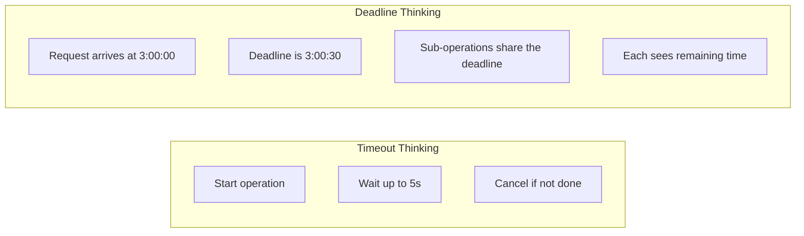

# Time and Clocks

> Time is hidden global state. Every call to `time.Now()` couples your code to an unpredictable, untestable external dependency. Treating time as an explicit dependency transforms flaky, timing-sensitive code into deterministic, testable systems.

---

## Core Principle

**Time is a dependency; inject it like any other.**

When a function calls `time.Now()` directly, it has a hidden dependency on the system clock—a global, mutable resource outside your control. You can't test time-sensitive logic without real delays, you can't reproduce bugs that depend on specific times, and you can't run tests in parallel reliably. Injecting time through an interface makes the dependency explicit and controllable.

---

## Invariants

> Rules that must hold true. Violating these leads to bugs, leaks, or architectural debt.

- **Deadlines are absolute; timeouts are relative.** A deadline is a specific point in time ("cancel at 3:00 PM"). A timeout is a duration from now ("cancel after 5 seconds"). Confusing them causes subtle bugs when operations take longer than expected.
- **Core/domain code must depend only on `Now()` (and possibly `Since`/`Until`).** Timers, tickers, `Sleep`, and `After` are boundary concerns. Domain logic that schedules or sleeps has conflated business rules with infrastructure.
- **All persisted and transmitted timestamps must be UTC.** Time zones are a presentation concern. Storing local times causes DST bugs, comparison failures, and cross-region inconsistencies.
- **Time-dependent tests must never use `time.Sleep()` for synchronization.** Sleep-based tests are slow, flaky, and encode timing assumptions that break under load. Use channels, synchronization primitives, or injected clocks.
- **Deadlines are set once at boundaries and propagated.** Don't create fresh timeouts at each layer—the time budget can exceed the intended total. Context propagation ensures sub-operations see remaining time.
- **Fake clocks are safe for single-goroutine, deterministic tests only.** Concurrent timer firing, `Advance` races, and reset semantics are subtle. Use proven libraries for concurrent scenarios.

---

## Non-Goals

This document addresses *local* time handling in single-process Go applications. It explicitly does **not** cover:

- **Distributed time consensus** (NTP, TrueTime, Hybrid Logical Clocks, vector clocks). These require different primitives and are outside single-process scope.
- **Cron/scheduler correctness.** Scheduling semantics (missed jobs, catch-up behavior, timezone-aware cron) are application-specific.
- **High-precision timing.** Sub-millisecond precision requires OS-specific APIs and is rarely needed in application code.

If an interviewer asks "what about Spanner's TrueTime?"—acknowledge it exists, note it solves distributed ordering (not testability), and redirect to the scope of this document.

---

## The "Why" Behind This

Time is deceptively simple. `time.Now()` returns the current time. `time.Sleep()` pauses execution. What could go wrong?

Everything.

Time is one of the most common sources of bugs in production systems. Tests that pass locally fail in CI because of timing differences. Features that work during development break in production because the server clock differs from the development machine. Code that expires tokens at midnight fails because it didn't account for time zones. Rate limiters that work in testing collapse under load because they assumed consistent timing.

The root cause is the same: **time is implicit global state**. When you call `time.Now()`, you're reading from a shared resource that changes constantly and unpredictably. Worse, in testing, that resource keeps advancing—you can't pause it, rewind it, or control it. Your tests are at the mercy of actual wall-clock time.

The solution is the same as for any other dependency: **make it explicit and injectable**. Instead of calling `time.Now()` directly, accept a clock interface. In production, use the real clock. In tests, use a fake clock you control completely. This transforms time from an implicit dependency into an explicit one, subject to the same design discipline as databases or HTTP clients.

This principle connects directly to [Testing Philosophy](07_TESTING_PHILOSOPHY.md): code that's hard to test is code with hidden dependencies. Time is the hidden dependency lurking in countless codebases, causing flaky tests and mysterious production bugs.

---

## Key Concepts

### The Hidden Dependency Problem

Consider a simple token validator:

```go
// Anti-pattern: hidden dependency on time.Now()
type TokenValidator struct {
    tokens map[string]time.Time
}

func (v *TokenValidator) IsValid(token string) bool {
    expiresAt, exists := v.tokens[token]
    if !exists {
        return false
    }
    return time.Now().Before(expiresAt) // Hidden dependency
}
```

This code has a bug that's nearly impossible to test: what happens at the exact moment of expiration? What if the token expires during a leap second? What if the system clock jumps backward due to NTP synchronization?

You can't write a test for "token expired 1 nanosecond ago" without either waiting for real time to pass or restructuring the code. The dependency on `time.Now()` makes the function's behavior unpredictable and untestable.

### The Clock Interface

The solution is a clock interface—an abstraction over time that can be implemented by both real and fake clocks:

```go
// Clock provides the current time. Implementations may be real or fake.
type Clock interface {
    Now() time.Time
}

// RealClock uses the system clock.
type RealClock struct{}

func (RealClock) Now() time.Time {
    return time.Now()
}

// Inject clock as a dependency
type TokenValidator struct {
    clock  Clock
    tokens map[string]time.Time
}

func NewTokenValidator(clock Clock) *TokenValidator {
    return &TokenValidator{
        clock:  clock,
        tokens: make(map[string]time.Time),
    }
}

func (v *TokenValidator) IsValid(token string) bool {
    expiresAt, exists := v.tokens[token]
    if !exists {
        return false
    }
    return v.clock.Now().Before(expiresAt)
}
```

Now time is explicit. The function's behavior depends only on what `clock.Now()` returns, which you control completely in tests.

### Fake Clocks for Testing

A fake clock lets you control time precisely:

```go
// FakeClock is a clock that returns a fixed time, advanceable for testing.
type FakeClock struct {
    mu      sync.Mutex
    current time.Time
}

func NewFakeClock(t time.Time) *FakeClock {
    return &FakeClock{current: t}
}

func (c *FakeClock) Now() time.Time {
    c.mu.Lock()
    defer c.mu.Unlock()
    return c.current
}

func (c *FakeClock) Advance(d time.Duration) {
    c.mu.Lock()
    defer c.mu.Unlock()
    c.current = c.current.Add(d)
}

func (c *FakeClock) Set(t time.Time) {
    c.mu.Lock()
    defer c.mu.Unlock()
    c.current = t
}
```

**Testing with fake clocks:**

```go
func TestTokenValidator_Expiration(t *testing.T) {
    // Start at a known time
    startTime := time.Date(2024, 1, 1, 12, 0, 0, 0, time.UTC)
    clock := NewFakeClock(startTime)
    
    validator := NewTokenValidator(clock)
    validator.tokens["abc123"] = startTime.Add(time.Hour) // Expires in 1 hour
    
    // Token is valid now
    if !validator.IsValid("abc123") {
        t.Error("token should be valid")
    }
    
    // Advance time by 59 minutes—still valid
    clock.Advance(59 * time.Minute)
    if !validator.IsValid("abc123") {
        t.Error("token should still be valid at 59 minutes")
    }
    
    // Advance 1 more minute—now expired
    clock.Advance(time.Minute)
    if validator.IsValid("abc123") {
        t.Error("token should be expired at 60 minutes")
    }
    
    // Test exact boundary: 1 nanosecond before expiration
    clock.Set(startTime.Add(time.Hour - time.Nanosecond))
    if !validator.IsValid("abc123") {
        t.Error("token should be valid 1ns before expiration")
    }
    
    // Exactly at expiration time
    clock.Set(startTime.Add(time.Hour))
    if validator.IsValid("abc123") {
        t.Error("token should be invalid at exact expiration")
    }
}
```

This test runs in microseconds, tests exact boundary conditions, and is completely deterministic. No `time.Sleep()`, no flakiness, no waiting.

### Extended Clock Interface: Timers and Tickers

A minimal `Now()` interface works for many cases, but production code often needs timers and tickers. Extend the interface:

```go
// Clock provides time operations. All time-related behavior should go through this.
type Clock interface {
    Now() time.Time
    Since(t time.Time) time.Duration
    Until(t time.Time) time.Duration
    NewTimer(d time.Duration) Timer
    NewTicker(d time.Duration) Ticker
    After(d time.Duration) <-chan time.Time
    Sleep(d time.Duration)
}

// Timer mirrors time.Timer
type Timer interface {
    C() <-chan time.Time
    Stop() bool
    Reset(d time.Duration) bool
}

// Ticker mirrors time.Ticker
type Ticker interface {
    C() <-chan time.Time
    Stop()
}
```

**Critical: Scope the interface to the layer.**

The full `Clock` interface above is appropriate for **boundary code** (HTTP servers, background workers, schedulers). Domain/core code should depend only on the minimal interface:

```go
// For domain/core code: minimal interface only
type Clock interface {
    Now() time.Time
}

// Or at most:
type Clock interface {
    Now() time.Time
    Since(t time.Time) time.Duration
    Until(t time.Time) time.Duration
}
```

**Why this matters:** If your domain service needs `NewTimer` or `Sleep`, you've likely mixed business logic with scheduling infrastructure. Timers and tickers are coordination primitives—they belong in workers, servers, and other boundary components, not in order validation or user authentication logic.

**Real implementation:**

```go
type RealClock struct{}

func (RealClock) Now() time.Time                         { return time.Now() }
func (RealClock) Since(t time.Time) time.Duration        { return time.Since(t) }
func (RealClock) Until(t time.Time) time.Duration        { return time.Until(t) }
func (RealClock) After(d time.Duration) <-chan time.Time { return time.After(d) }
func (RealClock) Sleep(d time.Duration)                  { time.Sleep(d) }

func (RealClock) NewTimer(d time.Duration) Timer {
    return &realTimer{Timer: time.NewTimer(d)}
}

func (RealClock) NewTicker(d time.Duration) Ticker {
    return &realTicker{Ticker: time.NewTicker(d)}
}

type realTimer struct{ *time.Timer }
func (t *realTimer) C() <-chan time.Time { return t.Timer.C }

type realTicker struct{ *time.Ticker }
func (t *realTicker) C() <-chan time.Time { return t.Ticker.C }
```

**Fake implementation sketch:**

```go
type FakeClock struct {
    mu       sync.Mutex
    current  time.Time
    timers   []*fakeTimer
    tickers  []*fakeTicker
}

func (c *FakeClock) Advance(d time.Duration) {
    c.mu.Lock()
    defer c.mu.Unlock()
    
    c.current = c.current.Add(d)
    
    // Fire any timers that have elapsed
    for _, t := range c.timers {
        if !t.fired && !c.current.Before(t.deadline) {
            select {
            case t.ch <- c.current:
                t.fired = true
            default:
            }
        }
    }
    
    // Fire tickers (simplified—production code needs more care)
    for _, tk := range c.tickers {
        if !c.current.Before(tk.nextTick) {
            select {
            case tk.ch <- c.current:
            default:
            }
            tk.nextTick = tk.nextTick.Add(tk.interval)
        }
    }
}
```

> ⚠️ **Concurrency warning:** The fake implementation above is a sketch for understanding, not production code. Fake clocks with timers and tickers have subtle concurrency bugs: timer firing order when multiple timers elapse in one `Advance`, races between `Advance` and timer creation, and ticker accumulation when `Advance` spans multiple intervals. **Use this pattern only for single-goroutine, deterministic tests.** For anything involving concurrent access, use a battle-tested library.

**Note:** Building a complete fake clock with timers and tickers is non-trivial. Consider using established libraries like `github.com/benbjohnson/clock` or `github.com/jonboulle/clockwork` which handle edge cases around concurrent timer access, ticker accumulation, and timer resets.

### Deadlines vs Timeouts

[Context and Lifecycle](04_CONTEXT_AND_LIFECYCLE.md) introduced this distinction. Let's deepen it.

**Timeout:** A duration from now. "Cancel after 5 seconds."

```go
ctx, cancel := context.WithTimeout(ctx, 5*time.Second)
defer cancel()
```

**Deadline:** An absolute point in time. "Cancel at 3:00:05 PM."

```go
deadline := time.Now().Add(5 * time.Second)
ctx, cancel := context.WithDeadline(ctx, deadline)
defer cancel()
```

These seem equivalent—`WithTimeout` is implemented as `WithDeadline(parent, time.Now().Add(timeout))`—but the semantic difference matters:



**When timeouts cause bugs:**

```go
// Anti-pattern: timeout at each layer
func HandleRequest(ctx context.Context) error {
    // Layer 1: 5-second timeout
    ctx1, cancel1 := context.WithTimeout(ctx, 5*time.Second)
    defer cancel1()
    
    data, err := fetchData(ctx1)
    if err != nil {
        return err
    }
    
    // Layer 2: another 5-second timeout
    ctx2, cancel2 := context.WithTimeout(ctx, 5*time.Second)
    defer cancel2()
    
    return processData(ctx2, data)
}
```

If `fetchData` takes 4 seconds, `processData` gets a fresh 5-second timeout. The total request could take 9 seconds even though you might have intended a 5-second budget for the entire operation.

**When deadlines solve this:**

```go
// Idiomatic: deadline at the boundary, shared downstream
func HandleRequest(ctx context.Context) error {
    // Set deadline once at the boundary
    deadline := time.Now().Add(5 * time.Second)
    ctx, cancel := context.WithDeadline(ctx, deadline)
    defer cancel()
    
    data, err := fetchData(ctx) // Sees 5s remaining (initially)
    if err != nil {
        return err
    }
    
    return processData(ctx, data) // Sees remaining time (e.g., 1s if fetch took 4s)
}
```

The deadline is set once and shared. Each sub-operation sees the *remaining* time until the deadline. If `fetchData` takes 4 seconds, `processData` sees only 1 second remaining. The total operation time is bounded by the original 5-second deadline.

**Rule of thumb:** Set deadlines at boundaries (HTTP handlers, gRPC interceptors, CLI commands). Pass the context through. Sub-operations inherit the deadline automatically through context propagation.

### Monotonic Time

Go's `time.Time` contains two components:

1. **Wall clock time:** The human-readable time (what you see on a clock). Subject to NTP adjustments, daylight saving changes, and manual clock resets.

2. **Monotonic clock reading:** A counter that only moves forward, immune to clock adjustments. Used for measuring durations.

**Important precision:** You don't explicitly "choose" monotonic time in Go. The monotonic reading is *embedded* in `time.Time` values returned by `time.Now()` and used *automatically* by duration calculations when both times have it. You benefit from monotonic time by default—you just need to understand when it's stripped.

```go
start := time.Now() // Captures both wall time and monotonic reading
// ... work happens ...
elapsed := time.Since(start) // Uses monotonic reading for accurate duration
```

**Why this matters:**

Imagine measuring request latency:

```go
start := time.Now()
doWork()
elapsed := time.Now().Sub(start)
```

If NTP adjusts the clock backward by 1 second during `doWork()`, the wall-clock-only approach would report negative latency. Go's monotonic time prevents this—`Sub` between two times with monotonic readings uses the monotonic component.

**When monotonic time is stripped:**

Certain operations strip the monotonic reading, leaving only wall time:

```go
t := time.Now()              // Has monotonic reading
t = t.Round(0)               // Strips monotonic (rounding to wall time)
t = t.Truncate(time.Second)  // Strips monotonic
t = t.In(time.UTC)           // Preserves monotonic
t = t.Add(time.Hour)         // Preserves monotonic

// Marshaling strips monotonic (serialization is wall-time only)
data, _ := t.MarshalJSON()
t2 := time.Time{}
t2.UnmarshalJSON(data)       // t2 has no monotonic reading
```

**Practical implication:** Never serialize a `time.Time`, deserialize it, and use it for duration calculation with a freshly captured `time.Now()`. The deserialized time has no monotonic reading.

```go
// Anti-pattern: comparing deserialized time with fresh time
startJSON := []byte(`"2024-01-01T12:00:00Z"`)
var start time.Time
json.Unmarshal(startJSON, &start) // No monotonic reading

elapsed := time.Since(start) // Uses wall time only—vulnerable to clock skew
```

**Solution:** Store and compare timestamps with the same origin, or accept that wall-time comparisons are subject to clock adjustments.

### Testing Time-Dependent Code

Beyond fake clocks, several patterns help test time-sensitive code:

**Pattern 1: Inject clock at construction**

```go
type RateLimiter struct {
    clock    Clock
    requests map[string][]time.Time
    limit    int
    window   time.Duration
}

func NewRateLimiter(clock Clock, limit int, window time.Duration) *RateLimiter {
    return &RateLimiter{
        clock:    clock,
        requests: make(map[string][]time.Time),
        limit:    limit,
        window:   window,
    }
}

func (r *RateLimiter) Allow(key string) bool {
    now := r.clock.Now()
    windowStart := now.Add(-r.window)
    
    // Filter to requests within window
    valid := r.requests[key][:0]
    for _, t := range r.requests[key] {
        if t.After(windowStart) {
            valid = append(valid, t)
        }
    }
    r.requests[key] = valid
    
    if len(valid) >= r.limit {
        return false
    }
    
    r.requests[key] = append(r.requests[key], now)
    return true
}
```

**Testing:**

```go
func TestRateLimiter(t *testing.T) {
    clock := NewFakeClock(time.Now())
    limiter := NewRateLimiter(clock, 3, time.Minute)
    
    // First 3 requests succeed
    for i := 0; i < 3; i++ {
        if !limiter.Allow("user1") {
            t.Errorf("request %d should be allowed", i+1)
        }
    }
    
    // 4th request fails (at limit)
    if limiter.Allow("user1") {
        t.Error("4th request should be denied")
    }
    
    // Advance time past the window
    clock.Advance(61 * time.Second)
    
    // Now requests succeed again
    if !limiter.Allow("user1") {
        t.Error("request after window should be allowed")
    }
}
```

**Pattern 2: Accept time as parameter**

For functions where injecting a clock is overkill, accept the current time as a parameter:

```go
// Instead of:
func IsExpired(token Token) bool {
    return time.Now().After(token.ExpiresAt)
}

// Accept time explicitly:
func IsExpired(token Token, now time.Time) bool {
    return now.After(token.ExpiresAt)
}
```

The caller controls what "now" means. In production, pass `time.Now()`. In tests, pass any time you want.

**Pattern 3: Deterministic time in tests**

For tests that don't need advancing time, use a fixed time:

```go
func TestScheduler(t *testing.T) {
    // Fixed, deterministic time
    fixedTime := time.Date(2024, 6, 15, 14, 30, 0, 0, time.UTC)
    
    tests := []struct {
        name     string
        schedule string
        now      time.Time
        wantNext time.Time
    }{
        {
            name:     "daily at midnight",
            schedule: "0 0 * * *",
            now:      fixedTime,
            wantNext: time.Date(2024, 6, 16, 0, 0, 0, 0, time.UTC),
        },
        // More test cases...
    }
    
    for _, tt := range tests {
        t.Run(tt.name, func(t *testing.T) {
            got := NextRun(tt.schedule, tt.now)
            if !got.Equal(tt.wantNext) {
                t.Errorf("NextRun() = %v, want %v", got, tt.wantNext)
            }
        })
    }
}
```

### Avoiding time.Sleep in Tests

`time.Sleep` in tests is almost always wrong:

```go
// Anti-pattern: sleep-based synchronization
func TestWorker(t *testing.T) {
    w := NewWorker()
    w.Start()
    
    w.Submit(job)
    time.Sleep(100 * time.Millisecond) // Hope it's done by now?
    
    if !w.IsComplete(job) {
        t.Error("job not complete")
    }
}
```

**Problems:**
- **Flaky:** Works on your machine, fails in CI under load
- **Slow:** You're waiting for real time to pass
- **Arbitrary:** Why 100ms? Why not 50ms? Why not 500ms?
- **Masks issues:** Occasionally passes when the code is broken

**Solutions:**

**Use channels for completion signals:**

```go
func TestWorker(t *testing.T) {
    w := NewWorker()
    w.Start()
    
    done := make(chan struct{})
    w.Submit(Job{
        Work: func() { /* ... */ },
        OnComplete: func() { close(done) },
    })
    
    select {
    case <-done:
        // Job completed
    case <-time.After(5 * time.Second):
        t.Fatal("timeout waiting for job completion")
    }
}
```

**Use eventually assertions:**

```go
func TestWorker(t *testing.T) {
    w := NewWorker()
    w.Start()
    w.Submit(job)
    
    deadline := time.Now().Add(5 * time.Second)
    for time.Now().Before(deadline) {
        if w.IsComplete(job) {
            return // Success
        }
        time.Sleep(10 * time.Millisecond) // Short polling interval
    }
    t.Fatal("job did not complete within deadline")
}
```

This is better than a single sleep—it returns as soon as the condition is met—but still uses real time. Prefer channel-based approaches when possible.

**Use fake clocks for time-triggered behavior:**

```go
func TestCacheExpiration(t *testing.T) {
    clock := NewFakeClock(time.Now())
    cache := NewCache(clock, 5*time.Minute)
    
    cache.Set("key", "value")
    
    // Immediately available
    if v, ok := cache.Get("key"); !ok || v != "value" {
        t.Error("value should be cached")
    }
    
    // Advance past TTL
    clock.Advance(6 * time.Minute)
    
    // Now expired
    if _, ok := cache.Get("key"); ok {
        t.Error("value should have expired")
    }
}
```

No real time passes. The test is fast and deterministic.

---

## Boundary vs Core

> How time behaves differently at system boundaries vs core logic.

**At boundaries (HTTP handlers, CLI commands, schedulers):**
- Capture the current time **once** at the start of the operation
- Use that captured time to derive deadlines
- Set deadlines using `context.WithDeadline`
- Use the real clock
- Pass both `ctx` (with deadline) and the captured `now` downstream if needed

```go
func (h *Handler) ServeHTTP(w http.ResponseWriter, r *http.Request) {
    // Boundary: capture time ONCE, set deadline
    now := time.Now()
    deadline := now.Add(30 * time.Second)
    ctx, cancel := context.WithDeadline(r.Context(), deadline)
    defer cancel()
    
    // Pass to core—now is consistent throughout the request
    result, err := h.service.Process(ctx, now, r)
    // ...
}
```

**In core logic (services, domain):**
- Accept clock as a dependency (injected at construction) for testability
- Accept time as a parameter when the boundary has already captured "now"
- **Avoid re-reading `clock.Now()` repeatedly** within a single operation—this can drift from the deadline and cause inconsistent behavior
- Use the clock for operations that genuinely need "current time" (like generating timestamps for new records)

```go
type OrderService struct {
    clock Clock
    repo  Repository
}

func (s *OrderService) CreateOrder(ctx context.Context, items []Item) (*Order, error) {
    // Use injected clock for timestamps
    now := s.clock.Now()
    
    order := &Order{
        ID:        generateID(),
        Items:     items,
        CreatedAt: now,
        ExpiresAt: now.Add(24 * time.Hour),
    }
    
    return order, s.repo.Save(ctx, order)
}

// When boundary already captured time, accept it as parameter
func (s *OrderService) IsOrderExpired(order *Order, asOf time.Time) bool {
    return asOf.After(order.ExpiresAt)
}
```

**Context + Clock interaction rule:**

Once inside a request flow, avoid reading time independently of the context's deadline semantics. If the boundary set a deadline at `T+30s`, repeatedly calling `clock.Now()` deep in the stack can produce times that drift from that deadline's reference point. For request-time consistency:

1. Capture `now` once at the boundary
2. Derive deadline from that `now`
3. Pass `ctx` (carrying the deadline) and `now` (if needed for consistency) downstream
4. Core logic uses `ctx.Done()` for cancellation, and the passed `now` for time-relative business logic

**The pattern:** Real clocks at boundaries, injectable clocks in core. This mirrors the boundary/core distinction from [Error Philosophy](03_ERROR_PHILOSOPHY.md)—boundaries handle external concerns (real time), core logic remains testable (controlled time).

---

## Hard Rules

> Quick reference for code reviews and design decisions.

| Rule | Rationale |
|------|-----------|
| Domain code depends on `Clock.Now()` only | Timers, tickers, sleep are boundary concerns |
| Deadlines set once at boundaries | Propagate via context; don't create fresh timeouts per layer |
| All persisted timestamps are UTC | Prevents DST bugs and cross-region inconsistencies |
| No `time.Sleep()` in tests | Use channels, fake clocks, or eventually assertions |
| Capture `now` once per request | Consistent time reference; avoids drift from deadline |
| Fake clocks for single-goroutine tests only | Use libraries for concurrent scenarios |

---

## Trade-Off Matrix

| If You Need... | Choose... | Accept... |
|----------------|-----------|-----------|
| Simple `Now()` only | Minimal clock interface | Can't control timers/tickers in tests |
| Full time control | Extended clock with timers | Implementation complexity; consider library |
| Quick fix for one function | Time as parameter | Caller burden; doesn't scale |
| Third-party integration | Real clock at boundary, inject downstream | Boundary code less testable |
| Deterministic tests | Fake clock | Additional abstraction layer |
| Duration measurement | `time.Since()` with monotonic time | Don't serialize and compare |

---

## Common Mistakes

| Mistake | Consequence | Fix |
|---------|-------------|-----|
| `time.Now()` deep in call stack | Hidden dependency; untestable | Inject clock or accept time parameter |
| `time.Sleep()` in tests | Slow, flaky tests | Use channels, fake clocks, or `eventually` patterns |
| Fresh timeout per layer | Time budget can exceed expected total | Set deadline at boundary; propagate via context |
| Serializing time for duration calc | Monotonic component stripped; clock skew bugs | Keep duration calculations on same machine/process |
| Ignoring monotonic time | Duration bugs during NTP adjustments | Understand when monotonic is used vs stripped |
| Storing local time | DST bugs, cross-region comparison failures | Always persist and transmit UTC |
| Timers/tickers in domain code | Business logic mixed with scheduling infrastructure | Move to boundary; domain uses only `Now()` |
| Hand-rolled fake clock with concurrency | Subtle races in timer firing and advance | Use proven library (benbjohnson/clock, clockwork) |
| Repeatedly calling `Now()` in one operation | Inconsistent time within request; drift from deadline | Capture once at boundary, pass downstream |

---

## Interview Signals

| When Asked... | Demonstrate... |
|---------------|----------------|
| "How do you test time-dependent code?" | Inject a clock interface. Fake clocks let you control `Now()`, advance time, and test boundary conditions without real delays. Never use `time.Sleep()` for synchronization in tests. |
| "Deadline vs timeout?" | Timeout is relative ("5 seconds from now"). Deadline is absolute ("at 3:00 PM"). Set deadlines at boundaries; sub-operations inherit remaining time via context. Fresh timeouts at each layer can exceed the intended budget. |
| "What is monotonic time?" | Go's `time.Time` embeds both wall time and a monotonic reading. Duration calculations automatically use the monotonic component when both times have it. You don't choose it explicitly—you just need to know when it's stripped (serialization, `Round`, `Truncate`). |
| "Why is `time.Now()` a problem?" | It's hidden global state. You can't control it in tests, so you can't test expiration boundaries, scheduling edge cases, or time-sensitive logic without real delays. |
| "How do you avoid `time.Sleep()` in tests?" | Channels for completion signals, fake clocks for time-triggered behavior, `eventually` assertions for polling. The goal is deterministic, fast tests that don't depend on actual elapsed time. |
| "When does monotonic time get stripped?" | Serialization (JSON, protobuf), `Round()`, `Truncate()`, and comparison with deserialized times. Be careful when comparing fresh `time.Now()` with a time that went through marshaling. |
| "What clock interface should domain code use?" | Minimal: just `Now()`, possibly `Since`/`Until`. Timers, tickers, and sleep are boundary concerns. If domain code needs them, it's likely mixing business logic with infrastructure. |
| "What about distributed time / TrueTime?" | Different problem. TrueTime solves distributed ordering with bounded uncertainty. This document addresses local testability and correctness. Acknowledge the distinction and stay in scope. |

---

## Clock Libraries

Building a production-quality fake clock is non-trivial. Consider these battle-tested libraries:

| Library | Features | Notes |
|---------|----------|-------|
| `github.com/benbjohnson/clock` | `Now`, `Timer`, `Ticker`, `After`, `Sleep` | Widely used, well-maintained |
| `github.com/jonboulle/clockwork` | Similar feature set | Popular alternative |
| `k8s.io/utils/clock` | Kubernetes ecosystem | Includes `PassiveClock` (no timers) and `Clock` |

**When to use a library vs roll your own:**

- **Simple `Now()` only:** Roll your own—it's 10 lines
- **Timers and tickers:** Use a library—edge cases around concurrent access, timer resets, and ticker accumulation are subtle
- **Already using one:** Stick with it for consistency

---

## Bridge to Related Documents

This deep dive extends [Context and Lifecycle](04_CONTEXT_AND_LIFECYCLE.md), which introduced deadlines and timeouts through `context.WithDeadline` and `context.WithTimeout`. The patterns here—clock injection, deadline vs timeout semantics—provide the implementation details for making that lifecycle management testable.

The invariant "time is a dependency; inject it like any other" connects directly to [Testing Philosophy](07_TESTING_PHILOSOPHY.md). Injecting time is a specific application of the broader principle that testable code makes its dependencies explicit. When time is hidden, tests are flaky; when time is injected, tests are deterministic.

For dependency injection patterns that apply to clocks and other dependencies, see [DD_DEPENDENCY_INJECTION.md](DD_DEPENDENCY_INJECTION.md) (after completing [Package and Project Design](08_PACKAGE_AND_PROJECT_DESIGN.md)).
