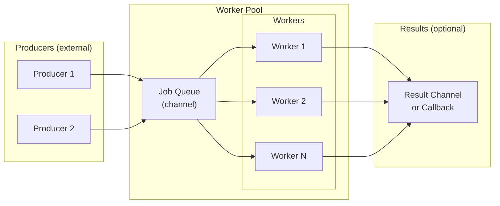

# Worker Pools

> Worker pools bound concurrency, manage backpressure, and provide predictable resource usage. They transform unbounded parallelism into controlled, observable systems that degrade gracefully under load.

---

## Core Principle

**A worker pool is an ownership boundary for concurrent work.**

The pool owns its workers; the workers own their tasks. When you submit work to a pool, you're transferring responsibility—the pool guarantees the work will be processed or explicitly rejected. This ownership model makes resource limits explicit and shutdown behavior predictable.

**Pool lifetime vs task lifetime:** These are distinct ownership scopes. The *pool* is typically application-scoped—created at startup, shut down with the application. Individual *tasks* are request-scoped—tied to a single operation's context. A common mistake is passing a request context to pool construction or using an application context for task cancellation. Keep them separate: the pool's context controls the pool's lifecycle; each task's context controls that task's deadline and cancellation. Cancelling a request should abort that request's task, not tear down a shared pool.

---

## Invariants

> Rules that must hold true. Violating these leads to bugs, leaks, or architectural debt.

- **Worker count is a resource commitment, not a performance hint.** Each worker is a goroutine consuming memory and scheduler time. Choose worker counts based on resource constraints (database connections, file descriptors, external API rate limits), not arbitrary "more is faster" thinking.
- **Every pool must have a shutdown path that drains or discards pending work.** A pool without shutdown semantics leaks goroutines and may lose work silently.
- **Backpressure must be explicit.** When the pool is at capacity, the caller must know: will submission block, queue, or fail? Implicit backpressure (unbounded queues, silent drops) creates systems that fail unpredictably under load.
- **Workers must respect context cancellation.** A worker that ignores `ctx.Done()` cannot be stopped gracefully. This connects directly to [Concurrency Architecture](05_CONCURRENCY_ARCHITECTURE.md)'s ownership principle.

---

## The "Why" Behind This

Unbounded concurrency is the default failure mode in Go. `for _, item := range items { go process(item) }` looks harmless but creates as many goroutines as there are items. For 10 items, fine. For 10,000 items hitting a database with 100 connections, you've overwhelmed the connection pool. For 1,000,000 items, you've exhausted memory.

Worker pools solve this by decoupling *work arrival* from *work execution*. Work arrives at whatever rate producers generate it. Execution happens at whatever rate the pool's fixed workers can sustain. The gap between these rates creates *backpressure*—a signal that flows backward to producers, slowing or rejecting new work when the system is overloaded.

This is a fundamental shift in system design. Instead of asking "how fast can we go?" you ask "how much load can we sustain?" The answer is predictable: N workers, each processing one item at a time, with a queue of size M. Under any load, the system uses bounded resources. When load exceeds capacity, the backpressure mechanism activates—blocking, rejecting, or shedding load—rather than degrading into chaos.

Worker pools also centralize lifecycle management. Starting N workers is one operation. Stopping them is one operation. Waiting for in-flight work is one operation. Compare this to ad-hoc goroutines scattered across a codebase, each with its own termination logic (or none at all). The pool becomes an *ownership boundary*: everything inside it is the pool's responsibility; everything outside interacts through a defined API.

---

## Key Concepts

### The Anatomy of a Worker Pool

Every worker pool has four components:



1. **Job Queue**: A channel that buffers incoming work. Buffer size determines how much work can accumulate before backpressure activates.
2. **Workers**: A fixed number of goroutines that receive from the job queue and process work.
3. **Results (optional)**: A mechanism to return outcomes—another channel, callbacks, or stored state.
4. **Lifecycle Controller**: Coordinates startup, shutdown, and waiting for completion.

### Fixed Worker Pool

The simplest and most common pattern. Start N workers at initialization; they run until shutdown.

```go
type Pool struct {
    jobs    chan Job
    results chan Result
    wg      sync.WaitGroup
}

func NewPool(ctx context.Context, workers int) *Pool {
    p := &Pool{
        jobs:    make(chan Job, workers*2), // Buffer: 2x workers
        results: make(chan Result, workers*2),
    }
    
    for i := 0; i < workers; i++ {
        p.wg.Add(1)
        go p.worker(ctx, i)
    }
    
    return p
}

func (p *Pool) worker(ctx context.Context, id int) {
    defer p.wg.Done()
    
    for {
        select {
        case <-ctx.Done():
            return
        case job, ok := <-p.jobs:
            if !ok {
                return // Channel closed; shutdown
            }
            result := process(ctx, job)
            select {
            case <-ctx.Done():
                return
            case p.results <- result:
            }
        }
    }
}

func (p *Pool) Submit(ctx context.Context, job Job) error {
    select {
    case <-ctx.Done():
        return ctx.Err()
    case p.jobs <- job:
        return nil
    }
}

func (p *Pool) Shutdown() {
    close(p.jobs)  // Signal workers to stop after draining
    p.wg.Wait()    // Wait for all workers to finish
    close(p.results)
}
```

**Key design decisions:**

- **Buffer size**: `workers * 2` allows some queueing without excessive memory. This is a heuristic—tune based on job characteristics.
- **Shutdown via channel close**: Closing `jobs` causes workers to exit after processing remaining work. This is *graceful* shutdown—work in the queue completes.
- **Context in Submit**: Allows callers to timeout or cancel submission attempts, preventing indefinite blocking.

**Anti-pattern—unbuffered job channel:**

```go
jobs: make(chan Job) // Unbuffered
```

Unbuffered channels force synchronization between Submit and a worker. If all workers are busy, Submit blocks—this might be desirable for strict backpressure, but often just creates unnecessary contention.

### Backpressure Strategies

When the pool is at capacity, you have three options:

| Strategy | Implementation | Use When |
|----------|----------------|----------|
| **Block** | Unbuffered or full channel; Submit blocks | Producers can tolerate delays; natural rate limiting |
| **Drop** | Non-blocking send with `select`/`default` | Work is time-sensitive; stale work is worthless |
| **Reject with error** | Check queue length; return error if full | Callers need to know submission failed |

**Blocking (default behavior):**

```go
func (p *Pool) Submit(ctx context.Context, job Job) error {
    select {
    case <-ctx.Done():
        return ctx.Err()
    case p.jobs <- job:
        return nil
    }
}
```

When the channel is full, `p.jobs <- job` blocks until a worker receives. The `ctx.Done()` case allows escape via cancellation.

**Dropping (lossy but non-blocking):**

```go
func (p *Pool) TrySubmit(job Job) bool {
    select {
    case p.jobs <- job:
        return true
    default:
        return false // Queue full; job dropped
    }
}
```

Use this for work that becomes stale quickly (real-time metrics, live dashboards). Document clearly that work may be lost.

**Rejecting with error:**

```go
var ErrPoolFull = errors.New("worker pool at capacity")

func (p *Pool) Submit(ctx context.Context, job Job) error {
    select {
    case <-ctx.Done():
        return ctx.Err()
    case p.jobs <- job:
        return nil
    default:
        return ErrPoolFull
    }
}
```

Callers can inspect the error and decide: retry later, queue elsewhere, or fail the operation. This makes backpressure visible to the caller.

**Hybrid: block with timeout:**

```go
func (p *Pool) SubmitWithTimeout(ctx context.Context, job Job, timeout time.Duration) error {
    ctx, cancel := context.WithTimeout(ctx, timeout)
    defer cancel()
    
    select {
    case <-ctx.Done():
        if errors.Is(ctx.Err(), context.DeadlineExceeded) {
            return ErrPoolFull
        }
        return ctx.Err()
    case p.jobs <- job:
        return nil
    }
}
```

Blocks for up to `timeout`, then fails. Balances blocking's simplicity with bounded wait times.

### Graceful Pool Shutdown

Shutdown has two phases: **stop accepting work** and **drain in-flight work**.

```go
type Pool struct {
    jobs     chan Job
    results  chan Result
    wg       sync.WaitGroup
    shutdown chan struct{}
    once     sync.Once
}

func (p *Pool) Shutdown(ctx context.Context) error {
    p.once.Do(func() {
        close(p.shutdown) // Signal: no more submissions
        close(p.jobs)     // Signal workers to drain and exit
    })
    
    // Wait for workers with timeout
    done := make(chan struct{})
    go func() {
        p.wg.Wait()
        close(done)
    }()
    
    select {
    case <-done:
        return nil
    case <-ctx.Done():
        return fmt.Errorf("shutdown timeout: %w", ctx.Err())
    }
}

func (p *Pool) Submit(ctx context.Context, job Job) error {
    select {
    case <-p.shutdown:
        return errors.New("pool is shutting down")
    case <-ctx.Done():
        return ctx.Err()
    default:
    }
    
    select {
    case <-p.shutdown:
        return errors.New("pool is shutting down")
    case <-ctx.Done():
        return ctx.Err()
    case p.jobs <- job:
        return nil
    }
}
```

**Shutdown sequence:**

1. Close `shutdown` channel to reject new submissions immediately
2. Close `jobs` channel to signal workers to drain and exit
3. Wait for `wg.Wait()` with a timeout from context
4. If timeout expires, return error (workers may still be running)

**Why the double select in Submit?** The first select (non-blocking) checks shutdown status without risking a blocked submission. The second select actually submits or respects cancellation. This prevents submissions from blocking indefinitely when shutdown races with submission.

**Idempotent shutdown:** `sync.Once` ensures closing channels only happens once, preventing panics from double-close.

### Using errgroup for Worker Pools

`golang.org/x/sync/errgroup` provides structured concurrency with error handling and bounded concurrency built in.

```go
func ProcessBatch(ctx context.Context, items []Item, maxWorkers int) error {
    g, ctx := errgroup.WithContext(ctx)
    g.SetLimit(maxWorkers)
    
    for _, item := range items {
        item := item // Capture loop variable (pre-Go 1.22)
        g.Go(func() error {
            return processItem(ctx, item)
        })
    }
    
    return g.Wait()
}
```

**What `errgroup.SetLimit` provides:**

- **Bounded concurrency**: At most `maxWorkers` goroutines run simultaneously
- **Automatic backpressure**: `g.Go()` blocks when at limit
- **Error propagation**: First error cancels context and is returned by `Wait()`
- **Clean waiting**: `Wait()` blocks until all goroutines complete

**errgroup vs custom pool:**

| Aspect | errgroup | Custom Pool |
|--------|----------|-------------|
| Setup complexity | Minimal | Requires implementation |
| Lifecycle | Per-batch (create, use, discard) | Long-lived (start once, use many times) |
| Result handling | Return error or store in closure | Dedicated result channel |
| Backpressure | Block only | Block, drop, or reject |
| Worker reuse | None (new goroutines per call) | Same workers process many jobs |

**Use errgroup** for bounded parallelism over a known batch of work. **Use a custom pool** for long-running services processing an unbounded stream of jobs.

**Critical subtlety:** When errgroup cancels context due to an error, other goroutines must check `ctx.Done()` to actually stop. errgroup doesn't forcibly terminate them.

```go
g.Go(func() error {
    for {
        select {
        case <-ctx.Done():
            return ctx.Err() // Respect cancellation
        default:
            // Do work that might be interrupted
            if err := doWork(ctx); err != nil {
                return err
            }
        }
    }
})
```

### Using semaphore for Rate Limiting

`golang.org/x/sync/semaphore` provides a weighted semaphore—useful when different operations consume different amounts of a limited resource.

```go
import "golang.org/x/sync/semaphore"

type RateLimitedPool struct {
    sem *semaphore.Weighted
}

func NewRateLimitedPool(maxConcurrent int64) *RateLimitedPool {
    return &RateLimitedPool{
        sem: semaphore.NewWeighted(maxConcurrent),
    }
}

func (p *RateLimitedPool) Process(ctx context.Context, job Job, weight int64) error {
    // Acquire weight tokens
    if err := p.sem.Acquire(ctx, weight); err != nil {
        return fmt.Errorf("acquiring semaphore: %w", err)
    }
    defer p.sem.Release(weight)
    
    return processJob(ctx, job)
}
```

**Weighted semaphore use cases:**

- **Database connections**: Heavy queries acquire 3 tokens; light queries acquire 1
- **Memory-intensive operations**: Operations declare their memory cost
- **External API rate limits**: Different endpoints have different costs

**Semaphore vs buffered channel:**

```go
// Channel semaphore: all operations equal weight
sem := make(chan struct{}, maxConcurrent)
sem <- struct{}{} // Acquire
<-sem             // Release

// Weighted semaphore: variable weights
sem := semaphore.NewWeighted(maxConcurrent)
sem.Acquire(ctx, weight) // Acquire N tokens
sem.Release(weight)       // Release N tokens
```

Channel semaphores are simpler for uniform costs. Weighted semaphores handle heterogeneous workloads.

### Dynamic Worker Pools

> ⚠️ **Default to fixed pools.** Dynamic pools add significant operational complexity: scaling decisions can oscillate, debugging becomes harder, and without proper hysteresis and observability, they often perform worse than a well-tuned fixed pool. Use dynamic pools only when traffic variance is extreme (10x+ swings), workers consume significant resources when idle, and you have the instrumentation to tune scaling parameters. For most services, a fixed pool sized for peak load is simpler and more predictable.

Some scenarios require adjusting worker count at runtime—scaling up under load, scaling down during quiet periods.

```go
type DynamicPool struct {
    jobs       chan Job
    minWorkers int
    maxWorkers int
    
    mu           sync.Mutex
    activeWorkers int
    workerDone   chan struct{}
    
    ctx    context.Context
    cancel context.CancelFunc
    wg     sync.WaitGroup
}

func NewDynamicPool(ctx context.Context, minWorkers, maxWorkers int) *DynamicPool {
    ctx, cancel := context.WithCancel(ctx)
    p := &DynamicPool{
        jobs:       make(chan Job, maxWorkers),
        minWorkers: minWorkers,
        maxWorkers: maxWorkers,
        workerDone: make(chan struct{}, maxWorkers),
        ctx:        ctx,
        cancel:     cancel,
    }
    
    // Start minimum workers
    for i := 0; i < minWorkers; i++ {
        p.addWorker()
    }
    
    // Start scaler goroutine
    p.wg.Add(1)
    go p.scaler()
    
    return p
}

func (p *DynamicPool) addWorker() {
    p.mu.Lock()
    if p.activeWorkers >= p.maxWorkers {
        p.mu.Unlock()
        return
    }
    p.activeWorkers++
    p.mu.Unlock()
    
    p.wg.Add(1)
    go p.worker()
}

func (p *DynamicPool) worker() {
    defer func() {
        p.wg.Done()
        p.mu.Lock()
        p.activeWorkers--
        p.mu.Unlock()
        
        select {
        case p.workerDone <- struct{}{}:
        default:
        }
    }()
    
    idleTimeout := time.NewTimer(30 * time.Second)
    defer idleTimeout.Stop()
    
    for {
        idleTimeout.Reset(30 * time.Second)
        
        select {
        case <-p.ctx.Done():
            return
        case job, ok := <-p.jobs:
            if !ok {
                return
            }
            process(p.ctx, job)
        case <-idleTimeout.C:
            // Idle too long; consider exiting
            p.mu.Lock()
            if p.activeWorkers > p.minWorkers {
                p.mu.Unlock()
                return // Exit this worker
            }
            p.mu.Unlock()
        }
    }
}

func (p *DynamicPool) scaler() {
    defer p.wg.Done()
    
    ticker := time.NewTicker(time.Second)
    defer ticker.Stop()
    
    for {
        select {
        case <-p.ctx.Done():
            return
        case <-ticker.C:
            queueLen := len(p.jobs)
            p.mu.Lock()
            workers := p.activeWorkers
            p.mu.Unlock()
            
            // Scale up if queue is backing up
            if queueLen > workers && workers < p.maxWorkers {
                p.addWorker()
            }
        }
    }
}
```

**Dynamic pool trade-offs:**

| Advantage | Disadvantage |
|-----------|--------------|
| Adapts to load automatically | More complex implementation |
| Reduces idle resource consumption | Scaling decisions can oscillate |
| Can handle burst traffic | Worker startup has latency |

**When to use dynamic pools:**

- Traffic patterns have significant variance (bursty workloads)
- Workers consume significant resources when idle
- Startup latency for new workers is acceptable

**When to prefer fixed pools:**

- Traffic is relatively stable
- Predictability is more important than efficiency
- Simpler implementation and debugging

### Result Collection Patterns

Workers produce results; how do callers collect them?

**Pattern 1: Result channel**

```go
type Pool struct {
    jobs    chan Job
    results chan Result
}

// Caller ranges over results
for result := range pool.Results() {
    handle(result)
}
```

Simple, but requires the caller to drain results. If caller stops reading, workers block on send.

**Pattern 2: Callback**

```go
type Job struct {
    Data     []byte
    Callback func(Result)
}

func (p *Pool) worker(ctx context.Context) {
    for job := range p.jobs {
        result := process(ctx, job.Data)
        job.Callback(result)
    }
}
```

Results go directly to their destination. No shared result channel. Callbacks must be thread-safe.

**Pattern 3: Future/Promise**

```go
type Future struct {
    result Result
    err    error
    done   chan struct{}
}

func (f *Future) Wait(ctx context.Context) (Result, error) {
    select {
    case <-ctx.Done():
        return Result{}, ctx.Err()
    case <-f.done:
        return f.result, f.err
    }
}

func (p *Pool) Submit(ctx context.Context, job Job) *Future {
    f := &Future{done: make(chan struct{})}
    
    wrappedJob := func() {
        f.result, f.err = process(ctx, job)
        close(f.done)
    }
    
    p.jobs <- wrappedJob
    return f
}
```

Caller gets a handle to wait on. Most flexible, but more complex.

### Observability and Instrumentation

Worker pools are not just concurrency primitives—they're **observability surfaces**. A well-instrumented pool tells you when the system is healthy, when it's under stress, and when it's about to fail.

**Essential metrics:**

| Metric | What It Tells You | Alert Threshold |
|--------|-------------------|-----------------|
| **Queue depth** (`len(jobs)`) | Backpressure accumulation | Sustained > 80% of buffer size |
| **Worker utilization** | Are workers idle or saturated? | Sustained > 90% or < 10% |
| **Submit latency** | How long callers wait to enqueue | p99 > acceptable wait time |
| **Job duration** | Processing time distribution | p99 drift from baseline |
| **Jobs completed/failed** | Throughput and error rate | Error rate > threshold |

**Instrumentation invariant:** Every pool should expose at minimum: current queue depth, jobs submitted, jobs completed, and jobs failed. Without these, you're operating blind.

```go
type PoolMetrics struct {
    QueueDepth      func() int      // Current jobs waiting
    ActiveWorkers   func() int      // Workers currently processing
    Submitted       func() int64    // Total jobs submitted
    Completed       func() int64    // Total jobs completed successfully
    Failed          func() int64    // Total jobs failed
    SubmitLatency   func() Histogram // Time from Submit call to job queued
    ProcessLatency  func() Histogram // Time from job start to completion
}
```

**Why this matters operationally:** Queue depth trending upward means work is arriving faster than it's being processed—you're heading toward backpressure activation or resource exhaustion. Worker utilization near 100% means you have no headroom for traffic spikes. Submit latency spikes mean producers are blocking, which can cascade upstream. These signals let you tune worker counts, identify slow jobs, and catch problems before they become outages.

**Correlate metrics, don't interpret them independently.** Queue depth rising *with* submit latency rising confirms backpressure is activating as designed. Queue depth rising *without* submit latency increase suggests workers are stalled or deadlocked—a different failure mode requiring different intervention. Metrics in isolation invite cargo-cult responses; correlated metrics enable causal reasoning.

**Watch for suspicious lows, not just highs.** Worker utilization near 0% sustained is as concerning as 100%—it signals overprovisioning (wasted resources), stalled producers (upstream failure), or jobs completing instantly (possible no-ops or short-circuits). Healthy pools show utilization that varies with load, not flatlines at either extreme.

---

## Complete Example: Production Worker Pool

Here's a complete, production-ready worker pool combining the patterns above:

```go
package workerpool

import (
    "context"
    "errors"
    "sync"
    "sync/atomic"
)

var (
    ErrPoolClosed = errors.New("worker pool is closed")
    ErrPoolFull   = errors.New("worker pool at capacity")
)

type Job func(context.Context) error

type Pool struct {
    jobs     chan Job
    wg       sync.WaitGroup
    
    closed   atomic.Bool
    shutdown chan struct{}
    
    // Metrics
    submitted atomic.Int64
    completed atomic.Int64
    failed    atomic.Int64
}

type Config struct {
    Workers   int
    QueueSize int
}

func New(ctx context.Context, cfg Config) *Pool {
    if cfg.Workers <= 0 {
        cfg.Workers = 1
    }
    if cfg.QueueSize <= 0 {
        cfg.QueueSize = cfg.Workers * 2
    }
    
    p := &Pool{
        jobs:     make(chan Job, cfg.QueueSize),
        shutdown: make(chan struct{}),
    }
    
    for i := 0; i < cfg.Workers; i++ {
        p.wg.Add(1)
        go p.worker(ctx)
    }
    
    return p
}

func (p *Pool) worker(ctx context.Context) {
    defer p.wg.Done()
    
    for {
        select {
        case <-ctx.Done():
            // Drain remaining jobs on cancellation.
            // Design choice: we favor work completion over fast abort. Jobs already
            // accepted into the queue represent a commitment. Discarding them silently
            // loses work; draining honors the backpressure contract. The cancelled
            // context passed to jobs allows them to exit early if they check ctx.Done().
            // Alternative: return immediately and let Shutdown's channel close handle
            // draining. Choose based on whether "fast abort" or "complete accepted work"
            // matters more for your use case.
            for job := range p.jobs {
                if err := job(ctx); err != nil {
                    p.failed.Add(1)
                } else {
                    p.completed.Add(1)
                }
            }
            return
        case job, ok := <-p.jobs:
            if !ok {
                return
            }
            if err := job(ctx); err != nil {
                p.failed.Add(1)
            } else {
                p.completed.Add(1)
            }
        }
    }
}

// Submit blocks until the job is queued or context is cancelled.
func (p *Pool) Submit(ctx context.Context, job Job) error {
    if p.closed.Load() {
        return ErrPoolClosed
    }
    
    select {
    case <-ctx.Done():
        return ctx.Err()
    case <-p.shutdown:
        return ErrPoolClosed
    case p.jobs <- job:
        p.submitted.Add(1)
        return nil
    }
}

// TrySubmit attempts to queue a job without blocking.
func (p *Pool) TrySubmit(job Job) error {
    if p.closed.Load() {
        return ErrPoolClosed
    }
    
    select {
    case p.jobs <- job:
        p.submitted.Add(1)
        return nil
    default:
        return ErrPoolFull
    }
}

// Shutdown stops accepting new jobs and waits for workers to finish.
func (p *Pool) Shutdown(ctx context.Context) error {
    if p.closed.Swap(true) {
        return nil // Already closed
    }
    
    close(p.shutdown) // Reject new submissions
    close(p.jobs)     // Signal workers to drain and exit
    
    done := make(chan struct{})
    go func() {
        p.wg.Wait()
        close(done)
    }()
    
    select {
    case <-done:
        return nil
    case <-ctx.Done():
        return fmt.Errorf("shutdown incomplete: %w", ctx.Err())
    }
}

// Stats returns pool metrics.
func (p *Pool) Stats() (submitted, completed, failed int64) {
    return p.submitted.Load(), p.completed.Load(), p.failed.Load()
}
```

**Usage:**

```go
func main() {
    ctx, cancel := context.WithCancel(context.Background())
    defer cancel()
    
    pool := workerpool.New(ctx, workerpool.Config{
        Workers:   10,
        QueueSize: 100,
    })
    
    // Submit work
    for i := 0; i < 1000; i++ {
        i := i
        err := pool.Submit(ctx, func(ctx context.Context) error {
            return processItem(ctx, i)
        })
        if err != nil {
            log.Printf("submit failed: %v", err)
        }
    }
    
    // Graceful shutdown
    shutdownCtx, shutdownCancel := context.WithTimeout(context.Background(), 30*time.Second)
    defer shutdownCancel()
    
    if err := pool.Shutdown(shutdownCtx); err != nil {
        log.Printf("shutdown error: %v", err)
    }
    
    submitted, completed, failed := pool.Stats()
    log.Printf("stats: submitted=%d completed=%d failed=%d", submitted, completed, failed)
}
```

---

## Trade-Off Matrix

| If You Need... | Choose... | Accept... |
|----------------|-----------|-----------|
| Simple bounded parallelism | `errgroup.SetLimit()` | Per-batch lifecycle; no long-lived workers |
| Long-running job processor | Custom fixed pool | Implementation complexity |
| Variable resource costs | `semaphore.Weighted` | Weight estimation complexity |
| Adaptive scaling | Dynamic pool | Scaling oscillation; implementation complexity |
| Strict backpressure | Blocking Submit | Potential producer stalls |
| Lossy but fast | Non-blocking TrySubmit | Lost work when overloaded |
| Zero-loss with bounds | Blocking Submit + timeout | Requires caller error handling |

---

## Common Mistakes

| Mistake | Consequence | Fix |
|---------|-------------|-----|
| Unbounded goroutine spawning | Memory exhaustion, scheduler overhead | Use fixed worker count or errgroup.SetLimit |
| No shutdown path | Goroutine leaks, lost work | Always implement Shutdown with drain/timeout |
| Ignoring ctx.Done() in workers | Workers don't stop on cancellation | Check ctx.Done() in worker select |
| Closing job channel from producer | Panic if multiple producers | Only pool (owner) closes channels |
| Blocking Submit without timeout | Producer hangs indefinitely | Use context with timeout or TrySubmit |
| Result channel without drain | Workers block on send | Ensure results are consumed or use callbacks |
| Dynamic scaling without hysteresis | Rapid oscillation up/down | Add cooldown periods between scale events |

---

## Interview Signals

| When Asked... | Demonstrate... |
|---------------|----------------|
| "How do you limit concurrency?" | Fixed worker pool with channel-based job queue. errgroup.SetLimit for batch processing. Semaphore for weighted resource limits. Explain trade-offs between approaches. |
| "What is backpressure?" | Signal that flows backward from overloaded systems to producers. Implemented via blocking (channel full), rejection (return error), or dropping (non-blocking send). Explicit backpressure prevents cascading failures. |
| "How do you shut down a worker pool?" | Close job channel to signal drain. Wait for workers with WaitGroup. Use context timeout to bound shutdown time. Reject new submissions during shutdown. Idempotent shutdown via sync.Once or atomic flag. |
| "errgroup vs custom pool?" | errgroup: simple, per-batch, automatic error cancellation. Custom pool: long-lived, reusable workers, flexible backpressure. Use errgroup for bounded parallel operations; custom pool for service-level job processing. |
| "How do workers know to stop?" | Three signals: context cancellation (ctx.Done), channel closure (range loop exits), explicit shutdown channel. Workers should respond to all three for robust shutdown. |
| "Fixed vs dynamic workers?" | Fixed: predictable, simple, suitable for stable load. Dynamic: adapts to traffic, more complex, risk of oscillation. Default to fixed; use dynamic only when variance justifies complexity. |

---

## Bridge to Related Documents

This deep dive extends [Concurrency Architecture](05_CONCURRENCY_ARCHITECTURE.md), which established goroutine ownership and the errgroup pattern. Worker pools are the production manifestation of structured concurrency—bounded, owned, and observable.

The channel patterns in [DD_CHANNEL_PATTERNS.md](DD_CHANNEL_PATTERNS.md) provide the building blocks: fan-out distributes work to workers; fan-in collects results; semaphore channels bound concurrency. Worker pools compose these patterns into reusable abstractions.

For graceful shutdown of pools within larger applications, see [Graceful Shutdown](06_GRACEFUL_SHUTDOWN.md). Pools are components that must participate in the application's shutdown sequence—typically draining before upstream producers and before downstream consumers stop.

For testing worker pools, including goroutine leak detection with `goleak`, see [Testing Philosophy](07_TESTING_PHILOSOPHY.md).
