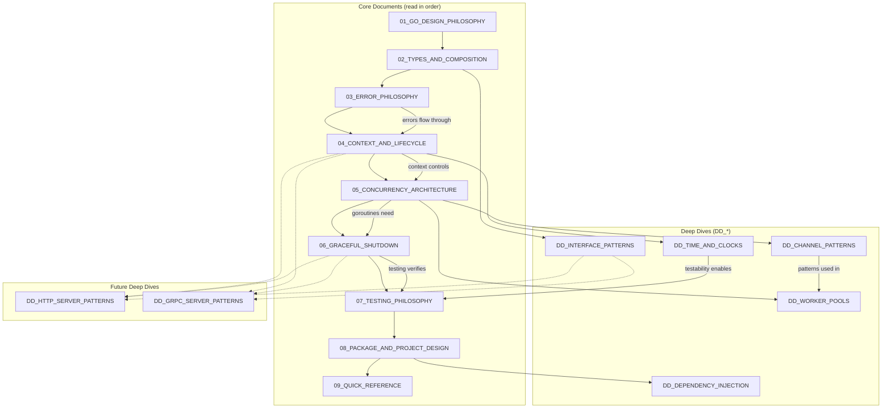

# Go Senior-Level Handbook - Execution Plan

> A comprehensive guide to Go beyond the basics: fundamentals, architectural patterns, and industry best practices for senior engineers.

---

## Project Overview

**Goal**: Create a senior-level preparation handbook for Golang that focuses on deep understanding of fundamentals, architectural/design concepts, and industry best practices.

**Audience Boundary**: This handbook assumes you already know basic Go syntax, control flow, and standard library usage. If `for`, `func`, `struct`, and `if err != nil` aren't second nature, start with the Go Tour first.

**Philosophy**: 
- Quality over quantity (~1000-2000 words per document, no noise)
- 60% concept / 40% code balance
- Teaching-style code with callouts for best practices and anti-patterns
- Mermaid diagrams for visual explanations
- Each document builds on the previous ("bridge" architecture)
- **Invariants-first thinking**: every document enforces rules that must never be violated
- **Boundary vs Core framing**: explicit separation between boundary code (HTTP, gRPC, CLI) and core logic

**Reference Style**: [system_design_interview_handbook](https://github.com/ae-lexs/system_design_interview_handbook)

---

## Document Structure

### Core Documents (Sequential - Read in Order)

| # | Document | Key Question | Bridge To |
|---|----------|--------------|-----------|
| 01 | `01_GO_DESIGN_PHILOSOPHY.md` | "Why does Go make these tradeoffs?" | Understanding unlocks all other decisions |
| 02 | `02_TYPES_AND_COMPOSITION.md` | "How do I model domain concepts idiomatically?" | Interfaces, methods, embedding |
| 03 | `03_ERROR_PHILOSOPHY.md` | "How do I design error handling as part of my API?" | Context propagation |
| 04 | `04_CONTEXT_AND_LIFECYCLE.md` | "How do I manage request/operation lifecycles?" | Concurrency control |
| 05 | `05_CONCURRENCY_ARCHITECTURE.md` | "How do I design safe, maintainable concurrent systems?" | Application lifecycle |
| 06 | `06_GRACEFUL_SHUTDOWN.md` | "How do I ensure clean application termination?" | Testing |
| 07 | `07_TESTING_PHILOSOPHY.md` | "How do I test concurrent, lifecycle-aware code?" | Package design |
| 08 | `08_PACKAGE_AND_PROJECT_DESIGN.md` | "How do I structure code for maintainability?" | Quick reference |
| 09 | `09_QUICK_REFERENCE.md` | "What do I need for interviews?" | — |

### Deep Dives (DD_*)

| Document | Topic | When to Read |
|----------|-------|--------------|
| `DD_INTERFACE_PATTERNS.md` | Small interfaces, implicit implementation, design patterns | After 02 |
| `DD_CHANNEL_PATTERNS.md` | Fan-out/fan-in, pipelines, select patterns, or-done | After 05 |
| `DD_WORKER_POOLS.md` | Bounded concurrency, back-pressure, job queues | After 05 |
| `DD_TIME_AND_CLOCKS.md` | Injected clocks, deadlines vs timeouts, testable time | After 04 |
| `DD_DEPENDENCY_INJECTION.md` | Constructor injection, functional options, wire-free DI | After 08 |

### Future Deep Dives (Parking Lot)

| Document | Topic | Notes |
|----------|-------|-------|
| `DD_HTTP_SERVER_PATTERNS.md` | Middleware, routing, request lifecycle | Common interview topic |
| `DD_GRPC_SERVER_PATTERNS.md` | Interceptors, streaming, service design | Microservices focus |

---

## Dependency Graph



---

## Document Template

Each document follows this structure:

```markdown
# [Topic Name]

> One-liner capturing the essence

---

## Core Principle

The key insight in one memorable phrase

---

## Invariants

> Rules that must hold true. Violating these leads to bugs, leaks, or architectural debt.

- [Invariant 1]
- [Invariant 2]

---

## The "Why" Behind This

[2-3 paragraphs explaining the philosophy, not just the mechanics]

---

## Key Concepts

### [Concept 1]

[Explanation with teaching-style code example]

**Idiomatic:**
​```go
// Good pattern with explanation
​```

**Anti-pattern:**
​```go
// What to avoid and why
​```

### [Concept 2]
...

---

## Boundary vs Core

> How this concept behaves differently at system boundaries (HTTP, gRPC, CLI) vs core logic.

[Only include when relevant to the document topic]

---

## Trade-Off Matrix

| If You Need... | Choose... | Accept... |
|----------------|-----------|-----------|
| ... | ... | ... |

---

## Interview Signals

| When Asked... | Demonstrate... |
|---------------|----------------|
| ... | ... |

---

## Bridge to Next

> [Connection to the next document in sequence]
```

---

## Document Summaries

### 01_GO_DESIGN_PHILOSOPHY.md

**Purpose**: Set the mental model for everything that follows.

**Key Sections**:
- Simplicity over cleverness (Go proverb mentality)
- Composition over inheritance
- "Share memory by communicating" principle
- Explicit over implicit (no magic)
- The cost of abstraction in Go

**Invariants**:
- "Clear is better than clever"
- "A little copying is better than a little dependency"

**Research Topics**: Go Proverbs, Effective Go philosophy sections, Rob Pike talks

---

### 02_TYPES_AND_COMPOSITION.md

**Purpose**: How to model domain concepts using Go's type system.

**Key Sections**:
- Structs as data + behavior containers
- Methods and receiver semantics (pointer vs value)
- Embedding for composition (not inheritance)
- Interfaces: implicit implementation
- "Accept interfaces, return structs" principle

**Invariants**:
- "The bigger the interface, the weaker the abstraction"
- "Don't design with interfaces, discover them"

**Research Topics**: Google Go Style Guide (interfaces section), Uber guide (receiver types)

---

### 03_ERROR_PHILOSOPHY.md

**Purpose**: Errors are values and part of your API design.

**Key Sections**:
- Errors as values (not exceptions)
- Error wrapping/unwrapping (`errors.Is`, `errors.As`)
- Sentinel errors vs typed errors vs opaque errors
- Error handling at boundaries (introduces boundary/core framing)
- When to panic (almost never)

**Invariants**:
- "Errors at boundaries must be translated, not leaked"
- "Handle an error or return it, never both"

**Boundary vs Core**: Introduced here—errors behave differently at system edges vs internal logic.

**Research Topics**: Go Blog error handling posts, Uber guide (error handling section)

---

### 04_CONTEXT_AND_LIFECYCLE.md

**Purpose**: `context.Context` as the backbone of lifecycle management. **Senior-critical topic.**

**Key Sections**:
- What context actually is (cancellation + deadline + values)
- Context propagation rules
- `WithCancel`, `WithTimeout`, `WithDeadline`, `WithValue`
- Context in HTTP handlers
- Anti-patterns: storing context in structs

**Invariants**:
- "Cancellation flows downstream only"
- "Context is created at boundaries, propagated through core"
- "Never store context in structs"

**Boundary vs Core**: Context is created at boundaries (HTTP handler, main), flows into core logic.

**Research Topics**: Go Blog context article, Google best practices (context section)

---

### 05_CONCURRENCY_ARCHITECTURE.md

**Purpose**: How to architect concurrent systems, not just use goroutines.

**Key Sections**:
- Concurrency vs parallelism
- Goroutine lifecycle and ownership
- Channels vs mutexes vs atomics (decision framework)
- "Structured concurrency" concept
- Preventing goroutine leaks

**Invariants**:
- "Every goroutine must have an owner responsible for its termination"
- "Share memory by communicating, don't communicate by sharing memory"
- "The goroutine that starts a goroutine must ensure it can stop"

**Research Topics**: Uber guide (goroutine leaks, goleak), concurrency pattern articles

---

### 06_GRACEFUL_SHUTDOWN.md

**Purpose**: Programs that terminate correctly. **Senior-critical topic.**

**Key Sections**:
- Why graceful shutdown matters
- Signal handling (`SIGTERM`, `SIGINT`)
- `signal.NotifyContext` pattern
- Shutdown ordering (reverse of startup)
- Component lifecycle interfaces
- Timeout budgets

**Invariants**:
- "Shutdown order is the reverse of startup order"
- "Every component must have a shutdown path"
- "Shutdown must complete within a bounded time"

**Research Topics**: Graceful shutdown pattern articles, Kubernetes termination lifecycle

---

### 07_TESTING_PHILOSOPHY.md

**Purpose**: Testing philosophy and patterns for concurrent code.

**Key Sections**:
- Table-driven tests
- Testing concurrent code (race detector)
- Testing with context
- Interface-based testing (fakes over mocks)
- Integration testing patterns

**Invariants**:
- "Fakes over mocks: prefer real implementations with controlled behavior"
- "Assert behavioral contracts, not call order"
- "Concurrency tests assert eventual outcomes, not timing"

**Sharpened Stance**:
- Explicitly reject mock-heavy testing culture
- Tests should verify *what happened*, not *how it happened*
- Time-dependent tests use injected clocks (links to DD_TIME_AND_CLOCKS)

**Research Topics**: Go testing documentation, Uber guide (testing section)

---

### 08_PACKAGE_AND_PROJECT_DESIGN.md

**Purpose**: Structure code for maintainability.

**Key Sections**:
- Package design principles
- `internal/`, `cmd/`, `pkg/` conventions
- Dependency direction
- Configuration patterns (functional options)
- When to split packages
- Boundary packages vs core packages

**Invariants**:
- "Name packages by responsibility, not by type"
- "Dependencies point inward (boundary → core, never core → boundary)"
- "internal/ protects your right to change"

**Boundary vs Core**: Package structure should reflect this separation explicitly.

**Research Topics**: Go official module layout, golang-standards/project-layout debates, Alex Edwards article

---

### 09_QUICK_REFERENCE.md

**Purpose**: Interview-day cheat sheet.

**Key Sections**:
- Go proverbs (memorized)
- Invariants grouped by theme:
  - **Philosophy**: clarity, simplicity, explicitness
  - **Lifecycle**: context propagation, ownership, shutdown ordering
  - **Concurrency**: goroutine ownership, communication patterns
  - **Boundaries**: error translation, dependency direction
  - **Testing**: fakes over mocks, behavioral contracts
- Decision matrices
- Common interview questions with senior answers
- Key code snippets
- "When asked X, demonstrate Y" table

---

## Deep Dive Summaries

### DD_INTERFACE_PATTERNS.md
- Small interfaces (1-2 methods ideal)
- Interface segregation in practice
- Compile-time interface satisfaction checks
- Common stdlib interfaces
- Designing for testability

### DD_CHANNEL_PATTERNS.md
- Fan-out / Fan-in
- Pipeline pattern
- Or-channel, Or-done channel
- Tee channel, Bridge channel

### DD_WORKER_POOLS.md
- Fixed and dynamic worker pools
- Back-pressure mechanisms
- Graceful pool shutdown
- `errgroup` and `semaphore` packages

### DD_TIME_AND_CLOCKS.md
- `time.Now()` as hidden global state
- Injecting clocks for testability
- Deadlines vs timeouts (semantic difference)
- Monotonic time and why it matters
- Testing time-dependent code

**Invariants**:
- "Time is a dependency; inject it like any other"
- "Deadlines are absolute, timeouts are relative"

### DD_DEPENDENCY_INJECTION.md
- Constructor injection
- Functional options pattern
- Config structs
- Wire vs manual DI comparison

---

## Editorial Process

### Approach: Document-by-Document

Each document will be created in a **separate conversation** to:
- Maintain focus and quality
- Avoid memory/context limitations
- Allow targeted research per document

This is a **curated body of knowledge**, not a content dump. Each document is reviewed for:
- Invariant clarity
- Bridge coherence
- Trade-off completeness
- Code example quality

### Per-Document Workflow

1. **Research Phase**: Targeted web searches for document-specific topics
2. **Draft Phase**: Create document following template
3. **Review Phase**: Verify bridges, trade-offs, invariants, and code examples
4. **Finalize**: Move to outputs

### Document Order

**Phase 1: Foundation**
1. README.md (repository structure, anti-goals)
2. 01_GO_DESIGN_PHILOSOPHY.md
3. 02_TYPES_AND_COMPOSITION.md
4. 03_ERROR_PHILOSOPHY.md

**Phase 2: Lifecycle Core (Senior-Critical)**
5. 04_CONTEXT_AND_LIFECYCLE.md
6. 05_CONCURRENCY_ARCHITECTURE.md
7. 06_GRACEFUL_SHUTDOWN.md

**Phase 3: Practice & Structure**
8. 07_TESTING_PHILOSOPHY.md
9. 08_PACKAGE_AND_PROJECT_DESIGN.md

**Phase 4: Reference & Deep Dives**
10. 09_QUICK_REFERENCE.md
11. DD_INTERFACE_PATTERNS.md
12. DD_CHANNEL_PATTERNS.md
13. DD_WORKER_POOLS.md
14. DD_TIME_AND_CLOCKS.md
15. DD_DEPENDENCY_INJECTION.md

---

## Key Research Sources

Validated during planning:

| Source | Use For |
|--------|---------|
| [Uber Go Style Guide](https://github.com/uber-go/guide) | Practical patterns, goroutine management, error handling |
| [Google Go Style Guide](https://google.github.io/styleguide/go/) | Clarity principles, best practices, naming |
| [Effective Go](https://go.dev/doc/effective_go) | Language fundamentals, idiomatic patterns |
| [Go Blog](https://go.dev/blog/) | Context, errors, modules official guidance |
| [Go Module Layout](https://go.dev/doc/modules/layout) | Official project structure guidance |

---

## Technical Notes

- **Diagrams**: Use Mermaid for all visual explanations
- **Code Style**: Teaching-style (focused, minimal, highlights concept)
- **Callouts**: Mark best practices and anti-patterns explicitly
- **Word Count**: ~1000-2000 words per document (quality over quantity)
- **Invariants**: Every document must define at least one invariant

---

## Anti-Goals (for README)

Things this handbook explicitly avoids:

- **No frameworks**: No Gin, Echo, or framework-specific patterns. Pure Go and stdlib.
- **No beginner syntax**: No explaining `for` loops, `if` statements, or basic types.
- **No cargo-cult patterns**: No "always do X" without explaining *why* and *when not to*.
- **No comprehensive coverage**: Not a language reference. Focused on senior-critical decisions.
- **No hype**: No "Go is the best language" cheerleading. Just trade-offs and clarity.

---

## Recurring Concepts

These concepts appear across multiple documents and should be reinforced consistently:

| Concept | Introduced In | Reinforced In |
|---------|---------------|---------------|
| Boundary vs Core | 03_ERROR_PHILOSOPHY | 04, 06, 08 |
| Ownership | 05_CONCURRENCY_ARCHITECTURE | 06, 07 |
| Testability through interfaces | 02_TYPES_AND_COMPOSITION | 07, DD_INTERFACE_PATTERNS |
| Time as dependency | 04_CONTEXT_AND_LIFECYCLE | 07, DD_TIME_AND_CLOCKS |

---

## Version History

| Version | Date | Changes |
|---------|------|---------|
| 1.2 | 2025-02 | Added: Themed invariant groupings for 09_QUICK_REFERENCE, Anti-goals section for README |
| 1.1 | 2025-02 | Added: Invariants section, DD_TIME_AND_CLOCKS, boundary/core framing, sharpened testing stance, Editorial Process rename, audience boundary |
| 1.0 | 2025-02 | Initial execution plan |
