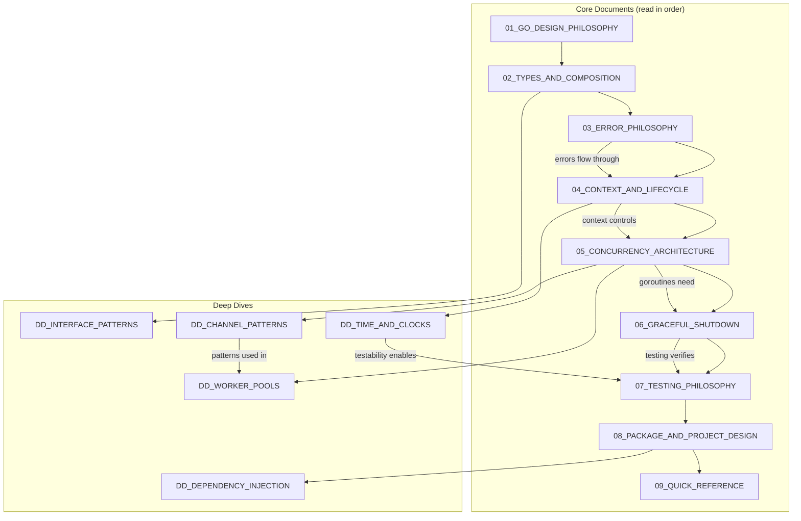

# Go Senior-Level Handbook

> A comprehensive guide to Go beyond the basics: fundamentals, architectural patterns, and industry best practices for senior engineers.

---

## Core Thesis

Go is a constraint-driven language. Mastering it means internalizing three things: **invariants** (rules that must never be violated), **lifecycle** (how things start, run, and stop), and **ownership** (who is responsible for what). This handbook optimizes for that mental model above all else.

---

## Why This Exists

Most Go resources stop at syntax or recipes. Senior interviews don't test whether you can write a goroutine—they test whether you understand *when it will leak*. Production Go failures are rarely about logic bugs; they're about **lifecycle** violations, **ownership** confusion, and concurrency misuse.

This handbook exists to close that gap.

---

## Who This Is For

This handbook assumes you already know basic Go syntax, control flow, and standard library usage. If `for`, `func`, `struct`, and `if err != nil` aren't second nature, start with the [Go Tour](https://go.dev/tour/) first.

This is for engineers preparing for senior-level Go positions or those looking to deepen their understanding of *why* Go works the way it does—not just *how*.

---

## Philosophy

- **Quality over quantity**: ~1000-2000 words per document, no noise
- **60% concept / 40% code**: Understanding trumps memorization
- **Invariants-first thinking**: Every document defines rules that must never be violated
- **Boundary vs Core framing**: Side-effectful boundaries (HTTP, gRPC, CLI) separated from pure, policy-driven core logic
- **Teaching-style code**: Minimal but complete examples that compile—no pseudo-code

---

## Reading Order

The core documents build on each other. Read them in sequence for first pass.

Some documents are **conceptually sequential** (01–06 form a tight chain). Others are **reference-oriented** and revisit earlier invariants (07–09). The Quick Reference assumes you've absorbed everything before it.

| # | Document | Key Question |
|---|----------|--------------|
| 01 | [Go Design Philosophy](01_GO_DESIGN_PHILOSOPHY.md) | Why does Go make these tradeoffs? |
| 02 | [Types and Composition](02_TYPES_AND_COMPOSITION.md) | How do I model domain concepts idiomatically? |
| 03 | [Error Philosophy](03_ERROR_PHILOSOPHY.md) | How do I design error handling as part of my API? |
| 04 | [Context and Lifecycle](04_CONTEXT_AND_LIFECYCLE.md) | How do I manage request/operation lifecycles? |
| 05 | [Concurrency Architecture](05_CONCURRENCY_ARCHITECTURE.md) | How do I design safe, maintainable concurrent systems? |
| 06 | [Graceful Shutdown](06_GRACEFUL_SHUTDOWN.md) | How do I ensure clean application termination? |
| 07 | [Testing Philosophy](07_TESTING_PHILOSOPHY.md) | How do I test concurrent, lifecycle-aware code? |
| 08 | [Package and Project Design](08_PACKAGE_AND_PROJECT_DESIGN.md) | How do I structure code for maintainability? |
| 09 | [Quick Reference](09_QUICK_REFERENCE.md) | What do I need for interviews? |

---

## Deep Dives

These documents go deeper on specific topics. Read them after completing the prerequisite core document.

Deep dives **do not introduce new core invariants**—they refine, stress-test, and apply existing ones to specialized contexts.

| Document | Topic | Read After |
|----------|-------|------------|
| [Interface Patterns](DD_INTERFACE_PATTERNS.md) | Small interfaces, implicit implementation, design patterns | 02 |
| [Channel Patterns](DD_CHANNEL_PATTERNS.md) | Fan-out/fan-in, pipelines, select patterns, or-done | 05 |
| [Worker Pools](DD_WORKER_POOLS.md) | Bounded concurrency, back-pressure, job queues | 05 |
| [Time and Clocks](DD_TIME_AND_CLOCKS.md) | Injected clocks, deadlines vs timeouts, testable time | 04 |
| [Dependency Injection](DD_DEPENDENCY_INJECTION.md) | Constructor injection, functional options, wire-free DI | 08 |

---

## Dependency Graph

---

## Anti-Goals

This handbook explicitly avoids:

- **No frameworks**: No Gin, Echo, or framework-specific patterns. Pure Go and stdlib.
- **No beginner syntax**: No explaining `for` loops, `if` statements, or basic types.
- **No cargo-cult patterns**: No "always do X" without explaining *why* and *when not to*.
- **No comprehensive coverage**: Not a language reference. Focused on senior-critical decisions.
- **No hype**: No "Go is the best language" cheerleading. Just trade-offs and clarity.

---

## Key Themes

These concepts recur throughout the handbook:

| Concept | Introduced In | Reinforced In |
|---------|---------------|---------------|
| Boundary vs Core | Error Philosophy | Context, Shutdown, Package Design |
| Ownership | Concurrency Architecture | Shutdown, Testing |
| Testability through interfaces | Types and Composition | Testing, Interface Patterns |
| Time as dependency | Context and Lifecycle | Testing, Time and Clocks |

---

## Sources

This handbook draws from authoritative Go resources:

- [Uber Go Style Guide](https://github.com/uber-go/guide) — Practical patterns, goroutine management
- [Google Go Style Guide](https://google.github.io/styleguide/go/) — Clarity principles, naming
- [Effective Go](https://go.dev/doc/effective_go) — Language fundamentals, idiomatic patterns
- [Go Blog](https://go.dev/blog/) — Context, errors, modules official guidance
- [Go Module Layout](https://go.dev/doc/modules/layout) — Official project structure

---

## License

[MIT](LICENSE)
